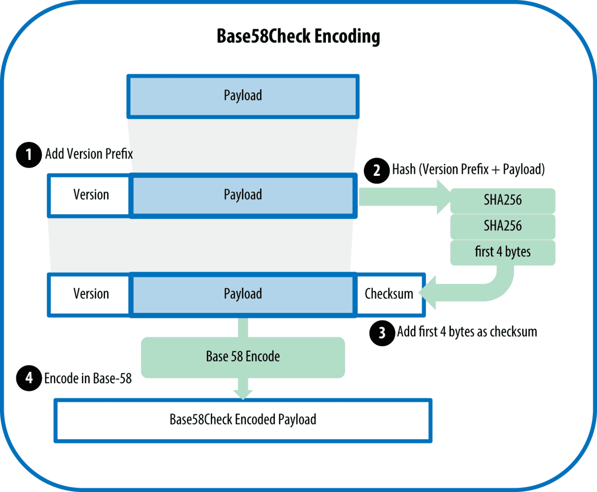

# Base58编码

## Base64编码
Base64就是一种基于64个可打印字符来表示二进制数据的方法

- Base64使用了26个小写字母、26个大写字母、10个数字以及两个符号（例如“+”和“/”），用于在电子邮件这样的基于文本的媒介中传输二进制数据。
- Base64通常用于编码邮件中的附件。
Base64字符集：
```
ABCDEFGHIJKLMNOPQRSTUVWXYZabcdefghijklmnopqrstuvwxyz0123456789+/
```
## Base58编码
Base58是一种基于文本的二进制编码格式，是用于Bitcoin中使用的一种独特的编码方式，主要用于产生Bitcoin的钱包地址。

- 相比Base64，Base58不使用数字"0"，大写字母"O"，大写字母"I"和小写字母"l"，以及"+"和"/"符号。目的就是去除容易混淆的字符。
- 这种编码格式不仅实现了数据压缩，保持了易读性，还具有错误诊断功能。
Base58字符集：
```
ABCDEFGHJKLMNPQRSTUVWXYZabcdefghijkmnopqrstuvwxyz123456789
```
## Base58Check
Base58Check是一种常用在比特币中的Base58编码格式，增加了错误校验码来检查数据在转录中出现的错误。在Base58Check中，对数据添加了一个称作“版本字节”的前缀，这个前缀用来明确需要编码的数据的类型。

1. 首先对数据添加一个版本前缀，这个前缀用来识别编码的数据类型。例如，比特币地址的前缀是0（十六进制是0x00）。
2. 对数据连续进行两次SHA256哈希算法checksum = SHA256(SHA256(prefix+data))。
3. 在产生的长度为32个字节（两次哈希云算）的哈希值中，取其前4个字节作为检验和添加到数据第一步产生的数据之后。
4. 将数据进行Base58编码处理
Base58Check的编码过程如下图。



### Base58Check的作用：

既然有了Base58编码，已经不会搞错0和O, 1和l和I，也把大整数转换成了可读字符串，为什么还要再有Base58Check这个环节呢？

假设一种情况，你在程序中输入一个Base58编码的地址，尽管你已经不会搞错0和O, 1和l和I，但是万一你不小心输错一个字符，或者少写多写一个字符，会咋样？你可能会说，没啥大不了的，错个字符而已，这不是很常见嘛，重新输入不就可以了吗？但是当用户给一个比特币地址转账，如果输入错误，那么对方就不会收到资金，更关键的是该笔资金发给了一个根本不存在的比特币地址，那么这笔资金也就永远不可能被交易，也就是说比特币丢失了。

### 校验码

* 校验码长4个字节，添加到需要编码的数据之后。
* 校验码是从需要编码的数据的哈希值中得到的，所以可以用来检测并避免转录和输入中产生的错误。

使用Base58check编码格式时，程序会计算原始数据的校验码并和自带的校验码进行对比，二者若不匹配则表明有错误产生。

实际上，在比特币交易中，都会校验比特币地址是否合法，如果经过Base58Check的比特币地址被比特币钱包程序判定是无效的，当然会阻止交易继续进行，就避免了资金损失。
