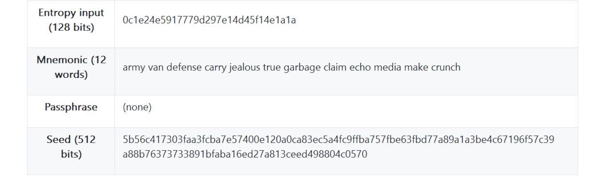

# 助记词
为了安全尽量保证比特币地址的公钥未在网络上出现过，这就需要我们每次支付时，将支付额转到一个新的账户发起转账，而收款时使用一个新账号地址。为了满足这样的场景，就需要安全管理很多的账号与对应的秘钥，这样显然是不科学的。因此，这里讲解通过助记词生成很多子地址，这样，我们只需保存一份助记词就相当于保存好了2^31个账号的私钥。

## 助记词的生成过程
BIP39是助记词标准的实现，助记词是一个随机数的字序列，用来作为种子产生一个确定性的钱包。单词序列足以重新创建种子，然后再创建钱包和所有派生的密钥。一个实现带有助记词的确定性钱包应用程序在首次创建钱包时将向用户显示12到24个单词的序列。该单词序列是钱包备份，可用于恢复和重新创建相同或任何兼容的钱包应用程序中的所有密钥。记忆单词使用户更容易备份钱包，因为与随机数字序列相比，它们易于阅读和正确地转录。所有的助记词在这里可以查看：[助记词词库](https://github.com/bitcoin/bips/blob/master/bip-0039/english.txt)。

使用BIP39中定义的标准化过程，钱包自动生成助记词。钱包从一个熵源开始，添加一个校验和，然后将熵映射到一个单词列表，具体步骤如下:

1. 创建128到256位的随机序列（熵）。
2. 通过获取SHA256哈希的第一（熵长度/ 32）位来创建随机序列的校验和。
3. 将校验和添加到随机序列的末尾。
4. 将序列分成11位的部分。
5. 将每个11位值映射到来自2048个单词的预定义字典中的单词。
6. 助记词是单词序列。
生成助记词的步骤如下图。


下表描述了初始熵长度（ENT），校验和长度（CS）和单词中生成的助记词（MS）的长度之间的关系。

|熵（bits）|	Checksum（bits）|	熵+Checksum（bits）|	助记词长度（words）
|:------|:------|:------|:------|
128|	4|	132|	12
160|	5|	165|	15
192|	6|	198|	18
224|	7|	231|	21
256|	8|	264|	24
## 从助记词到种子
用户可以决定用密码来保护他们的助记符。如果不存在密码短语，则使用空字符串“”。

助记词代表长度为128到256位的熵。然后使用熵通过使用密钥扩展函数PBKDF2来导出更长（512位）的种子。然后，所产生的种子用于构建确定性钱包并获得其密钥。

密钥扩展功能有两个参数：助记词和盐（salt）。密钥扩展功能中的盐的目的是使得难以构建能够进行暴力攻击的查找表。在BIP-39标准中，salt具有另一个目的 - 它允许引入密码短语作为保护种子的额外安全因子。

1. PBKDF2密钥扩展功能的第一个参数是从步骤6产生的助记词。
2. PBKDF2密钥扩展功能的第二个参数是salt。salt由字符串常量“mnemonic”和可选的用户提供的密码短语字符串组成。
3. PBKDF2使用2048轮HMAC-SHA512哈希算法来扩展助记词和salt参数，产生512位值作为其最终输出。那个512位的值就是种子。
使用助记词来生成种子的步骤如下图。


下面演示一下助记词生成种子的实例：




## 种子生成子秘钥
种子通过不可逆HMAC-SHA512算法推算出512位的哈希串，前256位是主私钥Master Private Key (m)，后256位是主链码Master Chain Code（c）。

1. 给定父扩展私钥和索引i，可以计算相应的子扩展私钥。

2. 函数CKDpriv（（kpar，cpar），i）→（ki，ci）

3. 如果i ≥ 2^31（硬化的子密钥）：让I= HMAC-SHA512（Key = cpar，Data = 0x00 || ser256（kpar）|| ser32（i））。 （注意：0x00将私钥补齐到33字节长。）

4. 如果i<2^31（普通的子密钥）：让I= HMAC-SHA512（Key = cpar，Data = serP（point（kpar））|| ser32（i））。

5. 给定父扩展公钥和索引i，可以计算相应的子扩展公钥。它只针对未硬化的子密钥定义。

6. 如果i ≥ 2^31(硬化子密钥)：返回失败

7. 如果i<2^31(普通子密钥)：让I= HMAC-SHA512(Key = cpar, Data = serP(Kpar) || ser32(i)).

扩展私钥的前缀是xprv，如：
```
tprv8iGPAfgu51nkCZZtua8jFgzVoCQLqHZrLCQonxTo7qdtzutL8ZFZt1yAtpcUF8sHdNyiVhece3SSRsBvtUCKpGkRvxXgV2TMdcDbKQzstta
```
扩展公钥的前缀是tpub，如：
```
tpubDExRK5j9DPUR62bgoDoKf6ecNDvGzckkuW1b5UW6Y7SHqQ96kx5A4Wb34w6bkHUStdq5w7ZHPQHkipwRdSQMbGnqTAQj1sEBaJmL9wXvBSu
```
每个扩展密钥有 2^31 个普通子密钥，2^31个硬化子密钥。这些子密钥都有一个索引，普通子密钥使用索引0到2^31-1，硬化的子密钥使用索引 2^31 到 2^32-1，为了简化硬化密钥索引的符号，数字iH表示i + 2^31。

以上过程再结合BIP43，BIP44，HD钱包就实现了多币种、多账户、多用途等功能。

## 示例
从生成助记词到扩展子地址

```
var bitcoin = require('bitcoinjs-lib');
var bip39 = require("bip39")
var bip32 = require("bip32")

const myNetwork = bitcoin.networks.testnet

const mnemonic = 'eternal list thank chaos trick paper sniff ridge make govern invest abandon'
// const mnemonic = bip39.generateMnemonic()
const seed = bip39.mnemonicToSeed(mnemonic, "lixu1234qwer")
const root = bip32.fromSeed(seed, myNetwork)

for(var i = 0; i < 3; i++) {
    const path = "m/44'/1'/0'/0/"+i
    console.log("路径：", path)
    const keyPair = root.derivePath(path)

    const privateKey = keyPair.toWIF()
    console.log("私钥", privateKey)

    const publicKey = keyPair.publicKey.toString("hex")
    console.log("公钥：", publicKey)

    let address = getAddress(keyPair, myNetwork)
    console.log("地址：", address, "\n")
}

function getAddress(keyPair, network) {
    const { address } = bitcoin.payments.p2pkh({ pubkey: keyPair.publicKey , network:network})
    return address
}
```
**代码解析**
* 需要安装库：bitcoinjs-lib、bip39、bip32。
*  `bitcoin.networks.testnet`：指定为测试网络，若切换到正式网络，则为`bitcoin.networks.bitcoin`，同时需要改变路径。
*  `bip39.generateMnemonic()`：用于生成助记词。
*  `bip39.mnemonicToSeed(mnemonic, "lixu1234qwer")`：将助记词与密码转成种子。
*  `bip32.fromSeed(seed, myNetwork)`：将种子转为相应网络下的root。
*  `const path = "m/44'/1'/0'/0/"+i`：指定第一个账号的第i个扩展子账号路径。若切换到正式网络，路径则是`"m/44'/0'/0'/0/"+i`
* `root.derivePath(path)`：获取指定路径的keyPair。
* `keyPair.toWIF()`：获取私钥。
* `keyPair.publicKey.toString("hex")`：获取公钥。
* `const { address } = bitcoin.payments.p2pkh({ pubkey: * keyPair.publicKey , network:network})`：获取普通比特币地址， p2pkh这是最常见的比特币交易地址类型。可见：在测试网络中的地址是以m或n开头，在正式网络中是以1开头。
