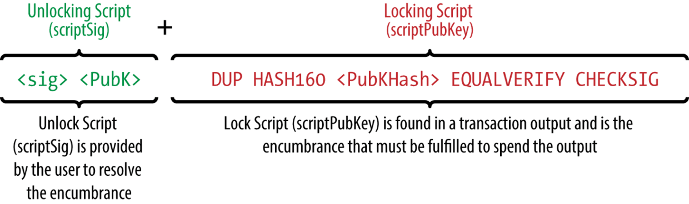

# 交易
比特币交易是比特币系统中最重要的部分。

## 交易的输入输出
比特币交易中的基础构建单元是交易输出。交易输出是比特币不可分割的基本组合，记录在区块上，并被整个网络识别为有效。比特币完整节点跟踪所有可找到的和可使用的输出，称为“未花费的交易输出”（unspent transaction outputs），即UTXO。所有UTXO的集合被称为UTXO集，目前有数百万个UTXO。当新的UTXO被创建，UTXO集就会变大，当UTXO被消耗时，UTXO集会随着缩小。每一个交易都代表UTXO集的变化（状态转换）。

###  交易输出
UTXO在UTXO集（UTXOset）中被每一个全节点比特币客户端追踪。新的交易从UTXO集中消耗（花费）一个或多个输出。

交易输出包含两部分：

- 一定量的比特币，面值为“聪”（satoshis），是最小的比特币单位；
- 确定花费输出所需条件的加密难题（cryptographic puzzle）
> 这个加密难题也被称为锁定脚本(locking script), 见证脚本(witness script), 或脚本公钥 (scriptPubKey)。
```
"vout": [
  {
    "value": 0.01500000,
    "scriptPubKey": "OP_DUP OP_HASH160 ab68025513c3dbd2f7b92a94e0581f5d50f654e7 OP_EQUALVERIFY OP_CHECKSIG"
  },
  {
    "value": 0.08450000,
    "scriptPubKey": "OP_DUP OP_HASH160 7f9b1a7fb68d60c536c2fd8aeaa53a8f3cc025a8 OP_EQUALVERIFY OP_CHECKSIG",
  }
]
```

## 交易输入
交易输入将UTXO（通过引用）标记为将被消费，并通过解锁脚本提供所有权证明。

要构建一个交易，一个钱包从它控制的UTXO中选择足够的价值来执行被请求的付款。有时一个UTXO就足够，其他时候不止一个。对于将用于进行此付款的每个UTXO，钱包将创建一个指向UTXO的输入，并使用解锁脚本解锁它。

交易输入是一个名为vin的数组（列表）：
```
"vin": [
  {
    "txid": "7957a35fe64f80d234d76d83a2a8f1a0d8149a41d81de548f0a65a8a999f6f18",
    "vout": 0,
    "scriptSig" : "3045022100884d142d86652a3f47ba4746ec719bbfbd040a570b1deccbb6498c75c4ae24cb02204b9f039ff08df09cbe9f6addac960298cad530a863ea8f53982c09db8f6e3813[ALL] 0484ecc0d46f1918b30928fa0e4ed99f16a0fb4fde0735e7ade8416ab9fe423cc5412336376789d172787ec3457eee41c04f4938de5cc17b4a10fa336a8d752adf",
    "sequence": 4294967295
  }
]
```
vin列表中只有一个输入（因为一个UTXO包含足够的值来完成此付款）。输入包含四个元素：

- 一个交易ID，引用包含正在使用的UTXO的交易
- 一个输出索引（vout），用于标识来自该交易的哪个UTXO被引用（第一个为零）
- 一个scriptSig（解锁脚本），满足放置在UTXO上的条件，解锁它用于支出
- 一个序列号

## 交易费
运用费用估算API
```
$ curl https://bitcoinfees.21.co/api/v1/fees/recommended
{"fastestFee":80,"halfHourFee":80,"hourFee":60}
```
## 比特币交易脚本

比特币交易脚本语言，称为脚本，是一种类似Forth的逆波兰表达式的基于堆栈的执行语言。放置在UTXO上的锁定脚本和解锁脚本都以此脚本语言编写。当一笔比特币交易被验证时，每一个输入值中的解锁脚本与其对应的锁定脚本同时（互不干扰地）执行，以确定这笔交易是否满足支付条件。

### 脚本构建（锁定与解锁）
比特币的交易验证引擎依赖于两类脚本来验证比特币交易：锁定脚本和解锁脚本。

锁定脚本是一个放置在输出上面的花费条件：它指定了今后花费这笔输出必须要满足的条件。由于锁定脚本往往含有一个公钥或比特币地址（公钥哈希值），在历史上它曾被称为脚本公钥（scriptPubKey）。由于认识到这种脚本技术存在着更为广泛的可能性，我们将它称为“锁定脚本”（locking script）。在大多数比特币应用程序中，我们所称的“锁定脚本”将以scriptPubKey的形式出现在源代码中。我们还将看到被称为见证脚本（witness script）的锁定脚本，或者更一般地说，它是一个加密难题（cryptographic puzzle）。这些术语在不同的抽象层次上都意味着同样的东西。

解锁脚本是一个“解决”或满足被锁定脚本在一个输出上设定的花费条件的脚本，它将允许输出被消费。解锁脚本是每一笔比特币交易输入的一部分，而且往往含有一个由用户的比特币钱包（通过用户的私钥）生成的数字签名。由于解锁脚本常常包含一个数字签名，因此它曾被称作ScriptSig。在大多数比特币应用的源代码中，ScriptSig便是我们所说的解锁脚本。你也会看到解锁脚本被称作“见证”。在本课程中，我们将它称为“解锁脚本”，用以承认锁定脚本的需求有更广的范围。但并非所有解锁脚本都一定会包含签名。

每一个比特币验证节点会通过同时执行锁定和解锁脚本来验证一笔交易。每个输入都包含一个解锁脚本，并引用了之前存在的UTXO。验证软件将复制解锁脚本，检索输入所引用的UTXO，并从该UTXO复制锁定脚本。然后依次执行解锁和锁定脚本。如果解锁脚本满足锁定脚本条件，则输入有效（请参阅单独执行解锁和锁定脚本部分）。所有输入都是独立验证的，作为交易总体验证的一部分。

> 请注意，UTXO被永久地记录在区块链中，因此是不变的，并且不受在新交易中引用失败的尝试的影响。只有正确满足输出条件的有效交易才能将输出视为“开销来源”，继而该输出将被从未花费的交易输出集（UTXO set）中删除。

下图是最常见类型的比特币交易（P2PKH:对公钥哈希的付款）的解锁和锁定脚本的示例，显示了在脚本验证之前从解锁和锁定脚本的并置产生的组合脚本：



### 脚本执行堆栈
比特币的脚本语言被称为基于堆栈的语言，因为它使用一种被称为堆栈的数据结构。堆栈是一个非常简单的数据结构，可以被视为一叠卡片。栈允许两个操作：push和pop（推送和弹出）。Push（推送）在堆栈顶部添加一个项目。Pop（弹出）从堆栈中删除最顶端的项。栈上的操作只能作用于栈最顶端项目。堆栈数据结构也被称为“后进先出”（Last-In-First-Out）或“LIFO”队列。

脚本语言通过从左到右处理每个项目来执行脚本。数字（数据常量）被推到堆栈上。操作码（Operators）从堆栈中推送或弹出一个或多个参数，对其进行操作，并可能将结果推送到堆栈上。例如，操作码OP_ADD将从堆栈中弹出两个项目，添加它们，并将结果的总和推送到堆栈上。

条件操作码（Conditional operators）对一个条件进行评估，产生一个TRUE或FALSE的布尔结果（boolean result）。例如，OP_EQUAL从堆栈中弹出两个项目，如果它们相等，则推送为TRUE（由数字1表示），否则推送为FALSE（由数字0表示）。比特币交易脚本通常包含条件操作码，以便它们可以产生用来表示有效交易的TRUE结果。

### P2PKH（Pay-to-Public-Key-Hash）
比特币网络处理的大多数交易花费的都是由“付款至公钥哈希”（或P2PKH）脚本锁定的输出，这些输出都含有一个锁定脚本，将输入锁定为一个公钥哈希值，即我们常说的比特币地址。由P2PKH脚本锁定的输出可以通过提供一个公钥和由相应私钥创建的数字签名来解锁（使用）。

例如，我们可以再次回顾一下Alice向Bob咖啡馆支付的案例。Alice下达了向Bob咖啡馆的比特币地址支付0.015比特币的支付指令，该笔交易的输出内容为以下形式的锁定脚本：

```
OP_DUP OP_HASH160 <Cafe Public Key Hash> OP_EQUALVERIFY OP_CHECKSIG
```

### 多重签名

多重签名脚本设置了一个条件，其中N个公钥被记录在脚本中，并且至少有M个必须提供签名来解锁资金。这也称为M-N方案，其中N是密钥的总数，M是验证所需的签名的数量。例如，2/3的多重签名是三个公钥被列为潜在签名人，至少有2个有效的签名才能花费资金。

当前，标准多重签名脚本限制在最多3个公钥，这意味着你可以使用1-1到3-3多重签名，或这个范围的任意组合。3这个数量限制可能会改变，所以，检查IsStandard()函数，看看网络当前接受的是什么值。注意，限制3只应用于标准签名脚本，而不应用于P2SH脚本中包装的多重签名脚本。P2SH签名脚本限制为15个密钥，允许最多15-15多重签名。我们将在后面学习P2SH。

设置M-N多重签名条件的锁定脚本的一般形式是：
```
M <Public Key 1> <Public Key 2> ... <Public Key N> N CHECKMULTISIG
```
M是花费输出所需的签名的数量，N是列出的公钥的总数。 设置2到3多重签名条件的锁定脚本如下所示：
```
2 <Public Key A> <Public Key B> <Public Key C> 3 CHECKMULTISIG
```
上述锁定脚本可由含有签名和公钥的脚本予以解锁：或者由3个存档公钥中的任意2个相一致的私钥签名组合予以解锁。两个脚本组合将形成一个验证脚本：
```
<Signature B> <Signature C> 2 <Public Key A> <Public Key B> <Public Key C> 3 CHECKMULTISIG
```
当执行时，只有当未解锁版脚本与解锁脚本设置条件相匹配时，组合脚本才显示得到结果为真（Ture）。

### P2SH（Pay-to-Script-Hash）
P2SH在2012年被作为一种新型、强大、且能大大简化复杂交易脚本的交易类型而引入。

在第一节课中，我们曾介绍过Mohammed，一个迪拜的电子产品进口商。Mohammed的公司采用比特币多重签名作为其公司会计账簿记账要求。多重签名脚本是比特币高级脚本最为常见的运用之一，是一种具有相当大影响力的脚本。针对所有的顾客支付（即应收账款），Mohammed的公司要求采用多重签名交易。基于多重签名机制，顾客的任何支付都需要至少两个签名才能解锁，一个来自Mohammed，另一个来自其合伙人或拥有备份钥匙的代理人。这样的多重签名机制能为公司治理提供管控便利，同时也能有效防范盗窃、挪用和遗失。最终的脚本非常长：
```
2 <Mohammed's Public Key> <Partner1 Public Key> <Partner2 Public Key> <Partner3 Public Key> <Attorney Public Key> 5 OP_C HECKMULTISIG
```
虽然多重签名十分强大，但其使用起来还是多有不便。基于之前的脚本，Mohammed必须在客户付款前将该脚本发送给每一位客户，而每一位顾客也必须使用特制的能产生客户交易脚本的比特币钱包软件，每位顾客还得学会如何利用脚本来完成交易。

此外，由于脚本可能包含特别长的公钥，最终的交易脚本可能是最初交易脚本长度的5倍之多。额外长度的脚本将给客户造成费用负担。最后，一个长的交易脚本将一直记录在所有节点的内存的UTXO集中，直到该笔资金被使用。采用这种复杂输出脚本使得在实际交易中变得困难重重。

P2SH正是为了解决这一实际难题而被引入的，它旨在使复杂脚本的运用能与直接向比特币地址支付一样简单。在P2SH支付中，复杂的锁定脚本被电子指纹所取代，电子指纹是指密码学中的哈希值。

当一笔交易试图支付UTXO时，要解锁支付脚本，它必须含有与哈希相匹配的脚本。P2SH的含义是，向与该哈希匹配的脚本支付，当输出被支付时，该脚本将在后续呈现。

在P2SH交易中，锁定脚本由哈希运算后的20字节的散列值取代，被称为赎回脚本。因为它在系统中是在赎回时出现而不是以锁定脚本模式出现。
#### P2SH地址
P2SH的另一重要特征是它能将脚本哈希编译为一个地址（其定义见BIP0013/BIP-13）。P2SH地址是基于Base58编码的一个含有20个字节哈希的脚本，就像比特币地址是基于Base58编码的一个含有20个字节的公钥。由于P2SH地址采用5作为前缀，这导致基于Base58编码的地址以“3”开头。例如，Mohammed的脚本，基于Base58编码下的P2SH地址变为“39RF6JqABiHdYHkfChV6USGMe6Nsr66Gzw”。

此时，Mohammed可以将该地址发送给他的客户，这些客户可以采用任何的比特币钱包实现简单支付，就像这是一个比特币地址一样。以“3”为前缀给予客户这是一种特殊类型的地址的暗示，该地址与一个脚本相对应而非与一个公钥相对应，但是它的效果与比特币地址支付别无二致。P2SH地址隐藏了所有的复杂性，因此，运用其进行支付的人将不会看到脚本。
#### P2SH的优点
与直接使用复杂脚本以锁定输出的方式相比，P2SH具有以下特点：

- 在交易输出中，复杂脚本由简短电子指纹取代，使得交易代码变短。
- 脚本能被编译为地址，支付指令的发出者和支付者的比特币钱包不需要复杂工序就可以执行P2SH。
- P2SH将构建脚本的重担转移至接收方，而非发送方。
- P2SH将长脚本数据存储的负担从输出方（存储于UTXO集，影响内存）转移至输入方（存储在区块链里面）。
- P2SH将长脚本数据存储的重担从当前（支付时）转移至未来（花费时）。
- P2SH将长脚本的交易费成本从发送方转移至接收方，接收方在使用该笔资金时必须含有赎回脚本。