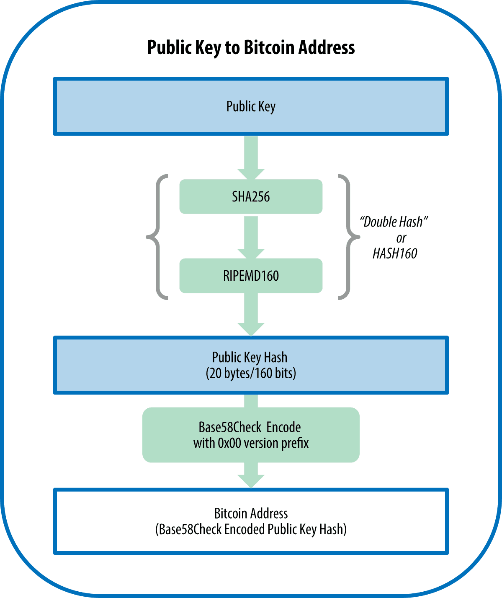
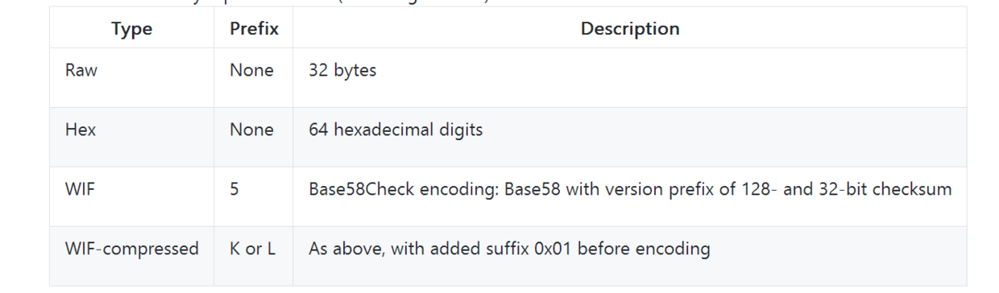

# 比特币密钥和地址
## private key 
以下是一个随机生成的私钥（k），以十六进制格式表示（256位的二进制数，以64位十六进制数显示，每个十六进制数占4位）：
```
1E99423A4ED27608A15A2616A2B0E9E52CED330AC530EDCC32C8FFC6A526AEDD
```

## public key
比特币密钥的生成点都是相同的：
```
{K = k * G}
```
其中k是私钥，G是生成点，在该曲线上所得的点K是公钥

## address
比特币地址可由公钥经过单向的加密哈希算法得到:

以公钥K为输入，计算其SHA256哈希值，并以此结果计算RIPEMD160哈希值，得到一个长度为160位（20字节）的数字：
```
A = RIPEMD160(SHA256(K))
```
公式中，K是公钥，A是生成的比特币地址。



### Base58和Base58Check编码
为了增加防止打印和转录错误的安全性，Base58Check是一种常用在比特币中的Base58编码格式，比特币有内置的检查错误的编码。检验和是添加到正在编码的数据末端的额外4个字节。校验和是从编码的数据的哈希值中得到的，所以可以用来检测并避免转录和输入中产生的错误。使用Base58check编码时，解码软件会计算数据的校验和并和编码中自带的校验和进行对比。二者不匹配则表明有错误产生，那么这个Base58Check的数据就是无效的。一个错误比特币地址就不会被钱包软件认为是有效的地址，否则这种错误会造成资金的丢失。

为了将数据（数字）转换成Base58Check格式，首先我们要对数据添加一个称作“版本字节”的前缀，这个前缀用来识别编码的数据的类型。例如，比特币地址的前缀是0（十六进制是0x00），而对私钥编码时前缀是128（十六进制是0x80）。表4-1会列出一些常见版本的前缀。

接下来，我们计算“双哈希”校验和，意味着要对之前的结果（前缀和数据）运行两次SHA256哈希算法：
```
checksum = SHA256(SHA256(prefix+data))
```
在产生的长32个字节的哈希值（两次哈希运算）中，我们只取前4个字节。这4个字节就作为检验错误的代码或者校验和。校验码会添加到数据之后。

结果由三部分组成：前缀、数据和校验和。这个结果采用之前描述的Base58字母表编码。


## 密钥的格式
公钥和私钥的都可以有多种格式。一个密钥被不同的格式编码后，虽然结果看起来可能不同，但是密钥所编码数字并没有改变。这些不同的编码格式主要是用来方便人们无误地使用和识别密钥。
###  私钥的格式
私钥可以以许多不同的格式表示，所有这些都对应于相同的256位的数字.

如下图,展示了私钥的三种常见格式：



不同的格式用在不同的场景下。十六进制和原始的二进制格式用在软件的内部，很少展示给用户看。WIF格式用在钱包之间密钥的输入和输出，也用于代表私钥的二维码（条形码）。
###  公钥的格式
分为非压缩格式或压缩格式公钥这两种形式
- 前缀04是用来区分非压缩格式公钥，
- 压缩格式公钥是以02或者03开头。

## 加密私钥（BIP0038）
> 私钥必须保密。

BIP0038提出了一个通用标准，使用一个口令加密私钥并使用Base58Check对加密的私钥进行编码，这样加密的私钥就可以安全地保存在备份介质里，安全地在钱包间传输，保持密钥在任何可能被暴露情况下的安全性。这个加密标准使用了AES，这个标准由NIST建立，并广泛应用于商业和军事应用的数据加密。

BIP0038加密方案是：输入一个比特币私钥，通常使用WIF编码过，base58chek字符串的前缀“5”。此外BIP0038加密方案需要一个长密码作为口令，通常由多个单词或一段复杂的数字字母字符串组成。

BIP0038加密方案的结果是一个由base58check编码过的加密私钥，前缀为6P。如果你看到一个6P开头的的密钥，这就意味着该密钥是被加密过，并需要一个口令来转换（解码）该密钥回到可被用在任何钱包WIF格式的私钥（前缀为5）。许多钱包APP现在能够识别BIP0038加密过的私钥，会要求用户提供口令解码并导入密钥。第三方APP，诸如非常好用基于浏览器的[Bit Address](http://bitaddress.org/) ，可以被用来解码BIP00038的密钥。

最通常使用BIP0038加密的密钥用例是纸钱包——一张纸张上备份私钥。只要用户选择了强口令，使用BIP0038加密的私钥的纸钱包就无比的安全，这也是一种很棒的比特币离线存储方式（也被称作“冷存储”）。

## P2SH (Pay-to-Script Hash)和多重签名地址
正如我们所知，传统的比特币地址从数字1开头，来源于公钥，而公钥来源于私钥。虽然任何人都可以将比特币发送到一个1开头的地址，但比特币只能在通过相应的私钥签名和公钥哈希值后才能消费。

以数字3开头的比特币地址是P2SH地址，有时被错误的称为多重签名或多重签名地址。他们指定比特币交易中受益人为哈希的脚本，而不是公钥的所有者。这个特性在2012年1月由BIP0016引进，目前因为BIP0016提供了增加功能到地址本身的机会而被广泛的采纳。

不同于P2PKH交易发送资金到传统1开头的比特币地址，资金被发送到3开头的地址时，需要的不仅仅是一个公钥的哈希值和一个私钥签名作为所有者证明。在创建地址的时候，这些要求会被指定在脚本中，所有对地址的输入都会被这些要求阻隔。

一个P2SH地址从交易脚本中创建，它定义谁能消耗这个交易输出（后面“P2SH（Pay-to-Script-Hash）”一节对此有详细的介绍）。编码一个P2SH地址涉及使用一个在创建比特币地址用到过的双重哈希函数，并且只能应用在脚本而不是公钥：
```
script hash = RIPEMD160(SHA256(script))
```
> script:哈希的脚本
产生的脚本哈希由Base58Check编码前缀为5的版本、编码后得到开头为3的编码地址。

> P2SH不一定是多重签名的交易。虽然P2SH地址通常都是代表多重签名，但也可能是编码其他类型的交易脚本。