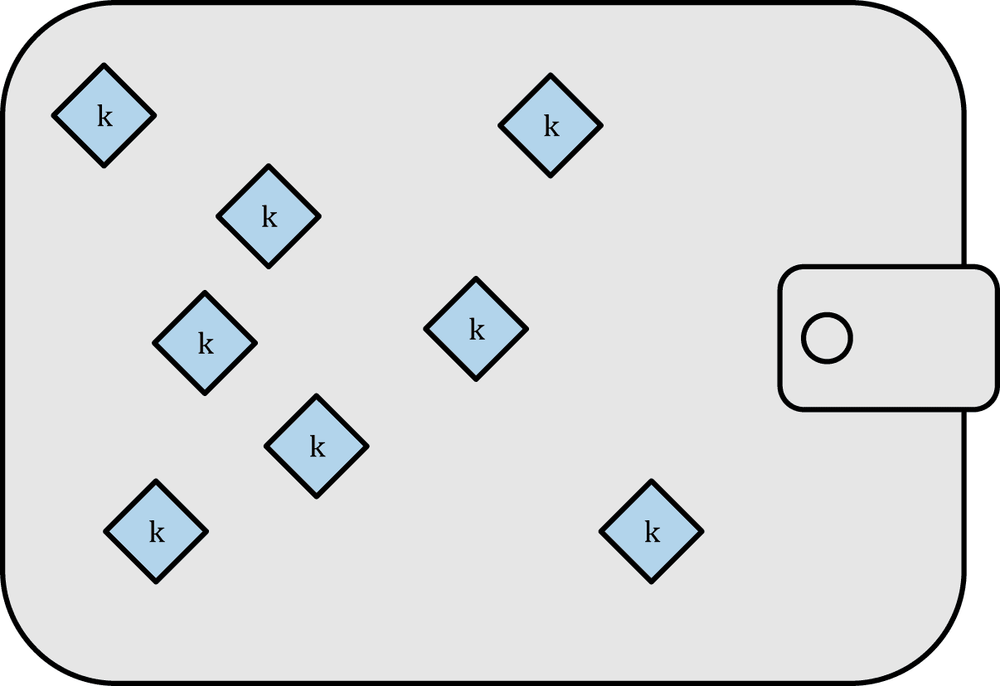
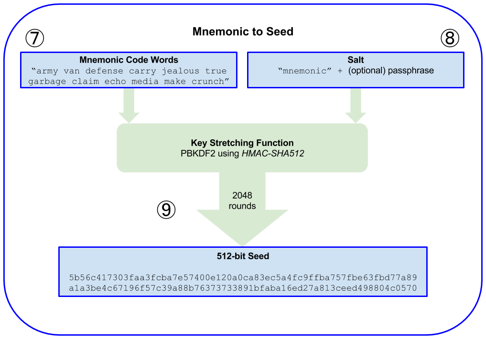

# 钱包

## 钱包
比特币钱包只含有密钥，而不是钱币。每个用户有一个包含多个密钥的钱包。钱包只包含私钥/公钥对的密钥链。用户用密钥签名交易，从而证明他们拥有交易输出（他们的钱币）。钱币以交易输出的形式存储在区块链中（通常记为vout或txout）。

有两种主要类型的钱包，区别在于它们包含的多个密钥是否相互关联。

- 第一种类型是非确定性钱包（nondeterministic wallet），其中每个密钥都是从随机数独立生成的。密钥彼此无关。这种钱包也被称为“Just a Bunch Of Keys（一堆密钥）”，简称JBOK钱包。

- 第二种类型是确定性钱包（deterministic wallet），其中所有的密钥都是从一个主密钥派生出来，这个主密钥即为种子（seed）。该类型钱包中所有密钥都相互关联，如果有原始种子，则可以再次生成全部密钥。确定性钱包中使用了许多不同的密钥推导方法。最常用的推导方法是使用树状结构，称为分级确定性钱包或HD钱包。

确定性钱包由种子衍生创造。为了便于使用，种子被编码为英文单词，也称为助记词。

### 非确定性（随机）钱包
在最早的一批比特币客户端中（ Bitcoin Core，现在称作比特币核心客户端），钱包只是随机生成的私钥集合。这种类型的钱包被称作零型非确定钱包。

这种钱包现在正在被确定性钱包替换，因为它们难以管理、 备份以及导入。随机密钥的缺点就是如果你生成很多私钥，你必须保存它们所有的副本。这就意味着这个钱包必须被经常性 地备份。每一个密钥都必须备份，否则一旦钱包不可访问时，钱包所控制的资金就付之东流。

### 确定性（种子）钱包
确定性，或者“种子”钱包包含通过使用单项离散函数而可从公共的种子生成的私钥。种子是随机生成的数字。这个数字也含有比如索引号码或者可生成私钥的“链码”。在确定性钱包中，种子足够恢复所有的已经产生的私钥，所以只用在初始创建时的一个简单备份就足以搞定。并且种子也足够让钱包导入或者导出。这就很容易允许使用者的私钥在钱包之间轻松转移。

### 分层确定性钱包（HD Wallets (BIP-32/BIP-44)）
确定性钱包被开发成更容易从单个“种子”中生成许多密钥。确定性钱包的最高级形式是通过BIP0032标准定义的HD钱包。HD钱包包含以树状结构衍生的密钥，使得父密钥可以衍生一系列子密钥，每个子密钥又可以衍生出一系列孙密钥，以此类推，无限衍生。

相比较随机（不确定性）密钥，HD钱包有两个主要的优势。
- 第一，树状结构可以被用来表达额外的组织含义。比如当一个特定分支的子密钥被用来接收交易收入并且有另一个分支的子密钥用来负责支付花费。不同分支的密钥都可以被用在企业环境中，这就可以支配不同的分支部门、子公司、具体功能以及会计类别。

- HD钱包的第二个好处是，用户可以创建一系列公钥，而不需要访问对应的私钥。这样，HD钱包就能用在不安全的服务器上，或者用在接收环境中，它为每个交易发布一个不同的公钥。公共钥匙不需要被预先加载或者提前衍生，而在服务器中不需要可用来支付的私钥。
### 种子和助记词（BIP-39）
HD钱包具有管理多个密钥和地址的强大机制。由一系列英文单词生成种子是个标准化的方法，这样易于在钱包中转移、导出和导入，如果HD钱包与这种方法相结合，将会更加有用。这些英文单词被称为助记词，标准由BIP-39定义。

由于比特币钱包技术已经成熟，出现了一些常见的行业标准，使得比特币钱包具备广泛互操作，易于使用，安全和灵活的特性。这些常用的标准是：

- 助记码，基于BIP-39

- HD钱包，基于BIP-32

- 多用途HD钱包结构，基于BIP-43

- 多币种和多帐户钱包，基于BIP-44

## 钱包技术细节
### 助记码词汇（BIP-39）
助记码词汇是英文单词序列代表（编码）用作种子对应所确定性钱包的随机数。单词的序列足以重新创建种子，并且从种子那里重新创造钱包以及所有私钥。在首次创建钱包时，带有助记码的，运行确定性钱包的钱包的应用程序将会向使用者展示一个12至24个词的顺序。单词的顺序就是钱包的备份。它也可以被用来恢复以及重新创造应用程序相同或者兼容的钱包的密钥。助记码词汇可以让使用者复制钱包更容易一些，因为相比较随机数字顺序来说，它们更容易地被阅读和正确抄写。

助记码被定义在比特币的改进建议39中。需要注意的是，BIP-39是助记码标准的一个实施方案。还有一个不同的标准，使用一组不同的单词，是由Electrum钱包使用，并且早于BIP-39。BIP-39由Trezor硬件钱包背后的公司提出，与Electrum的实现不兼容。然而，BIP-39现在已经在数十个可互操作的实践案例中获得了广泛的行业支持，应被视为事实上的行业标准。

BIP-39定义了助记符码和种子的创建，我们在这里描述了九个步骤。为了清楚起见，该过程分为两部分：
- 创建助记词
- 从助记词到种子
### 创建助记词
助记词是由钱包使用BIP-39中定义的标准化过程自动生成的。钱包从熵源开始，增加校验和，然后将熵映射到单词列表：

1. 创建一个128到256位的随机序列（熵）。

2. 提出SHA256哈希前几位（熵长/32），就可以创造一个随机序列的校验和。

3. 将校验和添加到随机序列的末尾。

4. 将序列划分为包含11位的不同部分。
 
5. 将每个包含11位部分的值与一个已经预先定义2048个单词的字典做对应。

6. 生成的有顺序的单词组就是助记码。

表5-2表示了熵数据的大小和助记词的长度之间的关系。

### 从助记词到种子
助记词表示长度为128至256位的熵。通过使用密钥延伸函数PBKDF2，熵被用于导出较长的（512位）种子。将所得的种子用于构建确定性钱包并得到其密钥。

密钥延伸函数有两个参数：助记词和盐。其中盐的目的是增加构建能够进行暴力攻击的查找表的困难度。

创建助记词之后的7-9步是：

7. PBKDF2密钥延伸函数的第一个参数是从步骤6生成的助记符。

8. PBKDF2密钥延伸函数的第二个参数是盐。由字符串常数“助记词”与可选的用户提供的密码字符串连接组成。

9. PBKDF2使用HMAC-SHA512算法，使用2048次哈希来延伸助记符和盐参数，产生一个512位的值作为其最终输出。这个512位的值就是种子。

图5-7显示了从助记词如何生成种子 

## 从种子中创造HD钱包
HD钱包从单个根种子（root seed）中创建，为128到256位的随机数。最常见的是，这个种子是从助记符产生的，如上一节所述。

HD钱包的所有的确定性都衍生自这个根种子。任何兼容HD钱包的根种子也可重新创造整个HD钱包。所以简单的转移HD钱包的根种子就让HD钱包中所包含的成千上百万的密钥被复制，储存导出以及导入。

图5-9展示创建主密钥以及HD钱包的主链代码的过程。

根种子输入到HMAC-SHA512算法中就可以得到一个可用来创造主私钥(m)（master private key(m) ）和主链代码（a master chain code）的哈希。主私钥（m）之后可以通过使用我们先前看到的那个普通椭圆曲线`m * G`过程生来成相对应的主公钥（M）。链代码用于从母密钥中创造子密钥的那个函数中引入熵。

### 私有子密钥的衍生
分层确定性钱包使用CKD（child key derivation)函数去从母密钥衍生出子密钥。

子密钥衍生函数是基于单项哈希函数。这个函数结合了：

- 一个母私钥或者公共钥匙（ECDSA未压缩键）

- 一个叫做链码（256 bits）的种子

- 一个索引号（32 bits）

链码是用来给这个过程引入确定性随机数据的，使得索引不能充分衍生其他的子密钥。因此，有了子密钥并不能让它发现自己的姊妹密钥，除非你已经有了链码。最初的链码种子（在密码树的根部）是用随机数据构成的，随后链码从各自的母链码中衍生出来。

这三个项目（母密钥，链码，索引）相结合并散列可以生成子密钥，如下。

母公共钥匙——链码——以及索引号合并在一起并且用HMAC-SHA512函数散列之后可以产生512位的散列。所得的散列可被拆分为两部分。散列右半部分的256位产出可以给子链当链码。左半部分256位散列以及索引码被加载在母私钥上来衍生子私钥。在图5-10中，我们看到这个说明——索引集被设为0去生产母密钥的第0个子密钥（第一个通过索引）。

改变索引可以让我们延长母密钥以及创造序列中的其他子密钥。比如子0，子1，子2等等。每一个母密钥可以有2,147,483,647 (2^31) 个子密钥。2^31是整个2^32范围可用的一半，因为另一半是为特定类型的推导而保留的，我们稍后讨论。

向密码树下一层重复这个过程，每个子密钥可以依次成为母密钥继续创造它自己的子密钥，直到无限代。