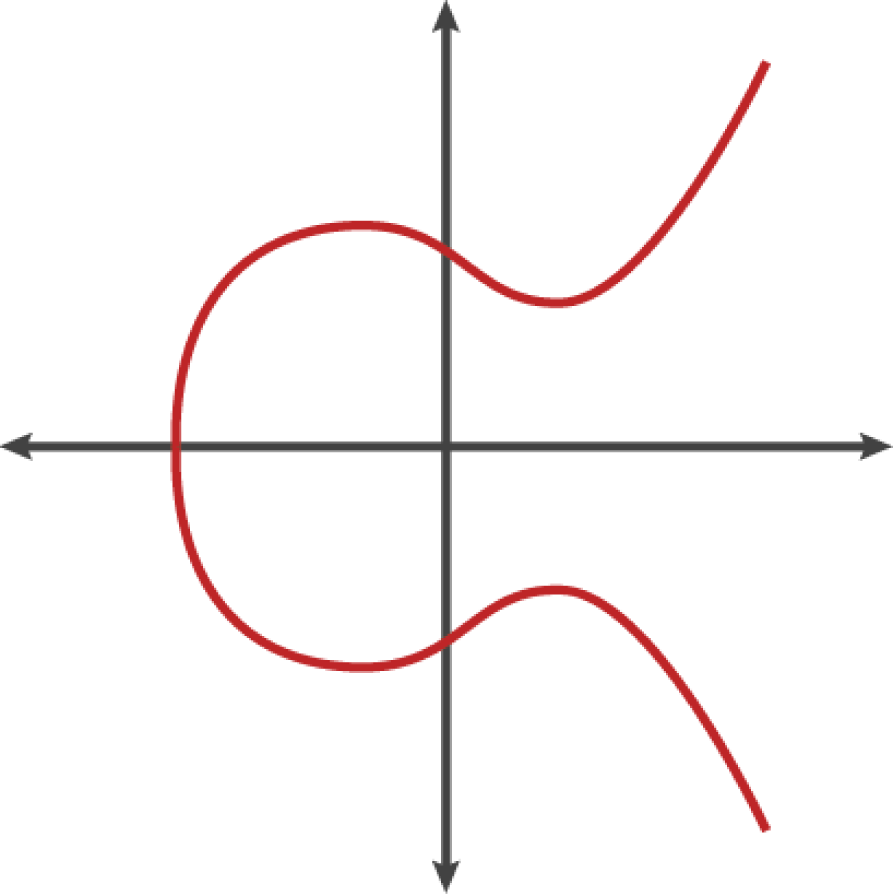
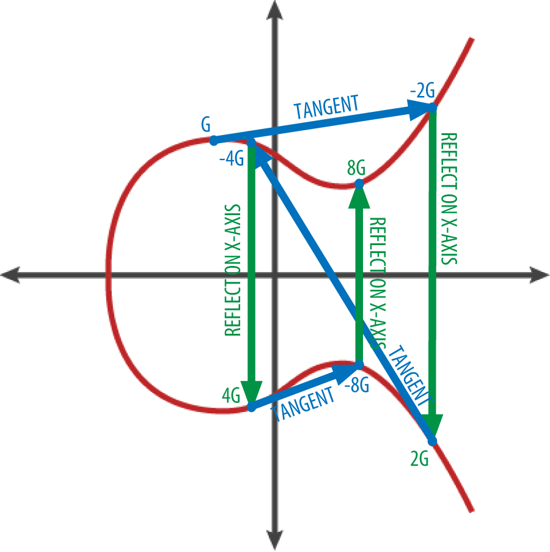

# 椭圆曲线加密
椭圆曲线加密法是一种基于离散对数问题的非对称加密法，可以用对椭圆曲线上的点进行加法或乘法运算来表达。

下图是一个椭圆曲线的示例，类似于比特币所用的曲线。

在椭圆曲线的数学原理中，有一个点被称为“无穷远点”，这大致对应于0在加法中的作用。计算机中，它有时表示为X = Y = 0（虽然这不满足椭圆曲线方程，但可作为特殊情况进行检验）。

还有一个 + 运算符，被称为“加法”，就像小学数学中的实数相加。给定椭圆曲线上的两个点P1和P2，则椭圆曲线上必定有第三点 P3 = P1 + P2。

几何图形中，该第三点P3可以在P1和P2之间画一条线来确定。这条直线恰好与椭圆曲线相交于另外一个地方。此点记为P3'= (x，y)。然后，在x轴做翻折获得P3=(x，-y)。

在椭圆曲线中，点的相加等同于从该点画切线找到与曲线相交的另一点，然后翻折到x轴。

 
## 加法解释    
已知椭圆曲线上两个不同的点P和Q，则这两个点之和R=P+Q可以通过如下操作得到：过P、Q两点做直线L，与椭圆曲线相交于第三点，该点关于X轴的对称点即是所求的R点。

对于加法运算也有另外一种描述：若椭圆曲线上三个点在同一直线上，则他们的和为O，也即是P+Q+R′=O，其中的O是无穷远点或者零点。

在椭圆曲线中，点的相加等同于从该点画切线找到与曲线相交的另一点，然后翻折到x轴。

## 参考资料
* https://www.cnblogs.com/Kalafinaian/p/7392505.html