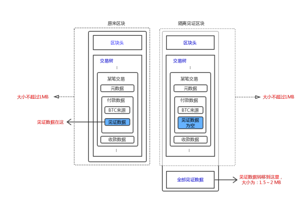

# 隔离见证
## 隔离见证是什么
隔离见证，即 Segregated Witness（简称SegWit），由Pieter Wuille（比特币核心开发人员、Blockstream联合创始人）在2015年12月首次提出。

- 见证（Witness），在比特币里指的是对交易合法性的验证。

    举个例子，Alice发起一笔交易，给Bob支付1个BTC，该笔交易信息由三部分组成： a.元数据：交易信息格式的版本号；交易锁定时间等 b.付款人：Alice用于付款的BTC来源，一般来源于某历史区块上某笔交易的输出（详 见UTXO）；证明Alice拥有该笔交易的输出，即见证（Witness）数据 c.收款人：Bob的收款地址和金额

    可见，见证数据包含在交易信息里头。

- 隔离（Segregated），指的就是把见证数据从交易信息里抽离出来，单独存放。

## 扩容
隔离见证的来源-比特币里的另一个概念--扩容

扩容，指的是增加比特币每秒的交易量。比特币每10分钟左右挖出一个大小小于1MB的区块，每笔交易平均250字节，即每个区块最多放进4000笔交易，这样算下来，比特币每秒处理的交易数不超过7个。对比其它交易平台，PayPal每秒数百笔、Visa每秒数千笔、支付宝能达到每秒数万笔，可见比特币是一个非常低效的交易系统。如果使用人数增多，则会造成比特币的拥堵。

如何解决拥堵呢？

有两种方式，一是简单的增加每个区块的大小，比如将区块大小增加到8M；另一种就是隔离见证+闪电网络啦。

### 扩容方案之一：增加区块大小
如果将区块大小增至8M，简单思考一下，比特币每秒处理的交易数似乎也增加到原来的8倍，即56笔每秒。如果每个区块1个GB，比特币每秒将处理7000笔交易，拥堵问题不就解决了吗？
中本聪可没那么傻，之所以将区块大小设定为1M，是有重要原因的。比特币白皮书的标题为：一种点对点的电子现金系统，相比于传统货币系统，比特币的核心价值在于实现了一种去中心而且安全的货币。如果区块的大小过大，则会危害到比特币的安全模型，作为一种货币应用，这显然是不能令人接受的。

为什么这么说呢？

POW机制的安全基础，是假设一个人的算力无法超过全网算力的50%。如果增大区块，可能一个人的算力超过全网的1/3，就危害到了比特币的安全。举个例子，为了达到每秒7000笔的交易速度，我们把区块的大小增加到1GB： 
- a.假设1GB的区块从产生到广播到全网节点需要10分钟； 
- b.有一个叫Byzantium的节点，拥有的算力超过全网1/3； 
- c.当Byzantium节点挖出一个新区块时，假设该时间点为0秒，那么Byzantium节点 获取新区块的时间点为0秒；根据假设a，全网最后一个获取新区块的节点的获取时间 为600秒，如果获取速度是线性的，全网其它节点获取新区块的平均时间是300秒。 
- d.因为在新区块上挖坑的算力才是有效算力；根据c，全网其它节点的有效算力只剩下 一半，也就是说，全网其它节点的有效算力小于1/3； 
- e.根据b和d，这种情况下，Byzantium节点算力超过全网其它节点算力，如果Byzantium 节点在自己挖出的区块上继续挖矿且不公布广播，则Byzantium节点上没公布的区块 长度，会大于全网区块长度；一旦Byzantium节点公布这些区块，则全网其它节点挖 出的区块全部作废。

可见，区块设计过大，会威胁到比特币的安全。换句话说，比特币区块的大小是有上限的，《On Scaling Decentralized Blockchain》这篇论文指出，在目前的互联网环境下，如果十分钟产生一个区块，区块的大小最好不能超过4MB。这样看来，增加区块大小这种扩容方案，效果就十分有限了。

### 扩容方案之二：隔离见证+闪电网络
隔离见证为什么能扩容呢？先来看看比特币区块的数据结构：

每笔交易平均250字节，见证部分的数据约为150字节，其余部分100字节。如果将见证数据隔离出来，原来1MB空间的区块可以放下10000笔交易（原来为4000笔），交易速度约提升2.5倍。隔离出来的见证数据放到了区块末尾，大小为1.5到2MB，所以隔离见证的整个区块大小为2.5到3MB左右。

可见，隔离见证也是通过增加区块大小来达到扩容的效果。这和上一节讲到的直接增加区块大小相比，有什么新的意义呢？

主要有三方面的意义： 
- a.解决了交易延展性（Transaction Malleability）问题；
- b.为闪电网络铺路 
- c.其它优化

a.交易延展性，指的是一笔交易发起后，交易数据中的见证部分可以被篡改，而且篡改后的交易仍然有效。具体的说，见证的实现依靠一种签名算法，比如椭圆曲线数字签名算法（ECDSA），这种算法下签名（r，s）和签名（r，-s（mod n））都是有效的，所以可以把一种有效见证数据篡改成另一种有效见证数据，该笔交易仍然是有效的。每笔交易有个交易ID，交易ID是对整个交易数据的Hash值，为该笔交易的唯一标识。通过对见证数据的篡改，可以改变Hash值，从而改变该笔交易的唯一标识。

隔离见证通过把见证数据隔离移出，生成交易ID时Hash的数据不包括见证数据，因此也就无法改变交易ID值。

b.通过增加区块大小无法从根本上解决比特币的扩容问题。闪电网络通过在比特币基础上，构建第二层网络，将交易转移到链下的方式，来减轻公链负担，以实现扩容的效果。目前看来，在公链基础上构建协议层网络，是解决公链拥堵问题最合适也是最有前景的方案，有关技术细节在此就不做展开了。感兴趣的同学，可以关注闪电网络、Litex等协议层项目。

隔离见证所带来的改变，为闪电网络的实现提供了一些便利，主要有3点： a.交易延展性的解决，让交易无法被干扰，闪电网络白皮书中提到的“人质状态” （hostage situation），得以避免； b.在通道的生命周期上，隔离见证让闪电网络的通道永久开启更方便实现； c.虽然从理论上系统是安全的，但用户还是要查看区块链中的交易是否广播撤回，防止 交易方的欺诈行为，隔离见证使得这项活动可以外包出去，只要给服务器传送少量信息， 就能代替你完成这一过程。

c.此外，隔离见证给比特币带来了一些细节优化，比如增加了脚本版本（Script Version），使得脚本语言可以以一种向后兼容的方式来发展；签名算法复杂度有了较大优化等等。