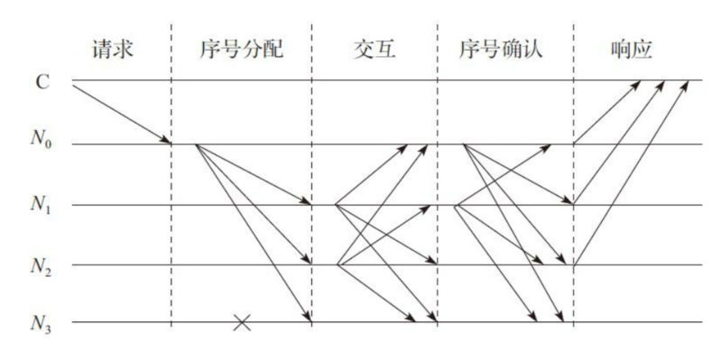
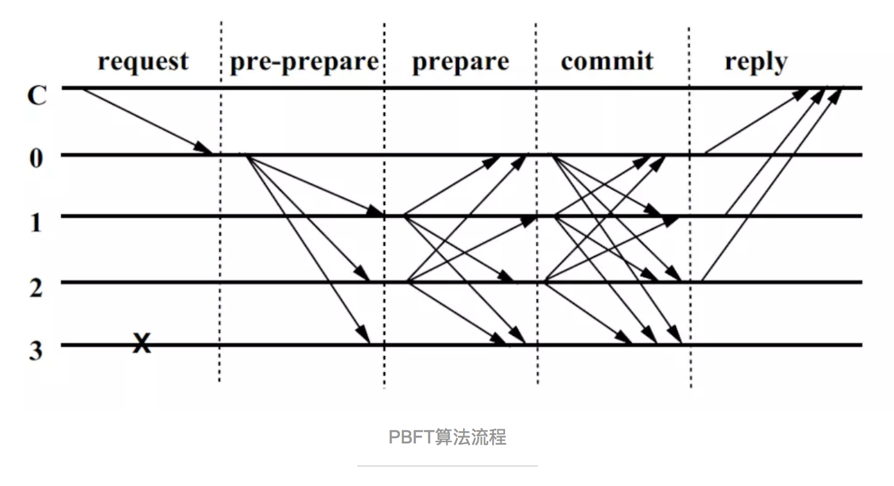

# PBFT

PBFT是Practical Byzantine Fault Tolerance的缩写，意为实用拜占庭容错算法。该算法是Miguel Castro (卡斯特罗)和Barbara Liskov（利斯科夫）在1999年提出来的，解决了原始拜占庭容错算法效率不高的问题，将算法复杂度由指数级降低到多项式级，使得拜占庭容错算法在实际系统应用中变得可行。该论文发表在1999年的操作系统设计与实现国际会议上（OSDI99）。没错，这个Loskov就是提出著名的里氏替换原则（LSP）的人，2008年图灵奖得主。

**PBFT 算法包括三个阶段来达成共识：Pre-Prepare、Prepare 和 Commit。**

**PBFT算法的核心理论是n>=3f+1**
## 分布式架构遭遇的问题
分布式架构会遭遇到以下问题：

1. 异构环境的分布式架构首先可能遇到网络传输问题，比如数据丢失、延迟、重复、乱序。
2. 欺骗攻击和重播攻击
3. 操纵多个失效节点，延迟通讯，制造混乱。

具体到区块链世界，存在同样类似的问题：

区块链是一个分布式账本系统，参与者通过点对点网络连接，所有消息都通过广播的形式来 发送。系统中存在两种角色:普通节点和记账节点。普通节点使用系统来进行转账、交易等操作，并接受账本中的数据;记账节点负责向全网提供记账服务，并维护全局账本。 我们假设在此网络中，消息可能会丢失、损坏、延迟、重复发送，并且接受的顺序与发送的 顺序不一致。此外，节点的行为可以是任意的:可以随时加入、退出网络，可以丢弃消息、 伪造消息、停止工作等，还可能发生各种人为或非人为的故障。

其实这就是拜占庭将军问题。
## 什么是实用拜占庭容错系统

实用拜占庭容错系统是一类“状态机”拜占庭系统（这里的状态机可以理解为“系统状态”，以区块链记账为例，系统每新增一个区块，账本就更新到一个新的状态。前面讲过，拜占庭容错系统是一个强一致性协议，每次记账后系统都会达成新的状态。），要求系统所有节点共同维护一个状态，所有节点采取的行动一致。

实用拜占庭容错系统需要运行三类基本协议：

* 一致性协议：解决如何达成共识
* 检查点协议：类似于操作系统的还原点
* 视图更换协议：系统的每个服务器节点在同样的配置信息下工作，该配置信息被称为“视图”。配置信息由主节点确定，主节点更换，视图也随之变化。

我们主要关注支持系统日常运行的一致性协议。

## PBFT 的 一致性协议

一致性协议至少包含请求（request）、序号分配（pre-prepare）、响应（reply）三个阶段。根据协议设计的不同，可能包含相互交互(prepare) 、序号确认(commit)等阶段。

PBFT系统通常假设故障节点个数为m个，而整个服务节点数为3m+1个。



上图显示了一个简化的 PBFT 的协议通信模式，其中C为客户端，N0~N3为服务节点，N0为主节点，N3为故障节点。协议的节本过程如下：

1. Request：客户端发送请求，激活主节点的服务操作
2. 当主节点接收请求后，启动三阶段的协议以向各从节点广播请求
    * Pre-Prepare：主节点给请求赋值一个序列号n，广播序号分配消息和请求消息，并构造PRE-PREPARE消息给各从节点
    * Prepare：从节点接收PRE-PREPARE消息，并向其他服务节点广播PREPARE消息
    * Commit：各节点对视图内的请求和次序进行验证后，广播COMMIT消息，执行收到的客户端的请求并给客户端以响应
3. Reply：客户端等待来自不同节点的响应，若有m+1个响应相同，则该响应即为运算的结果
> 从全网节点选举出一个主节点（Leader），新区块由主节点负责生成
## 4.算法

PBFT是一种状态机副本复制算法，即服务作为状态机进行建模，状态机在分布式系统的不同节点进行副本复制。每个状态机的副本都保存了服务的状态，同时也实现了服务的操作。将所有的副本组成的集合使用大写字母R表示，使用0到|R|-1的整数表示每一个副本。为了描述方便，假设|R|=3f+1，这里f是有可能失效的副本的最大个数。尽管可以存在多于3f+1个副本，但是额外的副本除了降低性能之外不能提高可靠性。

>PBFT的剧情缓缓展开，首先介绍舞台（view）、演员（replica）和角色（primary、backups）

所有的副本在一个被称为视图（View）的轮换过程（succession of configuration）中运作。在某个视图中，一个副本作为主节点（primary），其他的副本作为备份（backups）。视图是连续编号的整数。主节点由公式p = v mod |R|计算得到，这里v是视图编号，p是副本编号，|R|是副本集合的个数。当主节点失效的时候就需要启动视图更换（view change）过程。Viewstamped Replication算法和Paxos算法就是使用类似方法解决良性容错的。

PBFT算法的狗血剧情如下：
1. 客户端向主节点发送请求调用服务操作
2. 主节点通过广播将请求发送给其他副本
3. 所有副本都执行请求并将结果发回客户端
4. 客户端需要等待f+1个不同副本节点发回相同的结果，作为整个操作的最终结果。

同所有的状态机副本复制技术一样，PBFT对每个副本节点提出了两个限定条件：（1）所有节点必须是确定性的。也就是说，在给定状态和参数相同的情况下，操作执行的结果必须相同；（2）所有节点必须从相同的状态开始执行。在这两个限定条件下，即使失效的副本节点存在，PBFT算法对所有非失效副本节点的请求执行总顺序达成一致，从而保证安全性。

接下去描述简化版本的PBFT算法，忽略磁盘空间不足和消息重传等细节内容。并且，本文假设消息验证过程是通过数字签名方法实现的，而不是更加高效的基于消息验证编码（MAC）的方法。

### 4.1客户端

客户端c向主节点发送<REQUEST,o,t,c>请求执行状态机操作o，这里时间戳t用来保证客户端请求只会执行一次。客户端c发出请求的时间戳是全序排列的，后续发出的请求比早先发出的请求拥有更高的时间戳。例如，请求发起时的本地时钟值可以作为时间戳。

每个由副本节点发给客户端的消息都包含了当前的视图编号，使得客户端能够跟踪视图编号，从而进一步推算出当前主节点的编号。客户端通过点对点消息向它自己认为的主节点发送请求，然后主节点自动将该请求向所有备份节点进行广播。

副本发给客户端的响应为<REPLY,v,t,c,i,r>，v是视图编号，t是时间戳，i是副本的编号，r是请求执行的结果。

客户端等待f+1个从不同副本得到的同样响应，同样响应需要保证签名正确，并且具有同样的时间戳t和执行结果r。这样客户端才能把r作为正确的执行结果，因为失效的副本节点不超过f个，所以f+1个副本的一致响应必定能够保证结果是正确有效的。

如果客户端没有在有限时间内收到回复，请求将向所有副本节点进行广播。如果请求已经在副本节点处理过了，副本就向客户端重发一遍执行结果。如果请求没有在副本节点处理过，该副本节点将把请求转发给主节点。如果主节点没有将该请求进行广播，那么就有认为主节点失效，如果有足够多的副本节点认为主节点失效，则会触发一次视图变更。

本文假设客户端会等待上一个请求完成才会发起下一个请求，但是只要能够保证请求顺序，可以允许请求是异步的。

### 4.2 PBFT算法主线流程（正常情况）

>世界格局

每个副本节点的状态都包含了服务的整体状态，副本节点上的消息日志(message log)包含了该副本节点接受(accepted)的消息，并且使用一个整数表示副本节点的当前视图编号。

>事件的导火索

当主节点p收到客户端的请求m，主节点将该请求向所有副本节点进行广播，由此一场轰轰烈烈的三阶段协议（three-phase protocol）拉开了序幕。在这里，至于什么消息过多需要缓存的情况我们就不管了，这不是重点。

>三个阶段的任务

我们重点讨论预准备（pre-prepare）、准备(prepare)和确认(commit)这三个历史性阶段。预准备和准备两个阶段用来确保同一个视图中请求发送的时序性（即使对请求进行排序的主节点失效了），准备和确认两个阶段用来确保在不同的视图之间的确认请求是严格排序的。

>预准备阶段

在预准备阶段，主节点分配一个序列号n给收到的请求，然后向所有备份节点群发预准备消息，预准备消息的格式为<<PRE-PREPARE,v,n,d>,m>，这里v是视图编号，m是客户端发送的请求消息，d是请求消息m的摘要。

请求本身是不包含在预准备的消息里面的，这样就能使预准备消息足够小，因为预准备消息的目的是作为一种证明，确定该请求是在视图v中被赋予了序号n，从而在视图变更的过程中可以追索。另外一个层面，将“请求排序协议”和“请求传输协议”进行解耦，有利于对消息传输的效率进行深度优化。

>备份节点对预准备消息的态度

只有满足以下条件，各个备份节点才会接受一个预准备消息：

1. 请求和预准备消息的签名正确，并且d与m的摘要一致。
2. 当前视图编号是v。
3. 该备份节点从未在视图v中接受过序号为n但是摘要d不同的消息m。（许仙在这辈子从未见过名字叫白素贞的美貌女子）
4. 预准备消息的序号n必须在水线（watermark）上下限h和H之间。

水线存在的意义在于防止一个失效节点使用一个很大的序号消耗序号空间。

>进入准备阶段

如果备份节点i接受了预准备消息<<PRE-PREPARE,v,n,d>,m>，则进入准备阶段。在准备阶段的同时，该节点向所有副本节点发送准备消息<PREPARE,v,n,d,i>，并且将预准备消息和准备消息写入自己的消息日志。如果看预准备消息不顺眼，就什么都不做。

> 接受准备消息需要满足的条件

包括主节点在内的所有副本节点在收到准备消息之后，对消息的签名是否正确，视图编号是否一致，以及消息序号是否满足水线限制这三个条件进行验证，如果验证通过则把这个准备消息写入消息日志中。

>准备阶段完成的标志

我们定义准备阶段完成的标志为副本节点i将(m,v,n,i)记入其消息日志，其中m是请求内容，预准备消息m在视图v中的编号n，以及2f个从不同副本节点收到的与预准备消息一致的准备消息。每个副本节点验证预准备和准备消息的一致性主要检查：视图编号v、消息序号n和摘要d。

预准备阶段和准备阶段确保所有正常节点对同一个视图中的请求序号达成一致。接下去是对这个结论的形式化证明：如果prepared(m,v,n,i)为真，则prepared(m',v,n,j)必不成立，这就意味着至少f+1个正常节点在视图v的预准备或者准备阶段发送了序号为n的消息m。

>进入确认阶段

当(m,v,n,i)条件为真的时候，副本i将<COMMIT,v,n,D(m),i>向其他副本节点广播，于是就进入了确认阶段。每个副本接受确认消息的条件是：1）签名正确；2）消息的视图编号与节点的当前视图编号一致；3）消息的序号n满足水线条件，在h和H之间。一旦确认消息的接受条件满足了，则该副本节点将确认消息写入消息日志中。（补充：需要将针对某个请求的所有接受的消息写入日志，这个日志可以是在内存中的）。

>接受确认消息需要满足的条件

我们定义确认完成committed(m,v,n)为真得条件为：任意f+1个正常副本节点集合中的所有副本i其prepared(m,v,n,i)为真；本地确认完成committed-local(m,v,n,i)为真的条件为：prepared(m,v,n,i)为真，并且i已经接受了2f+1个确认（包括自身在内）与预准备消息一致。确认与预准备消息一致的条件是具有相同的视图编号、消息序号和消息摘要。

>确认被接受的形式化描述

确认阶段保证了以下这个不变式（invariant）：对某个正常节点i来说，如果committed-local(m,v,n,i)为真则committed(m,v,n)也为真。这个不变式和视图变更协议保证了所有正常节点对本地确认的请求的序号达成一致，即使这些请求在每个节点的确认处于不同的视图。更进一步地讲，这个不变式保证了任何正常节点的本地确认最终会确认f+1个更多的正常副本。

>故事的终结

每个副本节点i在committed-local(m,v,n,i)为真之后执行m的请求，并且i的状态反映了所有编号小于n的请求依次顺序执行。这就确保了所有正常节点以同样的顺序执行所有请求，这样就保证了算法的正确性（safety）。在完成请求的操作之后，每个副本节点都向客户端发送回复。副本节点会把时间戳比已回复时间戳更小的请求丢弃，以保证请求只会被执行一次。

我们不依赖于消息的顺序传递，因此某个副本节点可能乱序确认请求。因为每个副本节点在请求执行之前已经将预准备、准备和确认这三个消息记录到了日志中，这样乱序就不成问题了。（为什么？）

下图展示了在没有发生主节点失效的情况下算法的正常执行流程，其中副本0是主节点，副本3是失效节点，而C是客户端。


### 4.3 垃圾回收

为了节省内存，系统需要一种将日志中的无异议消息记录删除的机制。为了保证系统的安全性，副本节点在删除自己的消息日志前，需要确保至少f+1个正常副本节点执行了消息对应的请求，并且可以在视图变更时向其他副本节点证明。另外，如果一些副本节点错过部分消息，但是这些消息已经被所有正常副本节点删除了，这就需要通过传输部分或者全部服务状态实现该副本节点的同步。因此，副本节点同样需要证明状态的正确性。

在每一个操作执行后都生成这样的证明是非常消耗资源的。因此，证明过程只有在请求序号可以被某个常数（比如100）整除的时候才会周期性地进行。我们将这些请求执行后得到的状态称作检查点（checkpoint），并且将具有证明的检查点称作稳定检查点（stable checkpoint）。

副本节点保存了服务状态的多个逻辑拷贝，包括最新的稳定检查点，零个或者多个非稳定的检查点，以及一个当前状态。写时复制技术可以被用来减少存储额外状态拷贝的空间开销。

检查点的正确性证明的生成过程如下：当副本节点i生成一个检查点后，向其他副本节点广播检查点消息<CHECKPOINT,n,d,i>，这里n是最近一个影响状态的请求序号，d是状态的摘要。每个副本节点都默默地在各自的日志中收集并记录其他节点发过来的检查点消息，直到收到来自2f+1个不同副本节点的具有相同序号n和摘要d的检查点消息。这2f+1个消息就是这个检查点的正确性证明。

具有证明的检查点成为稳定检查点，然后副本节点就可以将所有序号小于等于n的预准备、准备和确认消息从日志中删除。同时也可以将之前的检查点和检查点消息一并删除。

检查点协议可以用来更新水线（watermark）的高低值（h和H），这两个高低值限定了可以被接受的消息。水线的低值h与最近稳定检查点的序列号相同，而水线的高值H=h+k，k需要足够大才能使副本不至于为了等待稳定检查点而停顿。加入检查点每100个请求产生一次，k的取值可以是200。

### 4.4 视图变更，改朝换代

>使用计时器的超时机制触发视图变更事件

视图变更协议在主节点失效的时候仍然保证系统的活性。视图变更可以由超时触发，以防止备份节点无期限地等待请求的执行。备份节点等待一个请求，就是该节点接收到一个有效请求，但是还没有执行它。当备份节点接收到一个请求但是计时器还未运行，那么它就启动计时器；当它不再等待请求的执行就把计时器停止，但是当它等待其他请求执行的时候再次情动计时器。

## PBFT 演示

在 n ≥ 3m + 1 的情況下一致性是可能解決的，其中，n为总节点数，m为恶意节点总数。我们模拟一下PBFT：
n = 4, m = 0

节点 | 得到数据 | 最终结果
----|----------|--------
A | 1111 | 1
B | 1111 | 1
C | 1111 | 1
D | 1111 | 1

n = 4, m = 1

节点 | 得到数据 | 最终结果
----|----------|---------
A | 1110 | 1
B | 1101 | 1
C | 1011 | 1
D | 0111 | 1

n = 4，m = 2


节点 | 得到数据 | 最终结果
-----|---------|--------
A | 1100 | 1
B |	1001 | 1
C |	0011 | 1
D |	0110 | 1

## go 实现简单PBFT
### 编译
```
go build main.go
```
### 测试
新打开 5 个终端
```
./main Apple

./main MS

./main Google

./main IBM

curl -H "Content-Type: applicaton/json" -X POST -d '{"clientID":"ahnhwi","operation":"GetMyName","timestamp":859381532}' http://localhost:1111/req
```