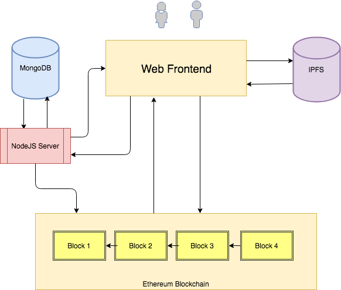
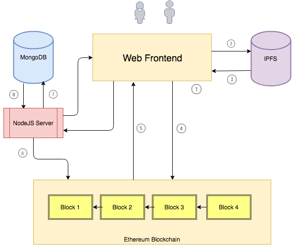

# 拍卖应用_02_项目架构

## 应用架构
在开始实现代码之前，先来看一下在本课程我们将要构建的 Dapp 的架构。

1. Web 前端：web 前端由 HTML，CSS 和 JavaScript 组合而成（大量使用了 web3js）。用户将会通过这个前端应用于区块链，IPFS 和 NodeJS 服务器交互。

2. 区块链：这是应用的核心，所有的代码和交易都在链上。商店里的所有商品，用户的出价和托管合约都在链上。

3. MongoDB：尽管产品存储在区块链上，但是通过查询区块链来显示产品，应用各种过滤（比如只显示某一类的产品，显示即将过期的产品等等）。我们会用 MongoDB 数据库来存储商品信息，并通过查询 MongoDB 来显示产品。

4. NodeJS 服务器：这是后端服务器，前端通过它与区块链通信。我们会给前端暴露一些简单的 API 从数据库中查询和检索产品。

5. IPFS: 当一个用户在商店里上架一个商品，前端会将产品文件和介绍上传到 IPFS，并将所上传文件的哈希存到链上。

架构图：

## 应用流程图
为了理解我们在上一节谈到的那些组件，让我们来看看一下用户上架一个商品的流程是怎样的。

1. 当用户输入产品细节（名字，起价，图片，描述信息等等）并点击保存后，web 前端将会包含一个 HTML 表格。(1)

2. web 前端将产品图片和介绍上传到 IPFS，并返回这些所上传内容的链接。你可以在 这里 查看 IPFS 的链接示例。(2) 和 (3)

3. web 前端然后会调用合约将产品信息和 IPFS 链接存储到链上。当合约成功地将产品加入到区块链，就会触发一个事件。事件包含了所有的产品信息。(4)和(5)

4. NodeJS 服务器用来监听这些事件，当事件被合约触发时，服务器读取时间内容并将产品信息插入到 MongoDB。(6), (7) 和 (8)

流程图：

## 应用实现步骤
1. 我们首先会用 solidity 和 truffle 框架实现合约，将合约部署到 ganache 并通过 truffle 控制台与合约进行交互。

2. 然后我们会学习 IPFS，安装并通过命令行与它交互。

3. 后端实现完成后，我们会构建前端与合约和 IPFS 进行交互。我们也会在前端实现出价和显示拍卖的功能。

4. 我们会安装 MongoDB 并设计存储产品的数据结构。

5. 一旦数据库启动运行，我们会实现 NodeJS 服务端代码，以监听合约事件，并记录向控制台的请求。我们然后会实现向数据库中插入产品的代码。

6. 我们将会更新前端从数据库而不是从区块链查询产品。

7. 我们会实现托管合约以及对应的前端，参与者可以从来向买方/买房释放或撤回资金。