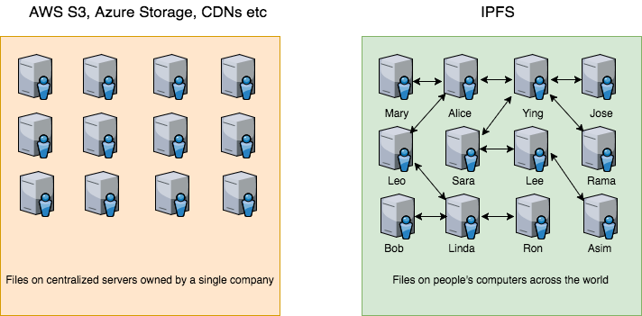

# 拍卖应用_04_IPFS
## IPFS 是什么？
IPFS 表示 Inter Planetary File System, 星际文件系统。IPFS 是一个点对点的分布式文件系统，旨在用同一个文件系统连接所有的计算设备。它也是一个被设计用来创建一个永久的，去中心化方式存储和分享文件的协议。

大多数人将他们的文件存储在他们的本地电脑，或是存储在云端提供商的云端（比如 Droxbox, AWS S3, Azure Cloud 等等）。如果你有一个网站，网站资源可能会有一个 CDN（通过多处分散/复制文件进行更快地访问） 提供。这些都是非常好的解决方案，因为用它们来存储和访问文件可用性很高，并且不会有数据丢失的烦恼。

但是，它们也有一些令人担心的缺点。如果这些服务提供商中断服务（确实会发生），就无法访问你的文件。如果你存储的文件违反了公司章程，它们有权移除/屏蔽这些文件。取决于文件数量，存储成本可能非常高昂。

在 IPFS 的世界里，这些服务提供商将不再是中心化服务器，而是 P2P 网络里的计算机。与任何人都可以运行一个以太坊节点一样，任何人都可以运行一个 IPFS 节点，并加入网络来形成全球的文件系统。文件会在很多节点间复制，几乎不可能出现无法访问文件的情况，并且防审查。现在任何人都可以运行 IPFS 节点，而未来，运行 IPFS 节点的人将会通过 Filecoin 获得奖励。


## 安装
你可以在 https://dist.ipfs.io/#go-ipfs 下载 IPFS 的 go 实现。安装和设置步骤见下。

如果你的安装和设置成功，当运行 ipfs daemon 后，IPFS 服务器应该会启动并在 5001 端口监听。

如果对 Linux 命令行熟悉，你应该知道像 ls，cat 等基本命令。IPFS 也使用类似的命令。如下所示，可以玩一下 IPFS。

IIPFS 也有一个漂亮的 UI 前端，在 http://localhost:5001/webui 进行查看。


```
$ tar xzvf go-ipfs_v0.4.10_linux-386.tar.gz (your file name might be slightly different)
$ cd go-ipfs
$ ./ipfs init
$ ./ipfs config --json API.HTTPHeaders.Access-Control-Allow-Origin '["*"]'
$ ./ipfs daemon
```
> ipfs在本地启动时，默认地址为：http://localhost:8080, 如果要访问本地刚上传的文件，则url为：http://localhost:8080/ipfs/hash

你也可以使用如下命令修改API端口配置


```
./ipfs config Addresses.Gateway /ip4/0.0.0.0/tcp/8080(9001)
./ipfs config Addresses.API /ip4/0.0.0.0/tcp/5001
```
**查看当前结点：**
```
$ cd go-ipfs
$ ./ipfs cat /ipfs/QmYwAPJzv5CZsnA625s3Xf2nemtYgPpHdWEz79ojWnPbdG/readme
```


## 读写文件
IPFS 设置并启动后，让我们来添加一个商品图片和介绍到 IPFS。

从网上下载一个 iPhone 的图片，并创建一个有一些 iPhone 介绍的 HTML 文件。现在将这些文件添加到 IPFS。如果上传成功，会返回给你一个哈希。通过将这个哈希粘贴到 "https://ipfs.io/ipfs" 你就可以看到所上传的文件。

这里是我们所上传到 IPFS 的文件：

`https://ipfs.io/ipfs/QmStqeYPDCTbgKGUwns2nZixC5dBDactoCe1FB8htpmrt1`

`https://ipfs.io/ipfs/QmbLRFj5U6UGTy3o9Zt8jEnVDuAw2GKzvrrv3RED9wyGRk`
> 如果网络不好，可以将ipfs.io改为127.0.0.1:8080,从本地节点访问数据。

在我们的合约里，我们 Product struct ，它里面有 imageLink 和 descLink 字段。

我们会将 IPFS 哈希存储在这些字段里。

```
$ ./ipfs add iphone.png
$ added QmStqeYPDCTbgKGUwns2nZixC5dBDactoCe1FB8htpmrt1 iphone.png
$ ./ipfs add description.html
$ added QmbLRFj5U6UGTy3o9Zt8jEnVDuAw2GKzvrrv3RED9wyGRk description.html
```

