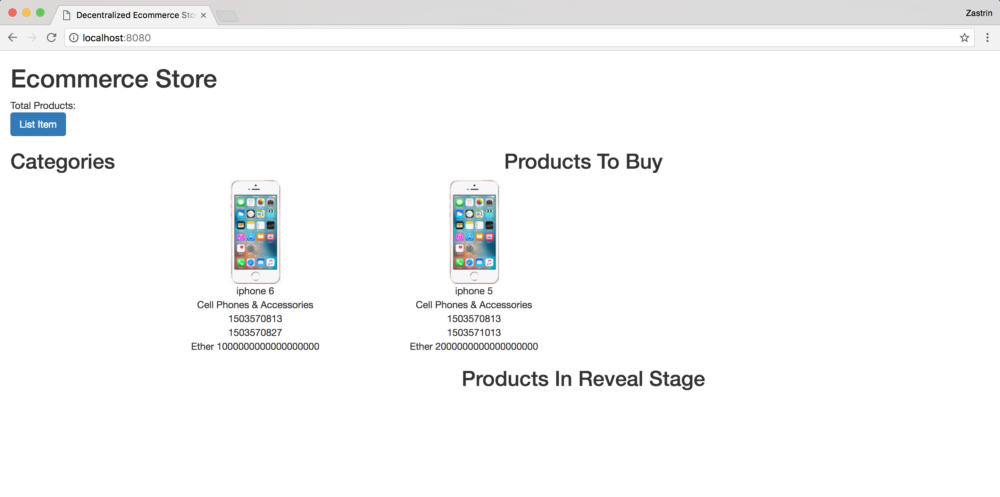
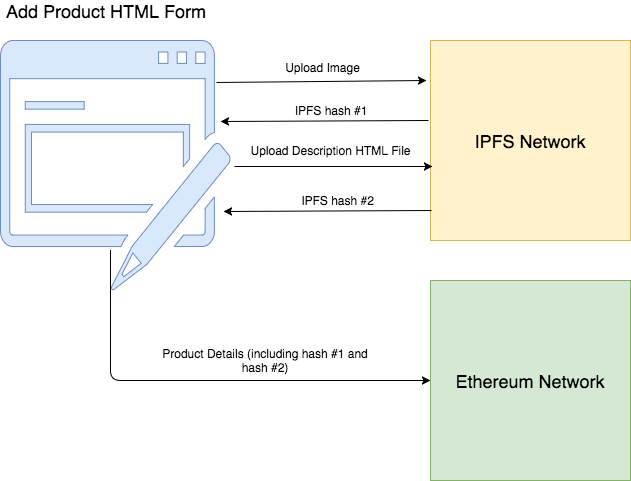
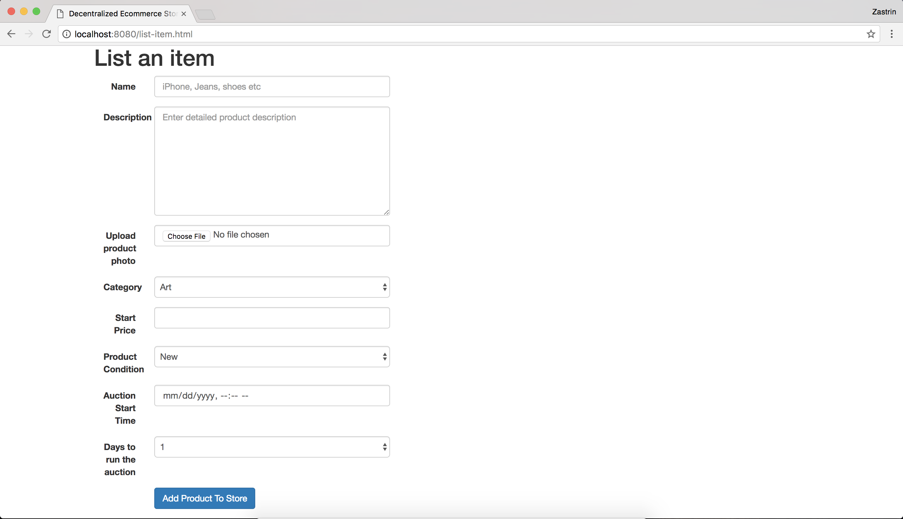

# 拍卖应用_05_Web 产品

## Web界面
我们已经在上面的合约中如何实现了创建产品，如何对商品出价和揭示出价。同时也学习了如何使用 IPFS存储大文件。

接下来，我们会在前端界面实现以下内容：

1. 一个新的网页，我们在上面看到区块链的所有产品。
2. 一个用户用来添加产品到区块链的网页。
3. 第三个页面，用户可以看到产品细节，上面的出价以及揭示他们的出价。

为了通过前端与 IPFS 进行交互，我们是用到一个叫做 ipfs-api 的 JavaScript 库。将这个库添加到 `package.json` 并运行 `npm install`。打开 app/scripts/index.js 并移除所有 MetaCoin（truffle 创建的示例应用）相关的代码。剩下合约和初始化后的 IPFS 空文件类似下面的文件。

`package.json`
```
"devDependencies": {
  ...
  ...
  "ipfs-api": "18.1.1"
}
```
`app/scripts/index.js`
```
// Import the page's CSS. Webpack will know what to do with it.
import "../stylesheets/app.css";

// Import libraries we need.
import { default as Web3} from 'web3';
import { default as contract } from 'truffle-contract'
import ecommerce_store_artifacts from '../../build/contracts/EcommerceStore.json'

var EcommerceStore = contract(ecommerce_store_artifacts);

const ipfsAPI = require('ipfs-api');
const ethUtil = require('ethereumjs-util');

const ipfs = ipfsAPI({host: 'localhost', port: '5001', protocol: 'http'});

window.App = {
 start: function() {
  var self = this;
 },

};

window.addEventListener('load', function() {
 // Checking if Web3 has been injected by the browser (Mist/MetaMask)
 if (typeof web3 !== 'undefined') {
  console.warn("Using web3 detected from external source. If you find that your accounts don't appear or you have 0 MetaCoin, ensure you've configured that source properly. If using MetaMask, see the following link. Feel free to delete this warning. :) http://truffleframework.com/tutorials/truffle-and-metamask")
  // Use Mist/MetaMask's provider
  window.web3 = new Web3(web3.currentProvider);
 } else {
  console.warn("No web3 detected. Falling back to http://localhost:8545. You should remove this fallback when you deploy live, as it's inherently insecure. Consider switching to Metamask for development. More info here: http://truffleframework.com/tutorials/truffle-and-metamask");
  // fallback - use your fallback strategy (local node / hosted node + in-dapp id mgmt / fail)
  window.web3 = new Web3(new Web3.providers.HttpProvider("http://localhost:8545"));
 }

 App.start();
});
```

## 种子区块链

当开发本应用时，为了实现各种用户场景和测试，我们将会不断地将产品添加到区块链。与其通过 truffle 控制台一个一个地添加，我们会创建一个有一些产品的脚本，任何时候我们需要更多的产品时，就运行该脚本。这个脚本你想运行多少次都可以。

创建一个下面所示的种子文件，执行 `truffle exec` 命令来执行该脚本。

这个文件并没有什么特别之处。你已经知道了如何向商店添加产品。在这里你做的所有事情就是脚本化而已，将合约调用放到一个脚本并运行脚本。

你会看到每个产品都有一对很长的哈希。这些就是我们在之前一节上传的图片和描述信息的 IPFS 哈希。的哈希可能会不同，你可以随意改变它或是不管也可以。

`seed.js`

里面的哈希值要注意替换成自己上传上去的图片和描述的哈希。
```
Eutil = require('ethereumjs-util');
EcommerceStore = artifacts.require("./EcommerceStore.sol");
module.exports = function(callback) {
 current_time = Math.round(new Date() / 1000);
 amt_1 = web3.toWei(1, 'ether');
 EcommerceStore.deployed().then(function(i) {i.addProductToStore('iphone 5', 'Cell Phones & Accessories', 'QmStqeYPDCTbgKGUwns2nZixC5dBDactoCe1FB8htpmrt1', 'QmbLRFj5U6UGTy3o9Zt8jEnVDuAw2GKzvrrv3RED9wyGRk', current_time, current_time + 200, 2*amt_1, 0).then(function(f) {console.log(f)})});
 EcommerceStore.deployed().then(function(i) {i.addProductToStore('iphone 5s', 'Cell Phones & Accessories', 'QmStqeYPDCTbgKGUwns2nZixC5dBDactoCe1FB8htpmrt1', 'QmbLRFj5U6UGTy3o9Zt8jEnVDuAw2GKzvrrv3RED9wyGRk', current_time, current_time + 400, 3*amt_1, 1).then(function(f) {console.log(f)})});
 EcommerceStore.deployed().then(function(i) {i.addProductToStore('iphone 6', 'Cell Phones & Accessories', 'QmStqeYPDCTbgKGUwns2nZixC5dBDactoCe1FB8htpmrt1', 'QmbLRFj5U6UGTy3o9Zt8jEnVDuAw2GKzvrrv3RED9wyGRk', current_time, current_time + 14, amt_1, 0).then(function(f) {console.log(f)})}); 
 EcommerceStore.deployed().then(function(i) {i.addProductToStore('iphone 6s', 'Cell Phones & Accessories', 'QmStqeYPDCTbgKGUwns2nZixC5dBDactoCe1FB8htpmrt1', 'QmbLRFj5U6UGTy3o9Zt8jEnVDuAw2GKzvrrv3RED9wyGRk', current_time, current_time + 86400, 4*amt_1, 1).then(function(f) {console.log(f)})});
 EcommerceStore.deployed().then(function(i) {i.addProductToStore('iphone 7', 'Cell Phones & Accessories', 'QmStqeYPDCTbgKGUwns2nZixC5dBDactoCe1FB8htpmrt1', 'QmbLRFj5U6UGTy3o9Zt8jEnVDuAw2GKzvrrv3RED9wyGRk', current_time, current_time + 86400, 5*amt_1, 1).then(function(f) {console.log(f)})});
 EcommerceStore.deployed().then(function(i) {i.addProductToStore('Jeans', 'Clothing, Shoes & Accessories', 'QmZwfUuHwBhwshGfo4HEvvvZwcdrppas156uNRxEVU3VYr', 'QmbLRFj5U6UGTy3o9Zt8jEnVDuAw2GKzvrrv3RED9wyGRk', current_time, current_time + 86400 + 86400 + 86400, 5*amt_1, 1).then(function(f) {console.log(f)})});
 EcommerceStore.deployed().then(function(i) {i.productIndex.call().then(function(f){console.log(f)})});
}
```
`Run the seed script`
```
$ truffle exec seed.js
```

## HTML 设置

当用户访问我们的 Dapp 时，他们第一眼看到的应该是商店里的产品列表。truffle 已经在 app/index.html 创建了一个 index 文件。用下面给出的代码内容替换 index 文件内容。

它是一个框架文件，主要有两块内容，一个用来显示目前活跃并可出价的产品，一个用来显示拍卖已结束处于揭示出价阶段的产品。我们也会支持通过各种目录过滤产品（手机，衣服，礼品卡片等等）

注意 line 8 我们包含了 app.js。与区块链交互的所有逻辑，IPFS 和后端服务器（我们会在下一章实现）渲染都在 app.js。

这里是一个简单的 css 文件，你可以复制并添加到 app/stylesheets/app.css，这样就不用担心样式问题了：https://s3.us-east-2.amazonaws.com/zastrin-course-assets/ecomm.css

`index.html`

```
<!DOCTYPE html>
<html>
<head>
 <title>Decentralized Ecommerce Store</title>
 <link href='https://fonts.proxy.ustclug.org/css?family=Open+Sans:400,700' rel='stylesheet' type='text/css'>
 <link href='https://maxcdn.bootstrapcdn.com/bootstrap/3.3.7/css/bootstrap.min.css' rel='stylesheet' type='text/css'>
 <script src="https://cdnjs.cloudflare.com/ajax/libs/jquery/3.2.1/jquery.min.js"></script>
 <script src="./app.js"></script>
</head>
<body>
 <div class="container-fluid">
  <h1>Ecommerce Store</h1>
  <div>Total Products: <span id="total-products"></span></div>
  <a href="./list-item.html" class="btn btn-primary">List Item</a>
  <div class="row">
   <div class="col-sm-2">
    <h2>Categories</h2>
    <div id="categories">
    </div>
   </div>
   <div class="col-sm-10">
    <div class="row">
     <h2 class="text-center">Products To Buy</h2>
     <div class="row">
      <div class="row" id="product-list">
      </div>
     </div>
    </div>
    <div class="row">
     <h2 class="text-center">Products In Reveal Stage</h2>
     <div class="row">
      <div class="row" id="product-reveal-list">
      </div>
     </div>
    </div>
   </div>
  </div>
 </div>
</body>
</html>
```
> webpack会将文件打包到build文件夹下，所以index.html中会有src="./app.js"，这里的app.js就是打包生成的。
## 渲染产品
让我们来查询区块链并渲染一些产品。步骤如下：

1. 在 start 函数里面，为合约 artifact 设置提供者并调用叫做 renderStore 的函数。

2. 创建一个叫做 renderStore 的函数，它会查询区块链（通过调用 getProduct），并将结果附加到 index.html 里面定义的 product-list div。目前，仅需硬编码通过 id 1 和 2 查询产品即可。这仅仅是一个中间过程，最终会进行改进。

如果你还没有启动前端服务器，运行 `npm run dev `并访问 http://localhost:8080/。

如果一切顺利，你应该看到下面这样的页面


它非常简洁，只有以 `wei` 显示的价格，以 `seconds` 显示的拍卖开始和结束时间等等。

`index.js`
```
window.App = {
 start: function() {
  var self = this;

  EcommerceStore.setProvider(web3.currentProvider);
  renderStore();
 }
};
```
把下面这部分代码添加到 index.js，注意放在 window.App 代码块之外。

在接下来的课程中，我们将会把所有的函数定义添加在 window.App 代码块外，只把函数调用和事件处理放在里面。
```
function renderStore() {
 EcommerceStore.deployed().then(function(i) {
  i.getProduct.call(1).then(function(p) {
   $("#product-list").append(buildProduct(p));
  });
  i.getProduct.call(2).then(function(p) {
   $("#product-list").append(buildProduct(p));
  });
 });
}

function buildProduct(product) {
 let node = $("<div/>");
 node.addClass("col-sm-3 text-center col-margin-bottom-1");
 node.append("");
 node.append("<div>" + product[1]+ "</div>");
 node.append("<div>" + product[2]+ "</div>");
 node.append("<div>" + product[5]+ "</div>");
 node.append("<div>" + product[6]+ "</div>");
 node.append("<div>Ether " + product[7] + "</div>");
 return node;
}
```

## 列出产品
我们已经能够成功地在主页渲染产品。现在让我们开放将产品添加到区块链的功能。记住，我们已经实现了添加产品的合约代码。这一步是将合约集成到 web 前端。

这个特性有点复杂，所以我们来分解步骤：

1. 首先，创建一个简单的 HTML 表单，里面的所有字段与我们的产品相匹配。
2. 使用 IPFS JavaScript api 将产品图片上传到 IPFS。
3. 如果成功，将产品介绍上传到 IPFS。
4. 通过用户在表单中输入的值，还有产品哈希，介绍哈希将产品添加到区块链。



## 添加商品表单
在 /app 目录下创建一个叫做 list-item.html 的新文件，内容如下。它是简单的 HTML 表格，其中的字段是为了手机产品细节。更新 webpack 配置将文件在打包时包含进去。
`webpack.config.js`

```
new CopyWebpackPlugin([
{ from: './app/index.html', to: "index.html" },
{ from: './app/list-item.html', to: "list-item.html" }
])
```

添加到 webpack 配置后重启前端服务器。

如果一切设置正确，访问 http://localhost:8080/list-item.html 应该可以显示如下界面：


`list-item.html`
```
<!DOCTYPE html>
<html>

<head>
    <title>Decentralized Ecommerce Store</title>
    <link href='https://fonts.googleapis.com/css?family=Open+Sans:400,700' rel='stylesheet' type='text/css'>
    <link href='https://maxcdn.bootstrapcdn.com/bootstrap/3.3.7/css/bootstrap.min.css' rel='stylesheet' type='text/css'>
    <script src="https://cdnjs.cloudflare.com/ajax/libs/jquery/3.2.1/jquery.min.js"></script>
    <script src="./app.js"></script>
</head>

<body>
    <div class="container">
        <h1>List an item</h1>
        <div class="container">
            <div class="row">
                <div style="display: none;" class="alert alert-success" id="msg"></div>
                <form class="form-horizontal col-sm-5" id="add-item-to-store">
                    <div class="form-group">
                        <label for="product-name" class="col-sm-2 control-label">Name</label>
                        <div class="col-sm-10">
                            <input type="text" name="product-name" class="form-control" id="product-name" placeholder="iPhone, Jeans, shoes etc"
                                required="required"></input>
                        </div>
                    </div>
                    <div class="form-group">
                        <label for="product-description" class="col-sm-2 control-label">Description</label>
                        <div class="col-sm-10">
                            <textarea class="form-control" name="product-description" rows="8" id="product-description"
                                placeholder="Enter detailed product description" required="required"></textarea>
                        </div>
                    </div>
                    <div class="form-group">
                        <label for="product-image" class="col-sm-2 control-label">Upload product photo</label>
                        <div class="col-sm-10">
                            <input type="file" name="product-image" class="form-control" id="product-image" required="required">
                        </div>
                    </div>
                    <div class="form-group">
                        <label for="product-category" class="col-sm-2 control-label">Category</label>
                        <div class="col-sm-10">
                            <select class="form-control" name="product-category" id="product-category">
                                <option>Art</option>
                                <option>Books</option>
                                <option>Cameras</option>
                                <option>Cell Phones & Accessories</option>
                                <option>Clothing</option>
                                <option>Coins & Paper Money</option>
                                <option>Collectibles</option>
                                <option>Computers/Tablets & Networking</option>
                                <option>Consumer Electronics</option>
                                <option>Crafts</option>
                                <option>DVDs & Movies</option>
                                <option>Entertainment Memorabilia</option>
                                <option>Gift Cards & Coupons</option>
                                <option>Music</option>
                                <option>Musical Instruments & Gear</option>
                                <option>Pet Supplies</option>
                                <option>Pottery & Glass</option>
                                <option>Sporting Goods</option>
                                <option>Stamps</option>
                                <option>Tickets</option>
                                <option>Toys & Hobbies</option>
                                <option>Video Games</option>
                            </select>
                        </div>
                    </div>
                    <div class="form-group">
                        <label for="product-price" class="col-sm-2 control-label">Start Price</label>
                        <div class="col-sm-10">
                            <input type="text" class="form-control" name="product-price" id="product-price" required="required"></input>
                        </div>
                    </div>
                    <div class="form-group">
                        <label for="product-condition" class="col-sm-2 control-label">Product Condition</label>
                        <div class="col-sm-10">
                            <select class="form-control" name="product-condition" id="product-condition">
                                <option value="1">New</option>
                                <option value="2">Used</option>
                            </select>
                        </div>
                    </div>
                    <div class="form-group">
                        <label for="product-auction-start" class="col-sm-2 control-label">Auction Start Time</label>
                        <div class="col-sm-10">
                            <input type="datetime-local" class="form-control" name="product-auction-start" id="product-auction-start"
                                required="required"></input>
                        </div>
                    </div>
                    <div class="form-group">
                        <label for="product-auction-end" class="col-sm-2 control-label">Days to run the auction</label>
                        <div class="col-sm-10">
                            <select class="form-control" name="product-auction-end" id="product-auction-end">
                                <option>1</option>
                                <option>3</option>
                                <option>5</option>
                                <option>7</option>
                                <option>10</option>
                            </select>
                        </div>
                    </div>
                    <div class="form-group">
                        <div class="col-sm-offset-2 col-sm-10">
                            <button type="submit" class="btn btn-primary">Add Product To Store</button>
                        </div>
                    </div>
                </form>
            </div>
        </div>
    </div>
</body>

</html>
```

## 上传到 IPFS
让我们实现上传产品图片和描述文本到 IPFS 必要的函数。

1. 当用户点击 html 中的 file 字段并选择一个文件上传时，触发change() 事件,将图片内容读取到一个缓冲区。

2. 我们使用 JavaScript ipfs 库将图片上传到 IPFS。我们已经在 index.js 初始化了 ipfs 对象。我们使用 ipfs.add 函数将文件上传到 IPFS。将这个调用封装在一个 promise 中，以便于当我们调用 saveImageOnIpfs（见下一节），可以等待上传完毕然后执行其他操作。

3. 与上传图片类似，将产品介绍上传到 IPFS。

注意我们仅仅是定义了将资源上传到 IPFS 的函数。我们会在下一节调用这些函数。
```
window.App = {
 start: function() {
   ......
  var reader;

  $("#product-image").change(function(event) {
    const file = event.target.files[0]
    reader = new window.FileReader()
    reader.readAsArrayBuffer(file)
  });
.....

function saveImageOnIpfs(reader) {
 return new Promise(function(resolve, reject) {
  const buffer = Buffer.from(reader.result);
  ipfs.add(buffer)
  .then((response) => {
   console.log(response)
   resolve(response[0].hash);
  }).catch((err) => {
   console.error(err)
   reject(err);
  })
 })
}

function saveTextBlobOnIpfs(blob) {
 return new Promise(function(resolve, reject) {
  const descBuffer = Buffer.from(blob, 'utf-8');
  ipfs.add(descBuffer)
  .then((response) => {
   console.log(response)
   resolve(response[0].hash);
  }).catch((err) => {
   console.error(err)
   reject(err);
  })
 })
}
```
## 保存产品
保存产品所需的大部分函数都已经被定义了。现在我们需要处理 JavaScript 事件，当用户点击 “Save Product” 时会触发该事件，然后调用相关函数。

保存产品的步骤如下：

1. 调用函数将图片上传到 IPFS。
2. 一旦图片上传完毕，继续上传产品介绍。
3. 最后，将所上传资源的哈希截图，调用合约函数将所有细节保存到区块链。
4. 将代码添加到 index.js 并保存。

现在，填充表单里的所有文本框，并点击 submit 按钮。你的产品已经保存到区块链了！你可以从 truffle 控制台检查 productIndex 的值是否已经加 1。你也可以访问 http://localhost:5001/webui ，点击文件你应该能够看到上传到 IPFS 的图片和描述信息。

如果遇到问题，看一下浏览器的控制台是否有错误。
```
// Remember to include this submit handler inside the start: function so the handler gets registered when the page loads
window.App = {
 start: function() {
......
......
$("#add-item-to-store").submit(function(event) {
   const req = $("#add-item-to-store").serialize();
   let params = JSON.parse('{"' + req.replace(/"/g, '\\"').replace(/&/g, '","').replace(/=/g,'":"') + '"}');
   let decodedParams = {}
   Object.keys(params).forEach(function(v) {
    decodedParams[v] = decodeURIComponent(decodeURI(params[v]));
   });
   saveProduct(reader, decodedParams);
   event.preventDefault();
});
......
......
  }
}
function saveProduct(reader, decodedParams) {
  let imageId, descId;
  saveImageOnIpfs(reader).then(function(id) {
    imageId = id;
    saveTextBlobOnIpfs(decodedParams["product-description"]).then(function(id) {
      descId = id;
       saveProductToBlockchain(decodedParams, imageId, descId);
    })
 })
}

function saveProductToBlockchain(params, imageId, descId) {
  console.log(params);
  let auctionStartTime = Date.parse(params["product-auction-start"]) / 1000;
  let auctionEndTime = auctionStartTime + parseInt(params["product-auction-end"]) * 24 * 60 * 60

  EcommerceStore.deployed().then(function(i) {
    i.addProductToStore(params["product-name"], params["product-category"], imageId, descId, auctionStartTime,
   auctionEndTime, web3.toWei(params["product-price"], 'ether'), parseInt(params["product-condition"]), {from: web3.eth.accounts[0], gas: 440000}).then(function(f) {
   console.log(f);
   $("#msg").show();
   $("#msg").html("Your product was successfully added to your store!");
  })
 });
}
```