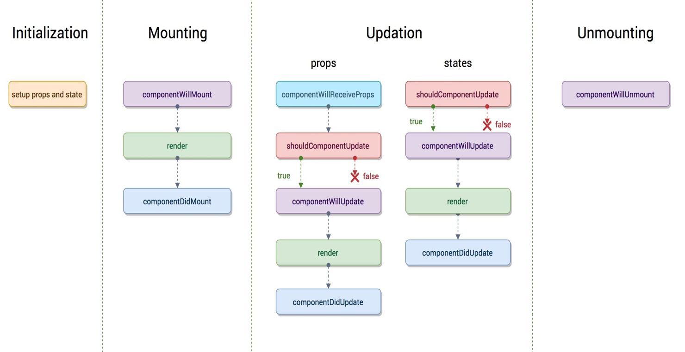
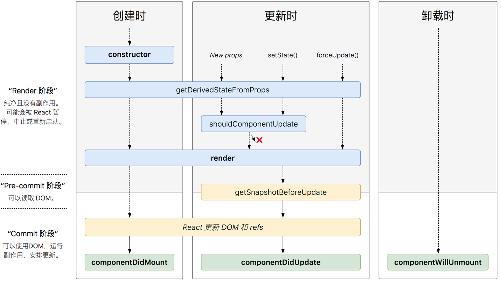

# React 生命周期

## React 生命周期（v16之前）

### 生命周期四阶段主要函数
- 组件初始化(initialization)
    - construtor() 可以给 this.state 赋初值
- 挂载(Mounting)阶段
    - componentWillMount()：在组件挂载到DOM前调用，且只会被调用一次
    - render()：根据组件的 props 和 state 返回一个React元素
    - componentDidMount()：组件挂载到DOM后调用，且只会被调用一次
- 更新(update)阶段
- 卸载(Unmounting)阶段
    - componentWillUnmount()：组件被卸载前调用，可以在这里执行一些清理工作

###   更新(Update)阶段
- 造成组件更新的原因
    - 父组件重新render，子组件将直接跟着重新渲染，无论props是否有变化
    - 组件本身调用setState，无论state有没有变化
- 生命周期函数
    - componentWillReceiveProps(nextProps)：只调用于props引起的组件更新过程中
    - shouldComponentUpdate(nextProps, nextState)
    - componentWillUpdate(nextProps, nextState) ：调用render方法前执行
    - render()
    - componentDidUpdate(prevProps, prevState)：组件更新后被调用
##   React 生命周期（v16.4）

### 新引入的生命周期函数
 - getDerivedStateFromProps(props, state)
    - 在组件创建时和更新时的 render 方法之前调用
    - 它应该返回一个对象来更新状态，或者返回null来不更新任何内容
 - getSnapshotBeforeUpdate(prevProps, prevState)
    - 被调用于render之后，可以读取但无法使用DOM的时候
    - 它使组件可以在更改之前从DOM捕获一些信息（例如滚动位置）
    - 返回的任何值都将作为参数传递给componentDidUpdate
