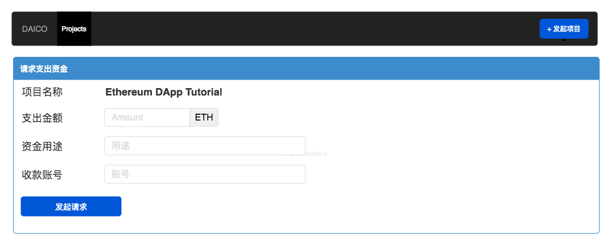

# 众筹DApp的功能设计和原型图
在开始开发众筹 DApp 之前，我们有必要仔细思考下它的主要用户，要实现的关键功能，以及初步的界面设计。
## 功能设计
任何面向用户的应用所有的功能设计都应该围绕着用户去做，对众筹 DApp 来说，用户都有谁？用户都会在这个应用里面做什么？搞清楚这些问题的答案，我们就能列出众筹 DApp 需要实现的核心功能。
- 众筹 DApp 的用户都有谁？最核心的用户就是项目方和投资人；
- 项目方会在众筹 DApp 上做什么？发起项目、请求支出资金、操作资金划转；
- 投资人会在众筹 DApp 上做什么？浏览项目、投资项目、参与项目资金支出的投票
首先，我们可以按照开发经典 WEB 应用的思路来想，如果系统中有用户，是不是需要用户系统？答案是不需要，因为我们架构在以太坊之上，直接让用户使用以太坊账户就行了。这样就要求使用我们系统的用户在浏览器中安装了 Metamask 插件，Metamask 中保存了他们的账户。
经典 WEB 应用的信息架构通常是：列表 --> 详情 --> 交互的模式，这种模式在众筹 DApp 也有很直观的体现，众筹 DApp 中存在两处这种模式的实例：
- 项目列表 --> 项目详情 --> 参与项目投资或直接返回，表现层就对应两个页面； 
- 项目详情 --> 资金支出列表 --> 资金支出详情 --> 投票、资金划转，表现层可以把资金支出列表和资金支出详情以表格的形式放在项目详情中，方便用户预览信息。
至于 DApp 中所呈现信息的来源，我们需要 3 个表单方便项目方和投资人填写和提交：
- 项目创建表单，项目方使用，创建新的众筹项目实例，新实例会追加到项目列表中；
- 资金支出请求创建表单，项目方使用，用于往项目中追加资金支出请求；
- 项目投资表单，投资人使用，用于往项目合约账户转账。
## 原型图
搞清楚核心用户、关键功能、信息架构之后，我们不难画出众筹 DApp 的原型图。原型图只是表征 DApp 开发之后大概的模样，实际开发出来的效果跟原型图可能会有出入。
首先是 DApp 首页，以卡片的形式展示所有项目的列表，为了简化，列表页暂不考虑分页：
 
然后是项目详情页，展示项目详情、投资表单、项目资金支出历史：
  
接下来是项目创建表单：
  
最后是资金支出请求创建表单：
  
不同页面之间的跳转关系完全按照以上信息架构，以及原型图上各种按钮的定义。
