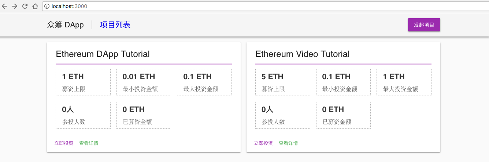

在DApp中渲染合约数据：项目列表页
9.1 封装通用的合约实例
我们之前采用的获取合约实例的代码，一般采用的是以下形式（注意这里是web3 v1.0.0版本的写法）：
new web3.eth.Contract(interface)
		.deploy({data: byteCode})
		.send({from: accounts[0], gas: 1000000})
而我们的代码中，ProjectList 智能合约在项目列表页和项目创建页都会使用，所以有必要将其封装成可复用的代码，在 libs 目录下新建 projectList.js，输入如下代码：
import web3 from './web3';
import ProjectList from '../compiled/ProjectList.json';
import address from '../address.json';

const contract = new web3.eth.Contract(JSON.parse(ProjectList.interface), address);

export default contract;
类似的，Project 合约会存在很多实例，需要有基于地址去生成合约实例的可复用函数，在 libs 目录下新建 project.js，输入如下代码：
import web3 from './web3';
import Project from '../compiled/Project.json';

const getContract = address => 
		new web3.eth.Contract(JSON.parse(Project.interface), address);

export default getContract;
9.2 使用脚本添加测试数据
把合约数据渲染到 DApp 之前，还需要准备一些测试数据，我们通过Node.js脚本来实现。脚本文件是 scripts/sample.js，通过代码调用 ProjectList 合约的 createProject 接口添加测试数据。
const Web3 = require('web3');
const ProjectList = require('../compiled/ProjectList.json');
const address = require('../address.json');
const web3 = new Web3(new 
	Web3.providers.HttpProvider('http://localhost:8545'));
const contract = new web3.eth.Contract(JSON.parse(ProjectList.interface), 
			address);

(async () => { 
const accounts = await web3.eth.getAccounts();
console.log(accounts);
const projects = [
{
description: 'Ethereum DApp Tutorial',
minInvest: web3.utils.toWei('0.01', 'ether'),
maxInvest: web3.utils.toWei('0.1', 'ether'),
goal: web3.utils.toWei('1', 'ether'),
},
{
description: 'Ethereum Video Tutorial',
minInvest: web3.utils.toWei('0.1', 'ether'),
maxInvest: web3.utils.toWei('1', 'ether'),
goal: web3.utils.toWei('5', 'ether')
},
];
console.log(projects);

const owner = accounts[0];
const results = await Promise.all(projects.map(x =>
contract
.methods
.createProject(x.description, x.minInvest, x.maxInvest, x.goal)
.send({ from: owner, gas: '1000000' })
)
);
console.log(results);
})();
9.3 获取并渲染项目列表
有了测试数据，接下来就需要在前端获取数据并在页面上渲染出来。可以修改pages/index.js:
import React from 'react';
import web3 from '../libs/web3';
import { Button } from '@material-ui/core';
import { Grid, Button, Typography, Card, CardContent, CardActions } from '@material-ui/core';
import { Link } from '../routes';
import ProjectList from '../libs/projectList';
import withRoot from '../libs/withRoot';
import Layout from '../components/Layout';

class Index extends React.Component {
constructor(props){
    super(props);
    this.state = {
    accounts: []
};
}
async componentDidMount(){
    const accounts = await web3.eth.getAccounts();
const balances = await Promise.all(accounts.map(x => web3.eth.getBalance(x)));
    console.log(accounts);
    this.setState({ accounts });
}

static async getInitialProps({ req }) {
const projects = await ProjectList.methods.getProjects().call();
return { projects };
}

render() {
const { accounts } = this.state;
const { projects } = this.props;
return (
    <Layout>
        <ul>
          {accounts.map(x => (
  <li key={x.account}>
    {x.account} => {web3.utils.fromWei(x.balance, 'ether')}
</li>
))}
        </ul>
        <Grid container spacing={16}>
            {projects.map(this.renderProject)}
</Grid>
</Layout>
}

renderProject(project) {
return (
<Grid item md={6} key={project}>
<Card>
<CardContent>
<Typography gutterBottom variant="headline" component="h2">
{project}
</Typography>
<Typography component="p">{project}</Typography>
</CardContent>
<CardActions>
<Link route={`/projects/${project}`}>
<Button size="small" color="primary">
立即投资
</Button>
</Link>
<Link route={`/projects/${project}`}>
<Button size="small" color="secondary">
查看详情
</Button>
</Link>
</CardActions>
</Card>
</Grid>
);
}
}
export default withRoot(Index);
改动里面有几点需要注意： 
	用 getInitialProps 获取项目地址列表，getInitialProps 是 Next.js 中服务端渲染时获取数据的基本方法；
	用 Card 组件实现项目卡片，Card 是 Material UI 中的组件，用来展示项目列表非常合适；
	用 next-routes 里面的 Link 组件实现路由跳转，目前详情页还没开发，点击跳转会 404。
由于ProjectList 合约里面只存储了所有 Project 合约实例的地址，所以目前我们在卡片上显示的信息很少。如果需要每个 Project 合约实例的基本信息，如标题，名称、投资数额限制等，可以在 Node.js 里循环所有的 Project 合约地址，创建合约实例，再调用他们的各个方法，但这将会产生大量的网络请求，会有比较严重的性能问题，因此，我们需要对 Project 合约稍作改进，增加一个获取项目基本信息的接口，代码如下：
Project.sol
function getSummary() public view returns (string, uint, uint, uint, uint, uint, uint, address) {
return (
description,
minInvest,
maxInvest,
goal,
address(this).balance,
investorCount,
payments.length,
owner
);
}
新增的 getSummary 接口会返回项目说明、投资金额限制、管理员地址、账户余额、资金支出条目、投资者数量等信息。
9.4 改进项目列表数据
接下来需要把 getSummary 接口返回的数据渲染在项目卡片中，继续修改 pages/index.js，调用 Project 合约的 getSummary 方法：
import React from 'react';
import web3 from '../libs/web3';
import { Grid, Button, Typography, Card, CardContent, CardActions } from '@material-ui/core';
import { Link } from '../routes';
import Project from '../libs/project';
import ProjectList from '../libs/projectList';
import withRoot from '../libs/withRoot';
import Layout from '../components/Layout';

class Index extends React.Component {
static async getInitialProps({ req }) {
const projects = await ProjectList.methods.getProjects().call();
const addressList = await ProjectList.methods.getProjects().call();
const summaryList = await Promise.all(
addressList.map(address =>
Project(address)
.methods.getSummary()
.call()
)
);
console.log({ summaryList });

const projects = addressList.map((address, i) => {
const [description, minInvest, maxInvest, goal, balance, investorCount, paymentCount, owner] = Object.values(
summaryList[i]
);
return {
address,
description,
minInvest,
maxInvest,
goal,
balance,
investorCount,
paymentCount,
owner
};
});
console.log(projects);

return { projects };
}

render() {
const { projects } = this.props;
return (
    <Layout>
        <Grid container spacing={16}>
            {projects.map(this.renderProject)}
</Grid>
</Layout>
}

renderProject(project) {
return (
<Grid item md={6} key={project.address}>
<Card>
<CardContent>
<Typography gutterBottom variant="headline" component="h2">
{project.description}
</Typography>
<Typography component="p">{project.address}</Typography>
</CardContent>
<CardActions>
<Link route={`/projects/${project.address}`}>
<Button size="small" color="primary">
立即投资
</Button>
</Link>
<Link route={`/projects/${project.address}`}>
<Button size="small" color="secondary">
查看详情
</Button>
</Link>
</CardActions>
</Card>
</Grid>
);
}
}
export default withRoot(Index);
需要注意的是，getSummary 接口返回的数据格式是一个数组，可以看作一个Result对象，对象里面使用数字为键，对应的值是合约源代码中声明的值，所以需要使用 Object.values 把值取出来，再使用解构赋值。
在getInitialProps中完成数据提取部分之后，在renderProject渲染部分将对应的值写入。
到目前为止，我们的页面和原型图还差两点没实现：
	募资进度条，可以直接使用 Material UI 中的 LinearProgress 组件来实现；
	项目基本信息小方块，小方块可以抽成公用的组件，方便在项目详情页、列表页间复用；
继续对 pages/index.js 做如下修改，增加进度条展示，并引入一个叫做InfoBlock的子组件来展示项目中的每个参数：
...
import { Grid, Button, Typography, Card, CardContent, CardActions, LinearProgress } from '@material-ui/core';
...
import InfoBlock from '../components/InfoBlock';

class Index extends React.Component {
...
renderProject(project) {
const progress = project.balance / project.goal * 100;
return (
...
<Typography gutterBottom variant="headline" component="h2">
{project.description}
</Typography>
<LinearProgress style={{ margin: '10px 0' }} color="primary" variant="determinate" value={progress} />
<Typography component="p">{project.address}</Typography>
<Grid container spacing={16}>
<InfoBlock title={`${web3.utils.fromWei(project.goal, 'ether')} ETH`} description="募资上限" />
<InfoBlock title={`${web3.utils.fromWei(project.minInvest, 'ether')} ETH`} description="最小投资金额" />
<InfoBlock title={`${web3.utils.fromWei(project.maxInvest, 'ether')} ETH`} description="最大投资金额" />
<InfoBlock title={`${project.investorCount}人`} description="参投人数" />
<InfoBlock title={`${web3.utils.fromWei(project.balance, 'ether')} ETH`} description="已募资金额" />
</Grid>
...
然后在 components 目录下新建 InfoBlock.js，输入如下代码：
import React from 'react';
import { Grid, Typography } from '@material-ui/core';
import { withStyles } from '@material-ui/core/styles';
const styles = {
container: {
padding: '0.5em 1em',
border: '1px dotted #AAA'
},
title: {
color: '#333',
marginBottom: '10px',
fontWeight: 'bold'
},
description: {
margin: 0,
color: '#666'
}
};

class InfoBlock extends React.Component {
render() {
const { classes, title, description } = this.props;
return (
<Grid item md={4}>

<Typography variant="title" color="inherit" className={classes.title}>
{title}
</Typography>
<Typography variant="paragraph" color="inherit" className={classes.description}>
{description}
</Typography>

</Grid>
);
}
}
export default withStyles(styles)(InfoBlock);
改完代码之后，先npm run test保证合约代码正确，然后npm run deploy部署最新的合约，最后重启npm run dev，查看项目列表页应如下所示：

