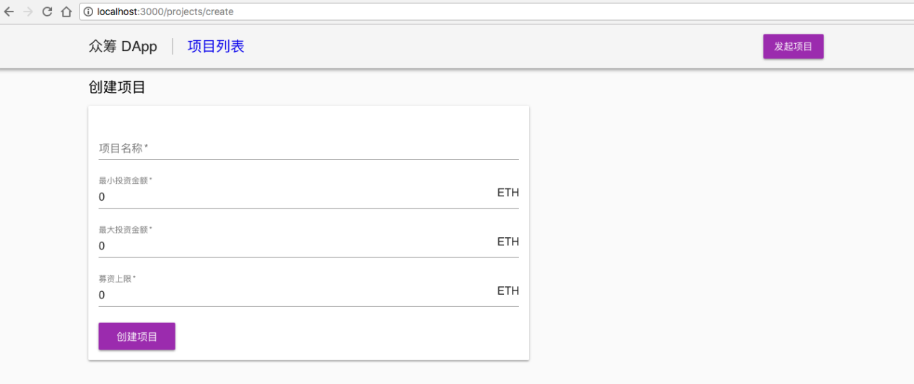

从前端向合约提交数据：项目创建页
从智能合约获取数据并渲染在DApp页面中的流程我们已经很熟悉，接下来就是从 DApp 向智能合约提交数据，即项目创建页的实现。
10.1 项目创建页入口
之前在Header中已经有项目创建的按钮，但是没有加上链接跳转，修改 components/Header.js加上入口：
import React from 'react';
import { AppBar, Toolbar, Typography, Button } from '@material-ui/core';
import { withStyles } from '@material-ui/core/styles';
import { Link } from '../routes';
...
class Header extends React.Component {
render() {
const { classes } = this.props;
return (
...
<Link route="/projects/create">
<Button variant="raised" color="primary">
发起项目
</Button>
</Link>
...

10.2 项目创建表单
然后我们需要在 pages 目录下创建文件 pages/projects/create.js，用来展示创建项目的表单，内容如下：
import React from 'react';
import { Grid, Button, Typography, TextField, Paper } from '@material-ui/core';
import { Link } from '../../routes';
import web3 from '../../libs/web3';
import ProjectList from '../../libs/projectList';
import withRoot from '../../libs/withRoot';
import Layout from '../../components/Layout';

class ProjectCreate extends React.Component {
constructor(props) {
super(props);
this.state = {
description: '',
minInvest: 0,
maxInvest: 0,
goal: 0
};
}
getInputHandler(key) {
return e => {
console.log(e.target.value);
this.setState({ [key]: e.target.value });
};
}
render() {
    return (
    <Layout>
<Typography variant="title" color="inherit">
            创建
</Typography>
<Paper style={{ width: '60%', padding: '15px', marginTop: '15px' }}>
<form noValidate autoComplete="off" style={{ marginBottom: '15px' }}>
<TextField
fullWidth 
required 
id="description" 
label="项目名称" 
value={this.state.description} 
onChange={this.getInputHandler('description')} 
margin="normal"
/>
<TextField
fullWidth 
required 
id="minInvest" 
label="最小投资金额" 
value={this.state.minInvest} 
onChange={this.getInputHandler('minInvest')} 
margin="normal"
InputProps={{ endAdornment: 'ETH' }}
/>
<TextField
fullWidth 
required 
id="maxInvest" 
label="最大投资金额" 
value={this.state.maxInvest} 
onChange={this.getInputHandler('maxInvest')} 
margin="normal"
InputProps={{ endAdornment: 'ETH' }}
/>
<TextField
fullWidth 
required 
id="goal" 
label="募资上限" 
value={this.state.goal} 
onChange={this.getInputHandler('goal')} 
margin="normal"
InputProps={{ endAdornment: 'ETH' }}
/>
                </form>
<Button variant="raised" size="large" color="primary">
  创建项目
</Button>
</Paper>
</Layout>
);
}
}
export default withRoot(ProjectCreate);
刷新浏览器，能看到项目创建表单如下：

接下来我们需要给表单提交添加对应的代码，具体代码改动如下：
create.js
import React from 'react';
import { Grid, Button, Typography, TextField, Paper, CircularProgress } from '@material-ui/core';
...
class ProjectCreate extends React.Component {
constructor(props) {
super(props);
this.state = {
description: '',
minInvest: 0,
maxInvest: 0,
goal: 0,
errmsg: '',
loading: false
};
this.onSubmit = this.createProject.bind(this);
}
...
async createProject() {
const { description, minInvest, maxInvest, goal } = this.state;
console.log(this.state);

// filed validation check
if (!description) {
return this.setState({ errmsg: '项目名称不能为空' });
}		
if (minInvest <= 0) {
return this.setState({ errmsg: '项目最小投资金额必须大于0' });
}
if (maxInvest <= 0) {
return this.setState({ errmsg: '项目最大投资金额必须大于0' });
}
if (parseInt(maxInvest) < parseInt(minInvest)) {
return this.setState({ errmsg: '项目最小投资金额必须小于最大投资金额' });
}
if (goal <= 0) {
return this.setState({ errmsg: '项目募资上限必须大于0' });
}

const minInvestInWei = web3.utils.toWei(minInvest, 'ether');
const maxInvestInWei = web3.utils.toWei(maxInvest, 'ether');
const goalInWei = web3.utils.toWei(goal, 'ether');
try {
this.setState({ loading: true });

// get accounts
const accounts = await web3.eth.getAccounts();
const owner = accounts[0];

// create project
const result = await ProjectList.methods
.createProject(description, minInvestInWei, maxInvestInWei, goalInWei)
.send({ from: owner, gas: '5000000' });

this.setState({ errmsg: '项目创建成功' });
console.log(result);
} catch (err) {
console.error(err);
this.setState({ errmsg: err.message || err.toString() });
} finally {
this.setState({ loading: false });
}
}
render() {
    return (
    <Layout>
...
<Button variant="raised" size="large" color="primary" onClick={this.onSubmit} >
  {this.state.loading ? <CircularProgress color="secondary" size={24} /> : '创建项目'}
</Button>
{!!this.state.errmsg && (
<Typography component="p" style={{ color: 'red' }}>
{this.state.errmsg}
</Typography>
)}
</Paper>
</Layout>
...
关于改动有几个关键点需要说明:
	因为 createProject 是 Transaction 类型的接口，耗时通常比较长，DApp 在交互上需要给用户恰当的提示，可以借助 Material UI 中的 CircularProgress 来实现；
	表单中填写的数值型字段的单位是 ether，但是调用 createProject 接口需要传入 wei，注意参数的单位转换；
	在出错时需要给用户提示，所以设置了 errmsg 状态变量来显示错误提示。
另外注意JSX的语法表达，render中布尔值，NULL和Undefined都是合法的子元素，但它们都不会被渲染，所以可以用 !!this.state.errmsg && < Typography > 来表示：当errmsg不为空字符串时，渲染后面的Typography元素。
保存代码后，重新启动server，可以测试 DApp 的项目创建功能。当我们在浏览器中向智能合约发起交易时，会弹出 Metamask 的交易确认界面，我们需要在交易确认弹窗里面点击 Submit，交易才会被发到以太坊网络上。
