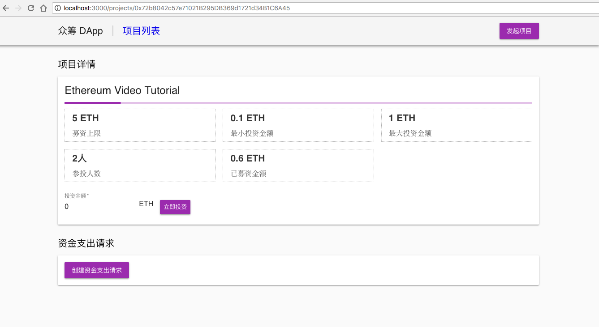
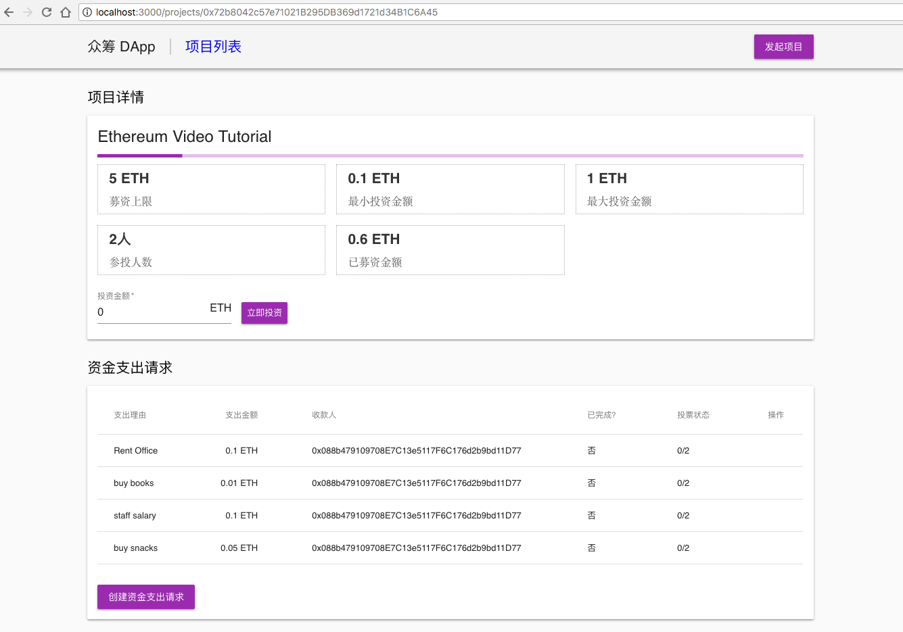

 众筹DApp中的项目资金管理功能
项目的资金支出列表在项目详情页，创建资金支出请求的入口也在项目详情页。
12.1 创建资金支出请求的入口
添加入口很简单，直接修改 pages/projects/detail.js：
...
class ProjectDetail extends React.Component {
static async getInitialProps({ query }) {
...
render() {
const { project } = this.props;

return (
<Layout>
<Typography variant="title" color="inherit" style={{ margin: '15px 0' }}>
项目详情
</Typography>
{this.renderBasicInfo(project)}
<Typography variant="title" color="inherit" style={{ margin: '30px 0 15px' }}>
资金支出请求
</Typography>
{this.renderPayments(project)}
</Layout>
);
}
renderBasicInfo(project) {
...
}
renderPayments(project) {
    console.log(project);

return (
    <Paper style={{ padding: '15px' }}>
<Link route={`/projects/${project.address}/payments/create`}>
<Button variant="raised" color="primary">
创建资金支出请求
</Button>
</Link>
</Paper>
);
}
}
export default withRoot(ProjectDetail);
修改完的项目详情页如下：

 
12.2 创建资金支出请求
资金支出请求创建页面，可以完全参照项目创建页面去做，在 pages/projects 下面新建 payments 目录，然后在其中新建 create.js，输入代码：
import React from 'react';
import { Grid, Button, Typography, TextField, Paper, CircularProgress } from '@material-ui/core';
import { Router } from '../../../routes';
import web3 from '../../../libs/web3';
import Project from '../../../libs/project';
import withRoot from '../../../libs/withRoot';
import Layout from '../../../components/Layout';

class PaymentCreate extends React.Component {
static async getInitialProps({ query }) {
const contract = Project(query.address);
const summary = await contract.methods.getSummary().call();
const description = summary[0];
const owner = summary[7];

return { project: { address: query.address, description, owner } };
}

constructor(props) {
super(props);
this.state = {
description: '',
amount: 0,
receiver: 0,
errmsg: '',
loading: false
};
this.onSubmit = this.createPayment.bind(this);
}

getInputHandler(key) {
return e => {
console.log(e.target.value);
this.setState({ [key]: e.target.value });
};
}

async createPayment() {
const { description, amount, receiver } = this.state;
console.log(this.state);

// field validation check
if (!description) {
return this.setState({ errmsg: '支出理由不能为空' });
}
if (amount <= 0) {
return this.setState({ errmsg: '支出金额必须大于0' });
}
if (!web3.utils.isAddress(receiver)) {
return this.setState({ errmsg: '收款人账户地址不正确' });
}

const amountInWei = web3.utils.toWei(amount, 'ether');
try {
this.setState({ loading: true, errmsg: '' });
// get accounts
const accounts = await web3.eth.getAccounts();
const sender = accounts[0];

// check account
if(sender !== this.props.project.owner) {
    return window.alert('只有管理员才能创建支出请求');
}

// create payment
const contract = Project(this.props.project.address);
const result = await contract.methods
.createPayment(description, amountInWei, receiver)
.send({ from: sender, gas: '5000000' });

this.setState({ errmsg: '资金支出请求创建成功' });
console.log(result);

setTimeout(() => {
Router.pushRoute(`/projects/${this.props.project.address}`);
}, 1000);
} catch (err) {
console.error(err);
this.setState({ errmsg: err.message || err.toString() });
} finally {
this.setState({ loading: false });
}
}

render() {
return (
<Layout>
<Typography variant="title" color="inherit" style={{ marginTop: '15px' }}>
创建资金支出请求：{this.props.project.description}
</Typography>
<Paper style={{ width: '60%', padding: '15px', marginTop: '15px' }}>
<form noValidate autoComplete="off" style={{ marginBottom: '15px' }}>
<TextField
fullWidth 
required 
id="description" 
label="支出理由" 
value={this.state.description} 
onChange={this.getInputHandler('description')} 
margin="normal"
/>
<TextField
fullWidth 
required 
id="amount" 
label="支出金额" 
value={this.state.amount} 
onChange={this.getInputHandler('amount')} 
margin="normal"
InputProps={{ endAdornment: 'ETH' }}
/>
<TextField
fullWidth 
required 
id="receiver" 
label="收款方" 
value={this.state.receiver} 
onChange={this.getInputHandler('receiver')} 
margin="normal"
/>
</form>
<Button variant="raised" size="large" color="primary" onClick={this.onSubmit} >
  {this.state.loading ? <CircularProgress color="secondary" size={24} /> : '保存'}
</Button>
{!!this.state.errmsg && (
<Typography component="p" style={{ color: 'red' }}>
{this.state.errmsg}
</Typography>
)}
</Paper>
</Layout>
);
}
}
export default withRoot(PaymentCreate);
这里我们从项目的summary中提取出owner信息，并在发起创建支出请求的交易之前做了身份验证，只有项目的创建人才能提起请求。另外，创建成功后应该刷新页面，并且跳转到项目详情页。
保存后，我们就可以从项目详情页开始测试资金支出请求的创建功能了。
12.3 资金支出列表
资金支出请求的数据现在已经有了，我们需要把它读取出来并渲染到 DApp 中。继续修改 pages/projects/detail.js，读取 payments 列表，并渲染成表格：
import { Grid, Button, Typography, LinearProgress, CircularProgress, Paper, TextField, Table, TableHead, TableBody, TableRow, TableCell } from '@material-ui/core';
...
class ProjectDetail extends React.Component {
static async getInitialProps({ query }) {
const contract = Project(query.address);

const summary = await contract.methods.getSummary().call();
const [description, minInvest, maxInvest, goal, balance, investorCount, paymentCount, owner] = Object.values( summary );

const tasks = [];
for (let i = 0; i < paymentCount; i++) {
tasks.push(contract.methods.payments(i).call());
}
const payments = await Promise.all(tasks);

const project = {
address: query.address,
description,
minInvest,
maxInvest,
goal,
balance,
investorCount,
paymentCount,
owner,
payments
};
return { project };
}
...
render() {
    ...
}
renderBasicInfo(project) {
...
}
renderPayments(project) {
    console.log(project);

return (
    <Paper style={{ padding: '15px' }}>
<Table style={{ marginBottom: '30px' }}>
<TableHead>
<TableRow>
<TableCell>支出理由</TableCell>
<TableCell numeric>支出金额</TableCell>
<TableCell>收款人</TableCell>
<TableCell>是否完成</TableCell>
<TableCell>投票状态</TableCell>
<TableCell>操作</TableCell>
</TableRow>
</TableHead>
<TableBody>
{project.payments.map(payment => {
return (
<TableRow key={payment.id}>
<TableCell>{payment.description}</TableCell>
<TableCell numeric>{web3.utils.fromWei(payment.amount, 'ether')} ETH</TableCell>
<TableCell>{payment.receiver}</TableCell>
<TableCell>{payment.completed ? '是' : '否'}</TableCell>
<TableCell>{payment.voterCount}/{project.investorCount}</TableCell>
<TableCell></TableCell>
</TableRow>
);
})}
</TableBody>
</Table>
<Link route={`/projects/${project.address}/payments/create`}>
<Button variant="raised" color="primary">
创建资金支出请求
</Button>
</Link>
</Paper>
);
}
}
export default withRoot(ProjectDetail);
资金支持列表渲染后的详情页如下：

12.4 资金支出投票
接下来是资金支出请求的投票功能，继续修改 pages/projects/detail.js：
...
class ProjectDetail extends React.Component {
static async getInitialProps({ query }) {
...
}
constructor() {
    super(props);
    this.state = {
    amount = 0;
    errmsg: '',
    loading: false,
isApproving: false
};
this.onSubmit = this.contributeProject.bind(this);
}
...
async approvePayment(i) {
try {
this.setState({ isApproving: i });

// get accounts
const accounts = await web3.eth.getAccounts();
const sender = accounts[0];

// approve payment
const contract = Project(this.props.project.address);
const isInvestor = await contract.methods.investors(sender).call();
if (!isInvestor) {
return window.alert('只有投资人才有权投票');
}
const result = await contract.methods
.approvePayment(i)
.send({ from: sender, gas: '5000000' });
	
window.alert('投票成功');

setTimeout(() => {
    location.reload();
}, 1000);
} catch (err) {
console.error(err);
window.alert(err.message || err.toString() );
} finally {
this.setState({ isApproving: false });
}
}

render() {
    ...
}
renderBasicInfo(project) {
...
}
renderPayments(project) {
    console.log(project);

return (
    <Paper style={{ padding: '15px' }}>
<Table style={{ marginBottom: '30px' }}>
<TableHead>
...
</TableHead>
<TableBody>
{project.payments.map(payment => {
return (
<TableRow key={payment.id}>
<TableCell>{payment.description}</TableCell>
<TableCell numeric>{web3.utils.fromWei(payment.amount, 'ether')} ETH</TableCell>
<TableCell>{payment.receiver}</TableCell>
<TableCell>{payment.completed ? '是' : '否'}</TableCell>
<TableCell>{payment.voterCount}/{project.investorCount}</TableCell>
<TableCell></TableCell>
</TableRow>
);
})}
{project.payments.map((payment, index) => this.renderPaymentRow(payment, index, project))}
</TableBody>
</Table>
...
</Paper>
);
}
renderPaymentRow(payment, index, project) {
const canApprove = !payment.completed;
return (
<TableRow key={payment.id}>
<TableCell>{payment.description}</TableCell>
<TableCell numeric>{web3.utils.fromWei(payment.amount, 'ether')} ETH</TableCell>
<TableCell>{payment.receiver}</TableCell>
<TableCell>{payment.completed ? '是' : '否'}</TableCell>
<TableCell>{payment.voterCount}/{project.investorCount}</TableCell>
<TableCell>
{canApprove && (
<Button size="small" color="primary" onClick={() => this.approvePayment(index)}>
{this.isApproving(index) ? <CircularProgress color="secondary" size={24} /> : '投赞成票'}
</Button>
)}
</TableCell>
</TableRow>
    );
}
isApproving(i) {
return typeof this.state.isApproving === 'number' && this.state.isApproving === i;
}
}
export default withRoot(ProjectDetail);
这里的改动需要说明几点： 
	把资金支出请求的渲染抽到了单独的函数里面，方便后续扩展；
	投票按钮的出现条件是资金支出请求没有完成划转；
	投票按钮的 loading 状态和参投的 loading 状态实现机制稍有不同，因为页面上存在多条资金支出请求，我们需要判断出在处理哪条，所以增加了状态isApproving 来记录当前处理的请求index。
12.5 资金划转
最后还应该实现资金划转功能，继续修改 pages/projects/detail.js：
...
class ProjectDetail extends React.Component {
static async getInitialProps({ query }) {
...
}
constructor() {
    super(props);
    this.state = {
    amount = 0;
    errmsg: '',
    loading: false,
isApproving: false,
isPaying: false
};
this.onSubmit = this.contributeProject.bind(this);
}
...
async doPayment(i) {
try {
this.setState({ isPaying: i });

// get accounts
const accounts = await web3.eth.getAccounts();
const sender = accounts[0];

// check account
if(sender !== this.props.project.owner) {
    return window.alert('只有管理员才能划转资金');
}

// do payment
const contract = Project(this.props.project.address);
const result = await contract.methods
.doPayment(i)
.send({ from: sender, gas: '5000000' });
	
window.alert('资金划转成功');

setTimeout(() => {
    location.reload();
}, 1000);
} catch (err) {
console.error(err);
window.alert(err.message || err.toString() );
} finally {
this.setState({ isPaying: false });
}
}

render() {
    ...
}
renderBasicInfo(project) {
...
}
renderPayments(project) {
...
}
renderPaymentRow(payment, index, project) {
const canApprove = !payment.completed;
const canDoPayment = !payment.completed && payment.voterCount / project.investorCount > 0.5;
return (
...
<TableCell>
{canApprove && (
<Button size="small" color="primary" onClick={() => this.approvePayment(index)}>
{this.isApproving(index) ? <CircularProgress color="secondary" size={24} /> : '投赞成票'}
</Button>
)}
{canDoPayment && (
<Button size="small" color="primary" onClick={() => this.doPayment(index)}>
{this.isPaying(index) ? <CircularProgress color="secondary" size={24} /> : '资金划转'}
</Button>
)}
</TableCell>
</TableRow>
    );
}
isApproving(i) {
return typeof this.state.isApproving === 'number' && this.state.isApproving === i;
}
isPaying(i) {
return typeof this.state.isPaying === 'number' && this.state.isPaying === i;
}
}
export default withRoot(ProjectDetail);
资金划转的实现套路和投赞成票的实现套路非常类似，除了按钮出现条件是要求投票人数超过投资人 50%。
我们可以重新启动服务器，完整地测试创建资金支出请求、投票、资金划转的整个流程。至此，我们已经实现了最初设计的众筹DApp的全部功能。
