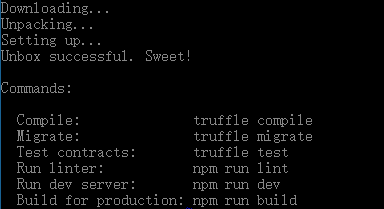

# Truffle

## 安装
启动 geth，然后我们来安装 truffle。truffle 是一个 dapp 的开发框架，它可以使得 dapp 的构建和管理非常容易。
你可以像这样使用 npm 安装 truffle：
```
>npm install -g truffle
```
然后我们创建一个空目录，在下面创建truffle 项目：
```
>mkdir simple_voting_by_truffle_dapp
>cd simple_voting_by_truffle_dapp
>npm install -g webpack
>truffle unbox webpack
```
> 说明：目录可以自定义
Unbox的过程相对会长一点，完成之后应该看到这样的提示：



- `truffle init`: 在当前目录初始化一个新的truffle空项目（项目文件只有`truffle-config.js`和`truffle.js`；`contracts`目录中只有`Migrations.sol`；`migrations`目录中只有`1_initial_migration.js`）
- `truffle unbox`: 直接下载一个`truffle box`，即一个预先构建好的truffle项目；

 
这里的webpack就是一个基于webpack构建流程的官方项目框架（truffle box），更多truffle box参见https://truffleframework.com/boxes.

webpack: 一个流行的前端资源依赖管理和打包工具。

## Truffle简介

truffle unbox webpack 一条命令由于要下载众多需要的模块，大概耗时10分钟左右，所以我们先来了解一下Truffle。

Truffle是目前最流行的以太坊DApp开发框架，（按照官网说法）是一个世界级的开发环境和测试框架，也是所有使用了EVM的区块链的资产管理通道，它基于JavaScript，致力于让以太坊上的开发变得简单。Truffle有以下功能：
- 内置的智能合约编译，链接，部署和二进制文件的管理。
- 合约自动测试，方便快速开发。
- 脚本化的、可扩展的部署与发布框架。
- 可部署到任意数量公网或私网的网络环境管理功能
- 使用EthPM和NPM提供的包管理，使用ERC190标准。
- 与合约直接通信的直接交互控制台（写完合约就可以命令行里验证了）。
- 可配的构建流程，支持紧密集成。
- 在Truffle环境里支持执行外部的脚本。
##  Truffle的客户端

我们之后写的智能合约必须要部署到链上进行测试，所以truffle构建的DApp也必须选择一条链来进行部署。我们可以选择部署到一些公共的测试链比如Rinkeby或者Ropsten上，缺点是部署和测试时间比较长，而且需要花费一定的时间赚取假代币防止out of gas。当然，对于DApp发布的正规流程，staging（模拟环境）还是应该用测试公链的。

还有一种方式就是部署到私链上，这在开发阶段是通常的选择。Truffle官方推荐使用以下两种客户端：
- Ganache 
- truffle develop
Ganache我们已经接触过了，之前的简单投票小项目就是用它来做模拟区块链的。这里再介绍一点命名背景。它的前身是大名鼎鼎的testRPC，网上的很多truffle教学的老文章里都是用testRPC。Ganache是奶油巧克力的意思，而Truffle是松露巧克力，一般是以Ganache为核，然后上面撒上可可粉，所以这两个产品的名字还是很贴切的。

而truffle develop是truffle内置的客户端，跟命令行版本的Ganache基本类似。在truffle目录下bash输入：
```
>truffle develop
```
即可开启客户端，和ganache一样，它也会给我们自动生成10个账户。

唯一要注意的是在truffle develop里执行truffle命令的时候需要省略前面的“truffle”，比如“truffle compile”只需要敲“compile”就可以了


