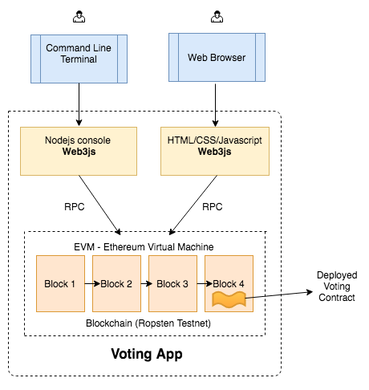

# 用truffle构建简单投票DApp

在接下来的项目中，我们将会实现以下内容：
1.	安装叫做 truffle 的以太坊 dapp 框架，它会被用于编译和部署我们的合约。
2.	在我们之前简单投票DApp上做一些小的更新来适配 truffle。
3.	编译合约，并将其部署到自己的测试私链。
4.	通过 truffle 控制台和网页与合约进行交互。



## 工作流（Workflow）
如果你正在构建一个基于以太坊的去中心化应用，你的 workflow 可能是像这样：
- Development（开发环境）: Ganache
- Staging/Testing（模拟/测试环境）: Ropsten, Rinkeby, Kovan or your own private network
- Production（生产环境）: Mainnet

## 创建 Voting 项目
初始化一个 truffle 项目时，它会创建运行一个完整 dapp 所有必要的文件和目录。我们直接下载 webpack 这个 truffle box，它里面的目录也是类似的：
```
>ls
README.md       contracts       node_modules      test          webpack.config.js   truffle.js	app          migrations       package.json
>ls app/
index.html javascripts stylesheets
>ls contracts/
ConvertLib.sol MetaCoin.sol Migrations.sol
>ls migrations/
1_initial_migration.js 2_deploy_contracts.js
```
- app/ - 你的应用文件运行的默认目录。这里面包括推荐的javascript文件和css样式文件目录，但你可以完全决定如何使用这些目录。
- contract/ - Truffle默认的合约文件存放目录。
- migrations/ - 部署脚本文件的存放目录
- test/ - 用来测试应用和合约的测试文件目录
- truffle.js - Truffle的配置文件

truffle 也会创建一个你可以快速上手的示例应用（在本课程中我们并不会用到该示例应用）。你可以放心地删除项目下面 contracts 目录的 ConvertLib.sol 和 MetaCoin.sol 文件。

```
>rm contracts/ConvertLib.sol contracts/MetaCoin.sol
```
此外，在你的项目目录下查找一个叫做 truffle.js 的配置文件。它里面包含了一个用于开发网络的配置。将端口号从 7545 改为 8545，因为我们的私链及 ganache 默认都会在该端口运行。

## 更新 migration 文件

将 2_deploy_contracts.js 的内容更新为以下信息：
```
var Voting = artifacts.require("./Voting.sol");
module.exports = function(deployer) { 
	deployer.deploy(Voting, ['Alice', 'Bob', 'Cary'], {gas: 
				290000});
};
```
从上面可以看出，部署者希望第一个参数为合约名，跟在构造函数参数后面。在我们的例子中，只有一个参数，就是一个候选者数组。第三个参数是一个哈希，我们用来指定部署代码所需的 gas。gas 数量会随着你的合约大小而变化。对于投票合约， 290000 就足够了。

## 更新 truffle 配置文件
像下面这样更新 truffle.js 的内容：
```
require('babel-register')
module.exports = { 
    networks: {  
        development: {   
        host: 'localhost',   
        port: 8545,   
        network_id: '*',   
        gas: 470000  
        } 
    }
}
```
你会注意到，之前的 truffle.js 与我们更新的文件唯一区别在于 gas 选项。这是一个会应用到所有 migration 的全局变量。比如，如果你没有指定 2_deploy_contracts.js gas 值为 290000，migration 就会采用默认值 470000.

## 合约代码
Voting.sol

## 创建账户（可用metamask上账户转币）
在能够部署合约之前，我们需要一个里面有一些以太的账户。当我们用 ganache 的时候，它创建了 10 个测试账户，每个账户里面有 100 个测试以太。但是对于测试网和主网，我们必须自己创建账户，并往里面打一些以太。

在之前的ganache应用里，我们曾单独启动了一个 node 控制台，并初始化了 web3 对象。当我们执行 truffle 控制台时，truffle 会帮我们做好所有准备，我们会有一个立即可用的 web3 对象。现在我们有一个账户，地址为 ‘0x95a94979d86d9c32d1d2ab5ace2dcc8d1b446fa1’ （你会得到一个不同的地址），账户余额为 0。
```
>truffle console
// Replace 'verystrongpassword' with a good strong password.
truffle(development)> web3.personal.newAccount('verystrongpassword')
' 0xbaeec91f6390a4eedad8729aea4bf47bf8769b15'
truffle(development)> web3.eth.getBalance('0xbaeec91f6390a4eedad8729aea4bf47bf8769b15')
{ [String: '0'] s: 1, e: 0, c: [ 0 ] }
truffle(development)> web3.personal.unlockAccount('0xbaeec91f6390a4eedad8729aea4bf47bf8769b15', 'verystrongpassword', 15000)
```

## 部署
如果已经有了一些以太，我们就可以继续编译并把合约部署到区块链上。你可以在下面找到相关命令，如果一切顺利，就会出现以下输出:
```
truffle compile
truffle migrate
```
```

>truffle compile
Compiling Migrations.sol...Compiling Voting.sol...Writing artifacts to ./build/contracts
>truffle migrate
Running migration: 1_initial_migration.js
Deploying Migrations...
Migrations: 0x3cee101c94f8a06d549334372181bc5a7b3a8bee
Saving successful migration to network...
Saving artifacts...
Running migration: 2_deploy_contracts.js
Deploying Voting...
Voting: 0xd24a32f0ee12f5e9d233a2ebab5a53d4d4986203
Saving successful migration to network...
Saving artifacts...
```

如果你有多个账户，确保相关账户未被锁定。默认情况，第一个账户 web3.eth.accounts[0] 会用于部署。

## 控制台和网页交互
如果部署顺利，你可以通过控制台和网页与合约进行交互。
- app/index.html
- app/scripts/index.js

 当你编译部署好投票合约时，truffle 会将 abi 和部署好的地址存储到一个 build 目录下面的 json 文件。我们已经在之前讨论了 abi 。我们会用这个信息来启动一个 Voting 抽象。我们将会随后用这个 abstraction 创建一个 Voting 合约的实例。

 Voting.deployed() 返回一个合约实例。truffle 的每一个调用会返回一个 promise，这就是为什么我们在每一个交易调用时都使用 then().

### 控制台交互
需要重新打开一个新的console
```
>truffle console
truffle(default)> Voting.deployed().then(function(contractInstance) {contractInstance.voteForCandidate('Alice').then(function(v) {console.log(v)})});


truffle(default)> Voting.deployed().then(function(contractInstance) {contractInstance.totalVotesFor.call('Alice').then(function(v) {console.log(v)})});


```
在调用 voteForCandidate 方法之后需要稍等一下，因为发送交易需要时间；
注意，truffle 的所有调用都会返回一个 promise，这就是为什么会看到每个响应被包装在 then() 函数下面；另外totalVoteFor() 方法也可以不加.call() 直接调用，不会发送交易。

发出的交易可以在geth的log输出文件中查到；如果我们连接的是测试网络，可以在etherscan上https://rinkeby.etherscan.io 查询。
可以看到truffle默认的gasPrice是100GWei，如果心疼，可以在truffle.js 中更改，加上gasPrice: 1000000000 将其改为 1GWei，重启truffle console 生效。

### 网页交互
在控制台用webpack启动服务器：
```
>npm run dev
```
默认端口8080，在浏览器访问localhost:8080即可看到页面。
如果安装了metamask，index.js中会自动检测并使用metamask作为web3 Provider；所以应该注意把metamask切换到我们当前连接的网络。

到目前为止，我们已经用truffle构建了一个真正的Dapp。

## 阿里云ESC

webpack 默认开启8080端口。由于使用的是阿里云ESC服务器，需要修改package.json

修改如下：
```
 "dev": "webpack-dev-server "
 ```
为
```
 "dev": "webpack-dev-server --host 0.0.0.0"
```