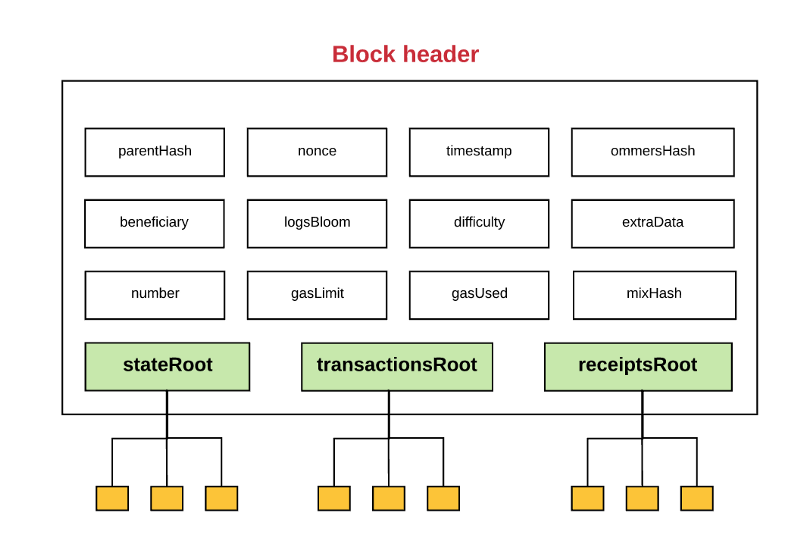

# 梅克尔-帕特里夏树 Merkel-Patricia Tree（MPT）
* https://ethfans.org/posts/merkle-patricia-tree-in-detail
## MPT是什么
- Merkel Patricia Tree (MPT)，翻译为梅克尔-帕特里夏树
- MPT 提供了一个基于密码学验证的底层数据结构，用来存储键值对（key-value）关系
- MPT 是完全确定性的，这是指在一颗 MPT 上一组键值对是唯一确定的，相同内容的键可以保证找到同样的值，并且有同样的根哈希（root hash）
- MPT 的插入、查找、删除操作的时间复杂度都是O(log(n))，相对于其它基于复杂比较的树结构（比如红黑树），MPT 更容易理解，也更易于编码实现

## 字典树（Trie）

- 字典树（Trie）也称前缀树（prefix tree），属于搜索树，是一种有序的树数据结构
- 字典树用于存储动态的集合或映射，其中的键通常是字符串

##   基数树（Radix Tree）

### 基本介绍

基数树又叫压缩前缀树（compact prefix tree），是一种空间优化后的字典树，其中如果一个节点只有唯一的子节点，那么这个子节点就会与父节点合并存储


### 基数树节点

在一个标准的基数树里，每个节点存储的数据如下：
```
[i0, i1, ... in, value]
```
- 这里的 i0,i1,...,in 表示定义好的字母表中的字符，字母表中一共有n+1个字符，这颗树的基数（radix）就是 n+1
- value 表示这个节点中最终存储的值
- 每一个 i0 到 in 的“槽位”，存储的或者是null，或者是指向另一节点的指针
- 用节点的访问路径表示 key，用节点的最末位置存储 value，这就实现了一个基本的键值对存储

### 示例

我们有一个键值对{ “dog”: “puppy” }，现在希望通过键 dog 访问它的值；我们采用16进制的 Hex 字符作为字符集.
- 首先我们将 “dog” 转换成 ASCII 码，这样就得到了字符集中的表示 64 6f 67，这就是树结构中对应的键
- 按照键的字母序，即 6->4->6->f->6->7，构建树中的访问路径
- 从树的根节点（root）出发，首先读取索引值（index）为 6 的插槽中存储的值，以它为键访问到对应的子节点
- 然后取出子节点索引值为 4 的插槽中的值，以它为键访问下一层节点，直到访问完所需要的路径
- 最终访问到的叶子节点，就存储了我们想要查找的值，即“puppy” 


### 基数树的问题

**数据校验**

基数树节点之间的连接方式是指针，一般是用32位或64位的内存地址作为指针的值，比如C语言就是这么做的。但这种直接存地址的方式无法提供对数据内容的校验，而这在区块链这样的分布式系统中非常重要。

**访问效率**

基数树的另一个问题是低效。如果我们只想存一个 bytes32 类型的键值对，访问路径长度就是64（在以太坊定义的 Hex 字符集下）；每一级访问的节点都至少需要存储 16 个字节，这样就需要至少 1k 字节的额外空间，而且每次查找和删除都必须完整地执行 64 次下探访问。


## 梅克尔树（Merkel Tree）
也被称作哈希树（Hash Tree），以数据块的 hash 值作为叶子节点存储值。梅克尔树的非叶子节点存储其子节点内容串联拼接后的 hash 值。


##   帕特里夏树（Patricia Tree）

- 如果一个基数树的“基数”（radix）为2或2的整数次幂，就被称为“帕特里夏树”，有时也直接认为帕特里夏树就是基数树
- 以太坊中采用 Hex 字符作为 key 的字符集，也就是基数为 16 的帕特里夏树
- 以太坊中的树结构，每个节点可以有最多 16 个子节点，再加上 value，所以共有 17 个“插槽”（slot）位置
- 以太坊中的帕特里夏树加入了一些额外的数据结构，主要是为了解决效率问题


##   MPT（Merkel Patricia Tree）
### 基本介绍
- 梅克尔-帕特里夏树是梅克尔树和帕特里夏树的结合
- 以太坊中的实现，对 key 采用 Hex 编码，每个 Hex 字符就是一个 nibble（半字节）
- 遍历路径时对一个节点只访问它的一个 nibble ，大多数节点是一个包含17个元素的数组；其中16个分别以 hex字符作为索引值，存储路径中下一个 nibble 的指针；另一个存储如果路径到此已遍历结束，需要返回的最终值。这样的节点叫做“分支节点”（branch node）
- 分支节点的每个元素存储的是指向下一级节点的指针。与传统做法不同，MPT 是用所指向节点的 hash 来代表这个指针的；每个节点将下个节点的 hash 作为自己存储内容的一部分，这样就实现了 Merkel 树结构，保证了数据校验的有效性

### MPT 节点分类
MPT 中的节点有以下几类：
- 空节点（NULL）
    - 表示空字符串
- 分支节点（branch）
    - 17 个元素的节点，结构为 [ v0 ... v15, vt ]
- 叶子节点（leaf）
    - 拥有两个元素，编码路径 encodedPath 和值 value
- 扩展节点（extension）
    - 拥有两个元素，编码路径 encodedPath 和键 key

### MPT 中数据结构的优化
- 对于64个字符的路径长度，很有可能在某个节点处会发现，下面至少有一段路径没有分叉；这很难避免
- 我们当然可以依然用标准的分支节点来表示，强制要求这个节点必须有完整的16个索引，并给没有用到的那15个位置全部赋空值；但这样有点蠢
- 通过设置“扩展节点”，就可以有效地缩短访问路径，将冗长的层级关系压缩成一个键值对，避免不必要的空间浪费
- 扩展节点（extension node）的内容形式是 [encodedPath, key]，其中 encodedPath 包含了下面不分叉的那部分路径，key 是指向下一个节点的指针（hash，也即在底层db中的存储位置）
- 叶子节点（leaf node）：如果在某节点后就没有了分叉路径，那这是一个叶子节点，它的第二个元素就是自己的 value


##   紧凑编码（compact coding）
- 路径压缩的处理相当于实现了压缩前缀树的功能；不过路径表示是 Hex 字符串（nibbles），而存储却是以字节（byte）为单位的，这相当于浪费了一倍的存储空间
- 我们可以采用一种紧凑编码（compact coding）方式，将两个 nibble 整合在一个字节中保存，这就避免了不必要的浪费
- 这里就会带来一个问题：有可能 nibble 总数是一个奇数，而数据总是以字节形式存储的，所以无法区分 nibble 1 和 nibbles 01；这就使我们必须分别处理奇偶两种情况
- 为了区分路径长度的奇偶性，我们在 encodedPath 中引入标识位

## Hex 序列的压缩编码规则
我们在 encodedPath 中，加入一个 nibble 作为前缀，它的后两位用来标识节点类型和路径长度的奇偶性


MPT 中还有一个可选的“结束标记”（用T表示），值为 0x10 (十进制的16)，它仅能在路径末尾出现，代表节点是一个最终节点（叶子节点）

如果路径是奇数，就与前缀 nibble 凑成整字节；如果是偶数，则前缀 nibble 后补 0000 构成整字节

**编码示例**
```
> [ 1, 2, 3, 4, 5, ...] 不带结束位，奇路径
'11 23 45' 
> [ 0, 1, 2, 3, 4, 5, ...]  不带结束位，偶路径
'00 01 23 45' 
> [ 0, f, 1, c, b, 8, 10]  带结束位 T 的偶路径
'20 0f 1c b8' 
> [ f, 1, c, b, 8, 10]  带结束位 T 的奇路径
'3f 1c b8'
```
**MPT 树结构示例**


## 以太坊中树结构
1. 以太坊中所有的 merkel 树都是 MPT
2. 在一个区块的头部（block head）中，有三颗 MPT 的树根：
- stateRoot
    - 状态树的树根
- transactionRoot
    - 交易树的树根
- receiptsRoot
    -  收据树的树根



## 以太坊中树结构

1. 状态树（state trie）
    - 世界状态树，随时更新；它存储的键值对 (path, value) 可以表示为 (sha3(ethereumAddress), rlp(ethereumAccount) )
    - 这里的 account 是4个元素构成的数组：[nonce, balance, storageRoot, codeHash]
2. 存储树（storage trie）
    - 存储树是保存所有合约数据的地方；每个合约账户都有一个独立隔离的存储空间
3. 交易树（transaction trie）
    - 每个区块都会有单独的交易树；它的路径（path）是 rlp(transactionIndex)，只有在挖矿时才能确定；一旦出块，不再更改
4. 收据树（receipts trie）
    - 每个区块也有自己的收据树；路径也表示为 rlp(transactionIndex)

