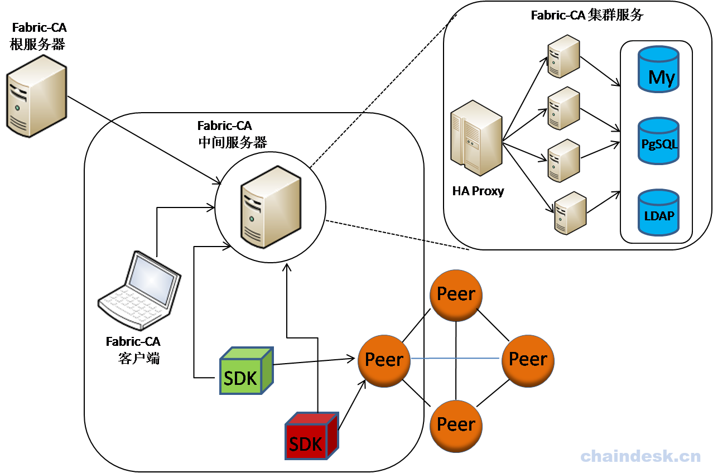

# Fabric CA
## Fabric CA简介
Hyperledger Fabric CA 是 Hyperledger Fabric 的证书颁发机构（CA），是超级账本 Hyperledger Fabric 内一个可选的 MemberService 组件，对网络内各个实体的身份证书进行管理，主要实现：

- 负责 Fabric 网络内所有实体（Identity）身份的注册。
- 负责对数字证书的签发，包括 ECerts（身份证书）、TCerts（交易证书）。
- 证书的续签或吊销。
Fabric CA 在 Hyperledger Fabric 网络中的作用如下图所示：



访问 Fabric CA 服务器可以通过 Hyperledger Fabric CA 客户端或通过其中一个 Fabric SDK 来实现，与 Hyperledger Fabric CA 服务器的所有通信都是通过 REST API 进行。

Hyperledger Fabric CA 客户端或 SDK 可以连接到 Hyperledger Fabric CA 服务器集群，集群由 HA Proxy 等实现负载均衡。服务器可能包含多个CA，每个CA都是根CA或中间CA，每个中间CA都有一个父CA。

Hyperledger Fabric CA 的身份信息保存在数据库或LDAP中。目前 Fabric CA 支持的数据库有 MySQL、PostgreSQL、SQLite；默认使用 SQLite 数据库。如果配置了 LDAP，则身份信息将保留在 LDAP 而不是数据库中。

关于 Hyperledger Fabric CA 的更多详细信息，请 [点击此处](https://hyperledger-fabric-ca.readthedocs.io/en/latest/)

## Fabric CA 安装
### 环境要求
1. 安装 Go1.9 或以上版本并设置 GOPATH 环境变量

2. 安装 libtool 与 libltdl-dev 依赖包
```
$ sudo apt update
$ sudo apt install libtool libltdl-dev
```
如果没有安装 libtool libltdl-dev 依赖，会在安装 Fabric CA 时产生错误

### 安装服务端与客户端

**方式一：**

1. 安装服务端与客户端二进制命令到 $GOPATH/bin 目录下
```
$ go get -u github.com/hyperledger/fabric-ca/cmd/...
```
2. 命令执行完成后，会自动在 $GOPATH/bin 目录下产生两个可执行文件：

* fabric-ca-client
* fabric-ca-server
3. 设置环境变量，以便于在任何路径下都可以直接使用两个命令：
```
export PATH=$PATH:$GOPATH/bin
```
**方式二：**

除了如上方式外，还可以在 fabric-ca 目录下生成 fabric-ca-client、fabric-ca-server 两个可执行文件，方法如下：

1. 切换至源码目录下：
```
$ cd $GOPATH/src/github.com/hyperledger/fabric-ca/
```
2. 使用make命令编译：
```
$ make fabric-ca-server
$ make fabric-ca-client
```
自动在当前的 fabric-ca 目录下生成 bin 目录, 目录中包含 fabric-ca-client 与 fabric-ca-server 两个可执行文件。

3. 设置环境变量：
```
$ export PATH=$GOPATH/src/github.com/hyperledger/fabric-ca/bin:$PATH
```