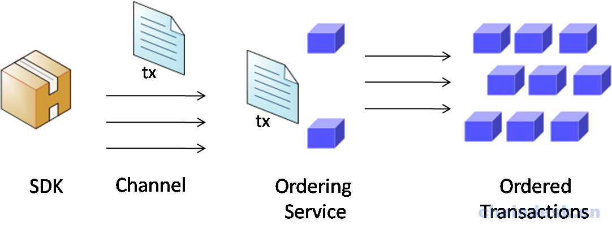

# Fabric交易流程
区块链技术最重要特征之一就是能够保证实现安全的交易。Hyperledger Fabric 与公有链的交易实现又有很大的区别。如：权限、认证、数据隔离等等。

Hyperledger Fabric 典型的交易流程如下图所示：

完整的交易流程解释如下：

1. 应用程序使用相应的 SDK（Node，Java，Python）提供的 API 构建交易提案并提交给相应的背书节点，交易提案中包含：

    * channelID：通道信息
    * chaincodeID：要调用的链码信息
    * timestamp：时间戳
    * sign：客户端的签名
    * txPayload：提交的事务本身包含的内容，包含两项：
        - operation：要调用的链码的函数及相应的参数
        - metadata：调用的相关属性
    ​

​

交易提案（Proposal）消息结构如下：

2. 背书节点对接收到的交易提案请求进行验证：

- 交易提案格式是否正确
- 交易在之前并未提交过（重复性攻击保护）
- 提交交易提案的客户端签名是否有效（使用MSP）
- 提交交易提案的请求者是否在该通道中有相应的执行权限
验证通过后调用链码进行模拟执行， 产生包括响应值、读集和写集的事务结果。对结果进行背书并响应给客户端。

> 注意，此时的调用链码是模拟执行，不会对账本中的数据进行真正意义上的更改。

交易提案响应（ProposalResponse）消息结构如下：
​

3. 应用程序收集到足够的消息和背书签名之后，构建合法的交易请求并将交易请求广播给 Ordering服务节点。

- 如果应用程序的请求仅仅是查询分类帐，则应用程序将检查查询响应信息，并且不会将事务提交给 Ordering 服务。

- 如果客户端应用程序的请求是更新分类账本数据，则会将事务提交给 Ordering 服务以继续下一步的操作，并且应用程序在提交事务之前检查确定请求是否已满足指定的认可策略（即指定的背书节点都认可）。

4. 交易请求被提交到 Ordering 服务节点，该事务将包含读/写集，背书签名和通道ID；Orderer 节点接收到事务请求之后，并不需要检查交易中的具体数据，它只是从网络中的所有通道接收交易，按时间顺序对它们进行排序，并创建交易区块。之后广播给同一通道内所有组织的 Leader 节点。

5. Leader节点：Leader 节点对接收到的区块进行验证（交易消息结构是否正确、是否重复、是否有足够的背书、读写集版本），通过验证后将结果写入到本地的分类账本中。

6. 同步广播：Leader 节点同步广播给组织内的其它节点（保证在同一通道内的）。

> 提示：在 Fabric 中，广播给其它节点默认为临近的3个节点。此广播数量可以通过配置进行修改。

> 注：跨组织广播则由组织内的 Anchor 节点负责。

## 分类账本更新：

每个Peer节点将区块附加到区块链中，写集被提交到当前的状态数据库中。并且对于每个有效的事务，发出一个事件，通知客户端应用程序事务（调用）已被不可变地附加到链中，以及通知该事务是否已经过验证或为无效事务。

