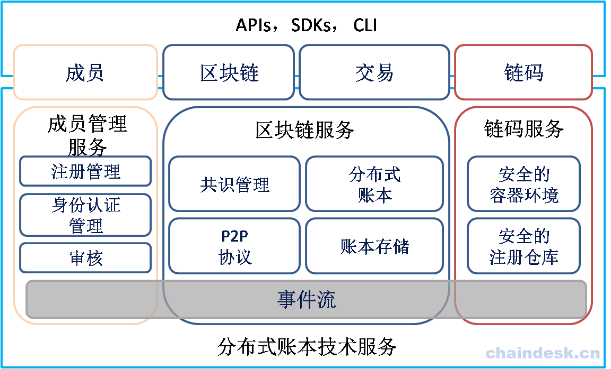
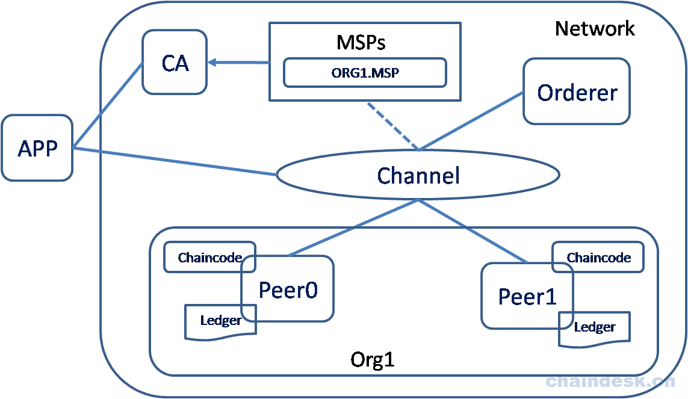

# Fabric架构
## 比较抽象的逻辑架构
Fabric从1.X开始，在扩展性及安全性上面有了大大的提升，且新增了诸多的新特性：

- 多通道：支持多通道，提高隔离安全性。
- 可拔插的组件：支持共识组件、权限管理组件等可拔插功能。
- 账本数据可被存储为多种格式。
- 分化了Peer节点的多种角色，可以根据具体情况实现灵活部署

Hyperledger Fabric超级账本整体逻辑架构如下图所示：

Fabric四大核心组件：

* Membership Services：成员管理保证了Fabric平台访问的安全性。提供了成员的注册、管理及审核功能。
* Blockchain Services：是区块链的核心部分，为区块链的主体功能提供了底层支撑；包括共识管理、分布式账本实现、账本的存储以及网络中各节点之间的通信实现。
    - BlockChain：区块之间以Hash连接为结构的交易日志。peer从order service接收交易区块，并根据背书策略和并发冲突标记区块上的交易是否有效，然后将该区块追加到peer文件系统中的Hash Chain上。
    - Transaction：交易有对链码的部署或调用两种操作类型：
        - 部署交易：部署是请求在peer上启动链码容器；创建新的链码并设置一个程序作为参数。当一个部署交易执行成功，表明链码已被安装到区块链上。
        - 调用交易：调用是从账本中请求读写集。是在之前已部署链码的情况下执行一个操作。调用交易将使用链码提供的一个函数。当成功时，链码执行特定的函数对账本数据进行操作（修改状态），并返回操作结果。
* Chaincode Services：提供了链码的部署及运行时的所需环境。
    - Chaincode：是一个可以对账本数据进行操作的可开发的组件程；链码被布署运行在一个安全的容器中；用户可以通过调用链码中的指定函数对账本数据进行修改或读取操作。
* Event：为各组件之间提供异步通信提供了技术实现。
## 实际中的运行时架构
实际运行时架构如下图所示：

运行时架构图中各项解释如下：

- APP：代表一个客户端（CLI）或SDK，作用是创建交易并获取到足够的背书之后向Orderer排序服务节点提交交易请求（Peer与Orderer节点提供了gRPC远程访问接口，供客户端调用）。

- CA：负责对网络中所有的证书进行管理(对Fabric网络中的成员身份进行管理), 提供标准的PKI服务。

- MSP（Member Service Provider）：为客户端和Peer提供证书的系统抽象组件。

- Channel：将一个大的网络分割成为不同的私有"子网"。

    - 通道的作用：通道提供一种通讯机制，将peers和orderer连接在一起，形成一个具有保密性的通讯链路（虚拟）， 进行数据隔离。

    > 要加入通道的每个节点都必须拥有自己的通过成员服务提供商（MSP）获得的身份标识。

- Orderer：对客户端提交的交易请求进行排序，之后生成区块广播给通道内的所有peer节点。

- Org1：代表联盟中的某一个组织（一个联盟中可以多个不同的组织组成）。

- Peer：表示组织中的节点；Peer节点以区块的形式从Orderer排序服务节点接收有序状态更新，维护状态和账本。在Fabric网络环境中 Peer 节点可以划分为如下角色：

    - Endorsing peer：根据指定的策略调用智能合约，对结果进行背书， 返回提案响应到客户端。
    - Committing peer：验证数据并保存至账本中。
    - Anchor peer：跨组织通信。
    - Leading peer：作为组织内所有节点的的代表连接到Orderer排序服务节点, 将从排序服务节点接收到的批量区块广播给组织内的其它节点。

    > 网络中只有部分节点为背书节点； 网络中所有Peer节点为账本节点。

- Chaincode：链式代码，简称链码；运行在容器中，提供相应的API与账本数据进行交互。

- Ledger：是由排序服务构建的一个全部有序的交易哈希链块，保存在所有的peer节点中。账本提供了在系统运行过程中发生的可验证历史，它包含所有成功的状态更改（有效交易）和不成功的状态更改（无效交易）。

## FAQ

### 应用程序或客户端到底需要连接到哪些Peer节点？

只需要连接到背书节点即可。

### 背书节点怎么指定？

在实例化链码时由背书策略指定。
