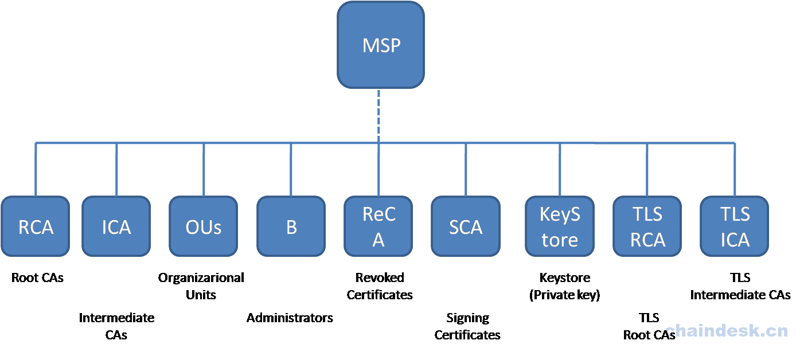

# MSP
## MSP定义及作用
在 Hyperledger Fabric 中，各个网络参与者之间的通信安全依赖于 PKI 标准来实现，并确保在区块链上发布的消息得到相应的认证。

`PKI（Public Key Infrastructure）`：公钥基础结构。由向各方（如服务的用户，服务提供商）发布数字证书的证书颁发机构组成，然后他们使用它们在与其环境交换的消息中对自己进行身份验证。

`PKI` 有四个关键要素：

- 数字证书：包含与证书持有者相关的一组属性的文档。最常见的证书类型是符合X.509标准的证书，允许在其结构中编码一方的识别细节。
- 公钥和私钥：身份验证和消息完整性是安全通信中的重要概念。身份验证要求确保交换消息的各方创建特定消息的身份。对于具有“完整性”的消息意味着在其传输期间不能被修改。
- 证书颁发机构：证书颁发机构向不同的参与者分发证书，这些证书由CA进行数字签名。CA是为组织的参与者提供可验证的数字身份的基础。
- 证书撤销列表：某种原因而被撤销的证书的引用列表。
> PKI 只是一个体系结构，负责生成及颁发；在 Hyperledger Fabric 中的默认 MSP 实际上是使用符合 X.509 标准的证书作为身份，采用传统的公钥基础结构（PKI）分层模型来实现。

MSP（Membership Service Provider）：成员服务提供商，是 Hyperledger Fabric 1.0版本开始抽象出来的一个模块化组件。用于定义身份验证，进行身份验证和允许访问网络的规则。更确切地说，MSP 是 Hyperledger Fabric 对网络中的组成成员进行身份管理与验证的模块组件。

具体作用如下：

- MSP 管理用户 ID。
- 验证想要加入网络的节点：每一个想加入网络中的节点必须提供其有效且合法的 MSP 信息。
- 为客户发起的交易提供凭证：在各节点（Client、Peer、Orderer）之间进行数据传输时，需要验证各节点的签名。

MSP 在 Hyperledger Fabric 中的分类：

- 网络MSP：对整个 Hyperledger Fabric 网络中的成员进行管理；定义参与组织的 MSP ，以及组织成员中的哪些成员被授权执行管理任务（如创建通道）
- 通道MSP：对一个通道中的组织成员进行管理。通道在特定的一组组织之间提供私有通信。在该通道的 MSP 环境中通道策略定义了谁有权限参与通道上的某些行为（如添加组织或实例化链码）。
- Peer MSP：本地 MSP 在每个 Peer 的文件系统上定义，并且每个 Peer 都有一个单独的 MSP 实例。执行与通道 MSP 完全相同的功能，其限制是它仅适用于定义它的 Peer。
- Orderer MSP：与 Peer MSP 相同，Orderer 本地 MSP 也在其节点的文件系统上定义，仅适用于该节点。
- User MSP： 每一个组织都可以拥有多个不同的用户，都在其 Organizations 节点的文件系统上定义，仅适用该组织（包括该组织下的所有 Peer 节点）。
## MSP 的组成结构
MSP的逻辑结构如下所示（与实际的物理结构会有所不同）：



如上图所示，MSP有九个元素。其中MSP名称是根文件夹名称，每个子文件夹代表MSP配置的不同元素：

- 根CA（Root CAs）：文件夹中包含根CA（CA：Certificate Authorities）的自签名 X.509 证书列表。用于自签名及给中间 CA 证书签名。

- 中间CA（ICA）：包含由根据 CA 颁发的证书列表。

- 组织单位（OUs）：这些单位列在 `$FABRIC_CFG_PATH/msp/config.yaml` 文件中，包含一个组织单位列表，其成员被视为该MSP所代表的组织的一部分。

- 管理员（B）：此文件夹包含一个标识列表，用于定义具有此组织管理员角色的角色。对于标准MSP 类型，此列表中应该有一个或多个 X.509 证书。

    > 需要注意，仅仅一个具有管理员的角色，并不意味着他们可以管理特定的资源，给定标识在管理系统方面的实际功能由管理系统资源的策略决定。

- 撤销证书（ReCA）：保存已被撤销参与者身份的信息。

- 签名证书（SCA）：背书节点在交易提案响应中的签名证书。此文件夹对于本地 MSP 是必需的，并且该节点必须只有一个 X.509 证书。

- 私钥（KeyStore）：此文件夹是为 Peer 或 Orderer 节点（或客户端的本地MSP）的本地MSP定义的，并包含节点的签名密钥。此密钥以加密方式匹配 SCA 文件夹中包含的签名证书，并用于签署数据（如签署交易提议响应，作为认可阶段的一部分）。此文件夹对于本地MSP是必需的，并且必须只包含一个私钥。

- TLS根CA（TLS RCA）：包含组织信任的用于 TLS 通信的根 CA 的自签名 X.509 证书列表。此文件夹中必须至少有一个 TLS 根 CA X.509 证书。

- TLS中间CA（TLS ICA）：保存由 TLS 根 CA 颁发的中间证书列表。

## MSP应用
要想初始化一个MSP实例，每一个peer节点和orderer节点都需要在本地指定其配置并启动。

首先， 为了方便地在网络中引用MSP，每个MSP都需要一个特定的名字（如 OrdererMSP、Org1MSP 或 Org2MSP.domain.com）。此名字被称之为 MSP 标识符或 MSP ID。对于每个 MSP 实例来说，MSP 标识符都必须独一无二。

在系统起始阶段，需要指定在网络中出现的所有 MSP 的验证参数，且这些参数需要在系统通道的创世区块中指定。MSP的验证参数包括MSP标识符、信任源证书、中间 CA 和管理员的证书，以及 OU 说明和 CLR。系统的创世区块会在 orderer 节点设置阶段被提供给它们，且允许它们批准创建通道的请求。如果创世区块包含两个有相同标识符的 MSP，那么 orderer 节点将拒绝系统创世区块，导致网络引导程序执行失败。

要想生成 X.509 证书以满足 MSP 配置，应用程序可以有多种方式实现：

- 使用Openssl。
  > 在此需要注意：在 Hyperledger Fabric 中，不支持包括RSA密钥在内的证书。
- 使用 cryptogen 工具，
- Hyperledger Fabric CA 也可用于生成配置 MSP 所需的密钥及证书。详见下节内容。

在节点的配置文件中（对 peer 节点而言配置文件是 core.yaml 文件，对 orderer 节点而言则是orderer.yaml文件。在实际开发中可自定义配置文件名称），我们需要指定到 mspconfig 文件夹的路径，以及节点的 MSP 的 MSP 标识符。节点的 MSP 的 MSP 标识符则会作为参数 localMspId 和 LocalMSPID 的值分别提供给 peer 节点和 orderer 节点。

运行环境可以通过为 peer 使用 CORE 前缀（如 CORE_PEER_LOCALMSPID）及为 orderer 使用 ORDERER 前缀（例如 ORDERER_GENERAL_LOCALMSPID）对以上变量进行重写。

如在 fabric-samples 中提供的示例配置文件 docker-compose-base.yaml：
```
version: '2'

services:

  orderer.example.com:
    container_name: orderer.example.com
    image: hyperledger/fabric-orderer:$IMAGE_TAG
    environment:
      - ORDERER_GENERAL_LOGLEVEL=INFO
      - ORDERER_GENERAL_LISTENADDRESS=0.0.0.0
      - ORDERER_GENERAL_GENESISMETHOD=file
      - ORDERER_GENERAL_GENESISFILE=/var/hyperledger/orderer/orderer.genesis.block
      # 指定本地 MSP ID
      - ORDERER_GENERAL_LOCALMSPID=OrdererMSP
      - ORDERER_GENERAL_LOCALMSPDIR=/var/hyperledger/orderer/msp
      # enabled TLS
      - ORDERER_GENERAL_TLS_ENABLED=true
      - ORDERER_GENERAL_TLS_PRIVATEKEY=/var/hyperledger/orderer/tls/server.key
      - ORDERER_GENERAL_TLS_CERTIFICATE=/var/hyperledger/orderer/tls/server.crt
      - ORDERER_GENERAL_TLS_ROOTCAS=[/var/hyperledger/orderer/tls/ca.crt]
    working_dir: /opt/gopath/src/github.com/hyperledger/fabric
    command: orderer
    volumes:
    - ../channel-artifacts/genesis.block:/var/hyperledger/orderer/orderer.genesis.block
    # MSP 映射信息
    - ../crypto-config/ordererOrganizations/example.com/orderers/orderer.example.com/msp:/var/hyperledger/orderer/msp
    # TLS 映射信息
    - ../crypto-config/ordererOrganizations/example.com/orderers/orderer.example.com/tls/:/var/hyperledger/orderer/tls
    - orderer.example.com:/var/hyperledger/production/orderer
    ports:
      - 7050:7050

  peer0.org1.example.com:
    container_name: peer0.org1.example.com
    extends:
      file: peer-base.yaml
      service: peer-base
    environment:
      - CORE_PEER_ID=peer0.org1.example.com
      - CORE_PEER_ADDRESS=peer0.org1.example.com:7051
      - CORE_PEER_GOSSIP_BOOTSTRAP=peer1.org1.example.com:7051
      - CORE_PEER_GOSSIP_EXTERNALENDPOINT=peer0.org1.example.com:7051
      # 指定本地 MSP ID
      - CORE_PEER_LOCALMSPID=Org1MSP

    volumes:
        - /var/run/:/host/var/run/
        # MSP 映射信息
        - ../crypto-config/peerOrganizations/org1.example.com/peers/peer0.org1.example.com/msp:/etc/hyperledger/fabric/msp
         # TLS 映射信息
        - ../crypto-config/peerOrganizations/org1.example.com/peers/peer0.org1.example.com/tls:/etc/hyperledger/fabric/tls
        - peer0.org1.example.com:/var/hyperledger/production
    ports:
      - 7051:7051
      - 7053:7053

  peer1.org1.example.com:
    container_name: peer1.org1.example.com
    extends:
      file: peer-base.yaml
      service: peer-base
    environment:
      - CORE_PEER_ID=peer1.org1.example.com
      - CORE_PEER_ADDRESS=peer1.org1.example.com:7051
      - CORE_PEER_GOSSIP_EXTERNALENDPOINT=peer1.org1.example.com:7051
      - CORE_PEER_GOSSIP_BOOTSTRAP=peer0.org1.example.com:7051
      # 指定本地 MSP ID
      - CORE_PEER_LOCALMSPID=Org1MSP
    volumes:
        - /var/run/:/host/var/run/
         # MSP 映射信息
        - ../crypto-config/peerOrganizations/org1.example.com/peers/peer1.org1.example.com/msp:/etc/hyperledger/fabric/msp
         # TLS 映射信息
        - ../crypto-config/peerOrganizations/org1.example.com/peers/peer1.org1.example.com/tls:/etc/hyperledger/fabric/tls
        - peer1.org1.example.com:/var/hyperledger/production
    ports:
      - 8051:7051
      - 8053:7053

  ......
```

对本地的 MSP 进行重新配置只能通过手动的方式实现，且该过程需要重启 peer 节点和 orderer 节点。在后期的版本中计划提供在线/动态的重新配置的功能（通过使用一个由节点管理的系统 chaincode，而不必停止node）。

## FAQ
### MSP 是如何实现对身份的验证？

身份验证过程：

首先，使用证书颁发机构对用户身份进行验证。证书颁发机构标识应用程序、Peer 和 Orderer 标识，并验证这些凭据。通过使用签名算法和签名验证算法生成签名。具体地，生成签名以签名算法开始，签名算法利用与其各自身份相关联的实体的凭证，并输出认可。生成签名，该签名是绑定到特定标识的字节数组。

接下来，签名验证算法将身份，认可和签名作为输入，如果签名字节数组与输入的认可的有效签名相对应，则输出 'accept'，否则输出 'reject'。如果输出是 'accept'，则用户可以看到网络中的事务并与网络中的其他参与者执行事务。如果输出为 'reject'，则表示用户未经过身份验证，并且无法向网络提交事务或查看任何的事务。
