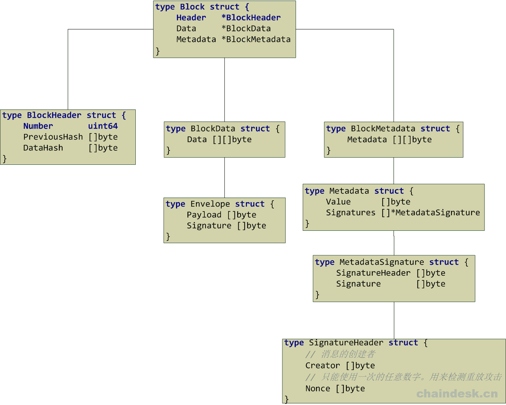
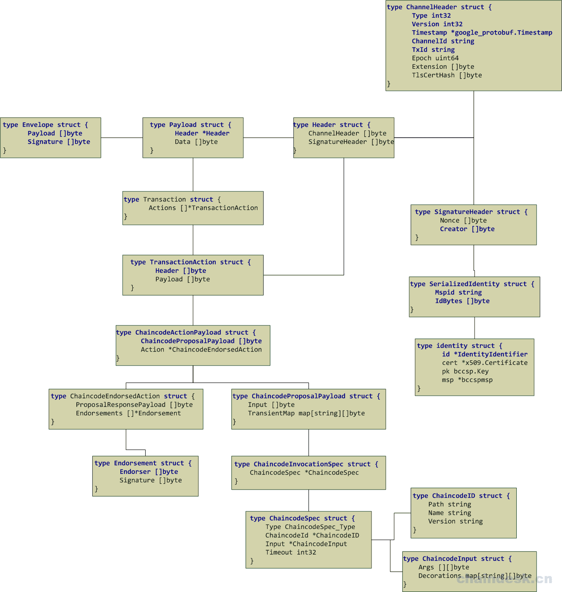

# cryptogen

cryptogen:用于生成组织关系和身份证书。
* 命令为：`cryptogen generate --config=./crypto-config.yaml --output ./crypto-config`
* crypto-config.yaml:配置文件
* 生成crypto-config目录结构解读：
    
    每个组织下，都包括ca、tlsca、msp、peers（或orderers）、users5个目录。如下以peer为例。

    每个组织下，有3种身份，组织本身、节点、用户。

    * 组织本身，包括ca、tlsca、msp三种信息，即组织的根证书、组织的根TLS证书、组织的身份信息。
        * 其中ca、和tlsca，均包括根证书和私钥。
        * 组织本身msp目录，包括ca根证书、tlsca根证书、管理员证书。
    * 每个节点(peers/orderers)目录下，包括msp和tls两个目录，即节点的身份信息，以及tls相关的证书和私钥。
        * 其中msp目录包括5种信息，cacerts、tlscacerts、signcerts为根证书、tls根证书和管理员证书，keystore、signcerts为节点的签名私钥和节点证书。
        * 其中tls目录，包括tls根证书，以及tls版本节点证书和私钥。
    * 每个用户(users)目录下，也包括msp和tls两个目录，即用户的身份信息，以及tls版本用户身份信息。
        * 其中msp目录下包括5种信息，cacerts、tlscacerts、signcerts为根证书、tls根证书和管理员证书，keystore、signcerts为用户的签名私钥和节点证书。
        * 其中tls目录，包括tls根证书，以及tls版本用户证书和私钥。


无论是开发Hyperledger Fabric应用还是测试，都需要有完整的网络环境，而Hyperledger Fabric网络环境包含了较多的内容，包括网络节点，身份证书，私钥等等。这些内容（Network Artifacts）全部都可以使用Hyperledger Fabric 中的cryptogen工具来负责生成，现在我们从源码中来分析一下相关的内容是如何生成的。


## 组织结构的定义
cryptogen工具的源码文件所在路径：hyperledger/fabric/common/tools/cryptogen/main.go，下面我们来分析其中的具体内容。

首先在源码中定义了一些常量，指定了用户名，管理员名称，默认的主机/节点名规则及默认的节点完整域名命名规则。如下所示：
```
const (
    userBaseName            = "User"
    adminBaseName           = "Admin"
    defaultHostnameTemplate = "{{.Prefix}}{{.Index}}"
    defaultCNTemplate       = "{{.Hostname}}.{{.Domain}}"
)
```
定义相关的结构体，指定组成内容，如下：
```
type HostnameData struct {
    Prefix string
    Index  int
    Domain string
}

type SpecData struct {
    Hostname   string
    Domain     string
    CommonName string
}

type NodeTemplate struct {
    Count    int      `yaml:"Count"`
    Start    int      `yaml:"Start"`
    Hostname string   `yaml:"Hostname"`
    SANS     []string `yaml:"SANS"`
}

type NodeSpec struct {
    Hostname           string   `yaml:"Hostname"`
    CommonName         string   `yaml:"CommonName"`
    Country            string   `yaml:"Country"`
    Province           string   `yaml:"Province"`
    Locality           string   `yaml:"Locality"`
    OrganizationalUnit string   `yaml:"OrganizationalUnit"`
    StreetAddress      string   `yaml:"StreetAddress"`
    PostalCode         string   `yaml:"PostalCode"`
    SANS               []string `yaml:"SANS"`
}

type UsersSpec struct {
    Count int `yaml:"Count"`
}

type OrgSpec struct {
    Name          string       `yaml:"Name"`
    Domain        string       `yaml:"Domain"`
    EnableNodeOUs bool         `yaml:"EnableNodeOUs"`
    CA            NodeSpec     `yaml:"CA"`
    Template      NodeTemplate `yaml:"Template"`
    Specs         []NodeSpec   `yaml:"Specs"`
    Users         UsersSpec    `yaml:"Users"`
}

type Config struct {
    OrdererOrgs []OrgSpec `yaml:"OrdererOrgs"`
    PeerOrgs    []OrgSpec `yaml:"PeerOrgs"`
}
```
## 默认配置模板
如果用户在生成Network Artifacts时没有指定对应所使用的配置文件模板，那么Hyperledger Fabric会使用一个默认的配置文件作为生成Network Artifacts的配置信息模板。定义一个defaultConfig变量，其值代表默认配置模板信息：

```
var defaultConfig = `
# ---------------------------------------------------------------------------
# "OrdererOrgs" - Definition of organizations managing orderer nodes
# ---------------------------------------------------------------------------
OrdererOrgs:
  # ---------------------------------------------------------------------------
  # Orderer
  # ---------------------------------------------------------------------------
  - Name: Orderer
    Domain: example.com

    # ---------------------------------------------------------------------------
    # "Specs" - See PeerOrgs below for complete description
    # ---------------------------------------------------------------------------
    Specs:
      - Hostname: orderer

# ---------------------------------------------------------------------------
# "PeerOrgs" - Definition of organizations managing peer nodes
# ---------------------------------------------------------------------------
PeerOrgs:
  # ---------------------------------------------------------------------------
  # Org1
  # ---------------------------------------------------------------------------
  - Name: Org1
    Domain: org1.example.com
    EnableNodeOUs: false

    # ---------------------------------------------------------------------------
    # "CA"
    # ---------------------------------------------------------------------------
    # Uncomment this section to enable the explicit definition of the CA for this
    # organization.  This entry is a Spec.  See "Specs" section below for details.
    # ---------------------------------------------------------------------------
    # CA:
    #    Hostname: ca # implicitly ca.org1.example.com
    #    Country: US
    #    Province: California
    #    Locality: San Francisco
    #    OrganizationalUnit: Hyperledger Fabric
    #    StreetAddress: address for org # default nil
    #    PostalCode: postalCode for org # default nil

    # ---------------------------------------------------------------------------
    # "Specs"
    # ---------------------------------------------------------------------------
    # Uncomment this section to enable the explicit definition of hosts in your
    # configuration.  Most users will want to use Template, below
    #
    # Specs is an array of Spec entries.  Each Spec entry consists of two fields:
    #   - Hostname:   (Required) The desired hostname, sans the domain.
    #   - CommonName: (Optional) Specifies the template or explicit override for
    #                 the CN.  By default, this is the template:
    #
    #                              "{{.Hostname}}.{{.Domain}}"
    #
    #                 which obtains its values from the Spec.Hostname and
    #                 Org.Domain, respectively.
    #   - SANS:       (Optional) Specifies one or more Subject Alternative Names
    #                 to be set in the resulting x509. Accepts template
    #                 variables {{.Hostname}}, {{.Domain}}, {{.CommonName}}. IP
    #                 addresses provided here will be properly recognized. Other
    #                 values will be taken as DNS names.
    #                 NOTE: Two implicit entries are created for you:
    #                     - {{ .CommonName }}
    #                     - {{ .Hostname }}
    # ---------------------------------------------------------------------------
    # Specs:
    #   - Hostname: foo # implicitly "foo.org1.example.com"
    #     CommonName: foo27.org5.example.com # overrides Hostname-based FQDN set above
    #     SANS:
    #       - "bar.{{.Domain}}"
    #       - "altfoo.{{.Domain}}"
    #       - "{{.Hostname}}.org6.net"
    #       - 172.16.10.31
    #   - Hostname: bar
    #   - Hostname: baz

    # ---------------------------------------------------------------------------
    # "Template"
    # ---------------------------------------------------------------------------
    # Allows for the definition of 1 or more hosts that are created sequentially
    # from a template. By default, this looks like "peer%d" from 0 to Count-1.
    # You may override the number of nodes (Count), the starting index (Start)
    # or the template used to construct the name (Hostname).
    #
    # Note: Template and Specs are not mutually exclusive.  You may define both
    # sections and the aggregate nodes will be created for you.  Take care with
    # name collisions
    # ---------------------------------------------------------------------------
    Template:
      Count: 1
      # Start: 5
      # Hostname: {{.Prefix}}{{.Index}} # default
      # SANS:
      #   - "{{.Hostname}}.alt.{{.Domain}}"

    # ---------------------------------------------------------------------------
    # "Users"
    # ---------------------------------------------------------------------------
    # Count: The number of user accounts _in addition_ to Admin
    # ---------------------------------------------------------------------------
    Users:
      Count: 1

  # ---------------------------------------------------------------------------
  # Org2: See "Org1" for full specification
  # ---------------------------------------------------------------------------
  - Name: Org2
    Domain: org2.example.com
    EnableNodeOUs: false
    Template:
      Count: 1
    Users:
      Count: 1
`
```
> 该默认模板文件的内容与fabric-samples/first-network/crypto-config.yaml的配置文件内容大致相同，不同之处在EnableNodeOUs与Template的值。

定义变量app，指定相关命令及该命令可以附带的参数信息：
```
//命令行参数
var (
    app = kingpin.New("cryptogen", "Utility for generating Hyperledger Fabric key material")

    gen           = app.Command("generate", "Generate key material")
    outputDir     = gen.Flag("output", "The output directory in which to place artifacts").Default("crypto-config").String()
    genConfigFile = gen.Flag("config", "The configuration template to use").File()

    showtemplate = app.Command("showtemplate", "Show the default configuration template")

    version       = app.Command("version", "Show version information")
    ext           = app.Command("extend", "Extend existing network")
    inputDir      = ext.Flag("input", "The input directory in which existing network place").Default("crypto-config").String()
    extConfigFile = ext.Flag("config", "The configuration template to use").File()
)
```
kingpin.New()是创建了一个Kingpin application实例，然后调用其Command函数创建相应的子命令generate、showtemplate、version、extend，并为generate与extend两个子命令使用Flag函数分别指定可附带的参数，其中generate子命令可附带的参数为：ouput、config，extend子命令可附带的参数为：input、config。

## 生成crypto
定义主函数，根据命令行中指定的命令执行相关的功能：
```
func main() {
    kingpin.Version("0.0.1")
    switch kingpin.MustParse(app.Parse(os.Args[1:])) {

    // 如果是 "generate" 命令
    case gen.FullCommand():
        generate()

    case ext.FullCommand():
        extend()

        // 如果是 "showtemplate" 命令
    case showtemplate.FullCommand():
        fmt.Print(defaultConfig)
        os.Exit(0)

        // 如果是 "version" 命令
    case version.FullCommand():
        printVersion()
    }

}
```
如果命令行中给定的是“generate”命令，则调用generate()函数，如果给定的是“extend”命令，则调用extend()函数，如果是“showtemplate”命令，则直接输出已定义的默认配置模板信息，如果是“version”命令，则调用printVersion()函数直接输出版本信息。

我们在此对generate命令进行解释，所调用的generate()函数源码如下：
```
func generate() {

    config, err := getConfig()
    if err != nil {
        fmt.Printf("Error reading config: %s", err)
        os.Exit(-1)
    }

    for _, orgSpec := range config.PeerOrgs {
        err = renderOrgSpec(&orgSpec, "peer")
        if err != nil {
            fmt.Printf("Error processing peer configuration: %s", err)
            os.Exit(-1)
        }
        generatePeerOrg(*outputDir, orgSpec)
    }

    for _, orgSpec := range config.OrdererOrgs {
        err = renderOrgSpec(&orgSpec, "orderer")
        if err != nil {
            fmt.Printf("Error processing orderer configuration: %s", err)
            os.Exit(-1)
        }
        generateOrdererOrg(*outputDir, orgSpec)
    }
}
```
首先通过调用getConfig()函数获取配置信息，如果在命令行中指定了config参数，则根据指定的文件所在路径及文件名称读取配置内容并返回，反之使用定义的默认配置模板信息。

然后利用for循环从配置信息中获取关于PeerOrgs的内容，调用renderOrgSpec(&orgSpec, "peer")生成指定的域，

```
func renderOrgSpec(orgSpec *OrgSpec, prefix string) error {
    // 首先处理模板所有节点
    for i := 0; i < orgSpec.Template.Count; i++ {
        data := HostnameData{
            Prefix: prefix,
            Index:  i + orgSpec.Template.Start,
            Domain: orgSpec.Domain,
        }

        hostname, err := parseTemplateWithDefault(orgSpec.Template.Hostname, defaultHostnameTemplate, data)
        if err != nil {
            return err
        }

        spec := NodeSpec{
            Hostname: hostname,
            SANS:     orgSpec.Template.SANS,
        }
        orgSpec.Specs = append(orgSpec.Specs, spec)
    }

    // 修改所有通用节点规范以添加域
    for idx, spec := range orgSpec.Specs {
        err := renderNodeSpec(orgSpec.Domain, &spec)
        if err != nil {
            return err
        }

        orgSpec.Specs[idx] = spec
    }

    // 以相同的方式处理CA节点规范
    if len(orgSpec.CA.Hostname) == 0 {
        orgSpec.CA.Hostname = "ca"
    }
    err := renderNodeSpec(orgSpec.Domain, &orgSpec.CA)
    if err != nil {
        return err
    }

    return nil
}
```
之后再调用generatePeerOrg(*outputDir, orgSpec)函数，将生成的Orgs结构信息保存在指定的输出目录中（如果没有指定输出目录，则默认为当前的"crypto-config"目录）。生成Orgs结构信息过程较为复杂，涉及到CA相关的内容。大体步骤如下：

1. 指定组织中相应的各目录路径，如下：
```
    orgDir := filepath.Join(baseDir, "peerOrganizations", orgName)
    caDir := filepath.Join(orgDir, "ca")
    tlsCADir := filepath.Join(orgDir, "tlsca")
    mspDir := filepath.Join(orgDir, "msp")
    peersDir := filepath.Join(orgDir, "peers")
    usersDir := filepath.Join(orgDir, "users")
    adminCertsDir := filepath.Join(mspDir, "admincerts")
```
2. 调用signCA, err := ca.NewCA(caDir, orgName, orgSpec.CA.CommonName, orgSpec.CA.Country, orgSpec.CA.Province, orgSpec.CA.Locality, orgSpec.CA.OrganizationalUnit, orgSpec.CA.StreetAddress, orgSpec.CA.PostalCode)根据的ca所属路径，创建CA的实例并保存签名密钥对；

3. 调用tlsCA, err := ca.NewCA(tlsCADir, orgName, "tls"+orgSpec.CA.CommonName, orgSpec.CA.Country, orgSpec.CA.Province, orgSpec.CA.Locality, orgSpec.CA.OrganizationalUnit, orgSpec.CA.StreetAddress, orgSpec.CA.PostalCode)生成TLS CA的实例并保存签名密钥对;

4. 调用err = msp.GenerateVerifyingMSP(mspDir, signCA, tlsCA, orgSpec.EnableNodeOUs)生成MSP相关的内容;

5. 调用generateNodes(peersDir, orgSpec.Specs, signCA, tlsCA, msp.PEER, orgSpec.EnableNodeOUs)生成Peer节点相关的内容;

6. 调用generateNodes(usersDir, users, signCA, tlsCA, msp.CLIENT, orgSpec.EnableNodeOUs)生成用户相关的内容；

7. 通过调用err = copyAdminCert(usersDir, adminCertsDir, adminUser.CommonName)函数，将管理证书复制到org的MSP admincerts目录下；

8. 最后通过一个for循环，将管理证书复制到组织的每个Peer节点的MSP admincert目录下。

至此为止，关于Org组织相关的所有内容已经全部创建完成，接下来利用for循环从配置信息中获取关于OrdererOrgs的内容，调用renderOrgSpec(&orgSpec, "orderer")生成生成指定的域，之后再调用generateOrdererOrg(*outputDir, orgSpec)函数，将生成的Orderer结构信息保存在指定的输出目录中（如果没有指定输出目录，则默认为当前的"crypto-config"目录），生成Orderer组织的结构过程与生成Orgs组织的结构过程类似，不再赘述。

## configtxgen命令解析
### 命令解析
生成组织结构及身份证书之后，需要创建初始区块配置文件、应用通道交易配置文件、锚节点更新配置文件。这些功能的实现源码被封装在hyperledger/fabric/common/tools/configtxgen/main.go文件中，我们先来分析main函数，在main函数中首先定义了一些带有指定名称、默认值和使用字符串的字符串标志， 作为configtxgen工具的可附带参数。如下所示：
```
    var outputBlock, outputChannelCreateTx, profile, configPath, channelID, inspectBlock, inspectChannelCreateTx, outputAnchorPeersUpdate, asOrg, printOrg string

    flag.StringVar(&outputBlock, "outputBlock", "", "The path to write the genesis block to (if set)")
    flag.StringVar(&channelID, "channelID", "", "The channel ID to use in the configtx")
    flag.StringVar(&outputChannelCreateTx, "outputCreateChannelTx", "", "The path to write a channel creation configtx to (if set)")
    flag.StringVar(&profile, "profile", genesisconfig.SampleInsecureSoloProfile, "The profile from configtx.yaml to use for generation.")
    flag.StringVar(&configPath, "configPath", "", "The path containing the configuration to use (if set)")
    flag.StringVar(&inspectBlock, "inspectBlock", "", "Prints the configuration contained in the block at the specified path")
    flag.StringVar(&inspectChannelCreateTx, "inspectChannelCreateTx", "", "Prints the configuration contained in the transaction at the specified path")
    flag.StringVar(&outputAnchorPeersUpdate, "outputAnchorPeersUpdate", "", "Creates an config update to update an anchor peer (works only with the default channel creation, and only for the first update)")
    flag.StringVar(&asOrg, "asOrg", "", "Performs the config generation as a particular organization (by name), only including values in the write set that org (likely) has privilege to set")
    flag.StringVar(&printOrg, "printOrg", "", "Prints the definition of an organization as JSON. (useful for adding an org to a channel manually)")

    version := flag.Bool("version", false, "Show version information")

    flag.Parse()
```
之后，检查有无channelID，如果没有设置，则使用默认的“testchainid”作为channelID的值。
```
if channelID == "" {
    channelID = genesisconfig.TestChainID
    logger.Warningf("Omitting the channel ID for configtxgen is deprecated.  Explicitly passing the channel ID will be required in the future, defaulting to '%s'.", channelID)
}
```
判断是否为查看版本信息的参数，如果是则调用printVersion()函数输出版本信息，源代码如下：
```
// 显示版本
if *version {
    printVersion()
    os.Exit(exitCode)
}
```

> 示例：如果在命令提示符中输入如下命令：
```
$ ../bin/configtxgen -version
```
> 则命令执行后会在终端中输出如下的类似信息：
```
configtxgen:
 Version: 1.1.0
 Go version: go1.9.2
 OS/Arch: linux/amd64
```
如果提供的参数不是显示版本信息，则通过调用logging.SetLevel函数设置日志级别为INFO。然后调用factory.InitFactories(nil)，指定默认的BCCSP，默认使用“SW”

如果指定了生成的配置文件存储目录，则调用genesisconfig.Load(profile, configPath)获取概要配置信息，并将其解封成为相应的结构体，以便于在输出文件时使用。源码如下：
```
var profileConfig *genesisconfig.Profile
if outputBlock != "" || outputChannelCreateTx != "" || outputAnchorPeersUpdate != "" {
    if configPath != "" {
        profileConfig = genesisconfig.Load(profile, configPath)
    } else {
        profileConfig = genesisconfig.Load(profile)
    }
}
```
> 注意：profile的值来自于参数中实际给定的值，如：TwoOrgsOrdererGenesis或TwoOrgsChannel。configPath的值同样取自于参数中实际给定的值，如果没有指定configPath参数，则默认为当前目录下的名为configtx.yaml的文件

之后通过判断configPath是否为空，选择加载configtx，将yaml配置文件中的内容保存在定义的对应的结构体中，完成初始化工作，以便于后期将组织的定义输出为JSON串。如下：
```
var topLevelConfig *genesisconfig.TopLevel
if configPath != "" {
    topLevelConfig = genesisconfig.LoadTopLevel(configPath)
} else {
    topLevelConfig = genesisconfig.LoadTopLevel()
}
```
获取到相应的配置信息之后，根据指定的参数调用不同的函数生成不同的配置文件：

```
if outputBlock != "" {    // 生成初始区块文件
        if err := doOutputBlock(profileConfig, channelID, outputBlock); err != nil {
            logger.Fatalf("Error on outputBlock: %s", err)
        }
    }

if outputChannelCreateTx != "" {    // 生成应用通道交易配置文件
    if err := doOutputChannelCreateTx(profileConfig, channelID, outputChannelCreateTx); err != nil {
        logger.Fatalf("Error on outputChannelCreateTx: %s", err)
    }
}

if inspectBlock != "" {    // 检查初始区块文件内容
    if err := doInspectBlock(inspectBlock); err != nil {
        logger.Fatalf("Error on inspectBlock: %s", err)
    }
}

if inspectChannelCreateTx != "" {    // 检查应用通道交易配置文件内容
    if err := doInspectChannelCreateTx(inspectChannelCreateTx); err != nil {
        logger.Fatalf("Error on inspectChannelCreateTx: %s", err)
    }
}

if outputAnchorPeersUpdate != "" {    // 生成锚节点更新配置文件
    if err := doOutputAnchorPeersUpdate(profileConfig, channelID, outputAnchorPeersUpdate, asOrg); err != nil {
        logger.Fatalf("Error on inspectChannelCreateTx: %s", err)
    }
}

if printOrg != "" {
    if err := doPrintOrg(topLevelConfig, printOrg); err != nil {
        logger.Fatalf("Error on printOrg: %s", err)
    }
}
```
## 使用configtxgen工具生成GenesisBlock配置文件过程
### 生成genesis.block
configtxgen命令解析完毕之后，接下来就可以进入对应的分支条件中理解各文件是如何被创建的。

下面我们来看一下生成初始区块的详细过程，在hyperledger/fabric/common/tools/configtxgen/main函数中，判断outputBlock参数是否为空，如果不为空，则说明用户需要生成GenesisBlock文件：
```
if outputBlock != "" {
        if err := doOutputBlock(profileConfig, channelID, outputBlock); err != nil {
            logger.Fatalf("Error on outputBlock: %s", err)
        }
    }
```
如果判断条件成立，则将概要配置信息的结构体对象，通道名称，文件保存路径及文件名称作为参数通过调用doOutputBlock函数，实现生成GenesisBlock文件，doOutputBlock函数的实现源码如下：
```
func doOutputBlock(config *genesisconfig.Profile, channelID string, outputBlock string) error {
    pgen := encoder.New(config)
    logger.Info("Generating genesis block")
    if config.Consortiums == nil {
        logger.Warning("Genesis block does not contain a consortiums group definition.  This block cannot be used for orderer bootstrap.")
    }
    genesisBlock := pgen.GenesisBlockForChannel(channelID)
    logger.Info("Writing genesis block")
    err := ioutil.WriteFile(outputBlock, utils.MarshalOrPanic(genesisBlock), 0644)
    if err != nil {
        return fmt.Errorf("Error writing genesis block: %s", err)
    }
    return nil
}
```
首先通过调用encoder.New(config)函数，将*genesisconfig.Profile结构体作为参数传递给encoder.New函数，New函数的作用就是创建一个用于生成genesis块的新引导程序，源码如下：
```
func New(config *genesisconfig.Profile) *Bootstrapper {
    channelGroup, err := NewChannelGroup(config)
    if err != nil {
        logger.Panicf("Error creating channel group: %s", err)
    }
    return &Bootstrapper{
        channelGroup: channelGroup,
    }
}
```
可以看到该函数最后返回一个*Bootstrapper类型的结构体，Bootstrapper结构体是一个围绕NewChannelConfigGroup的包装器，它可以生成genesis块。在New函数中，最主要的就是该函数中的第一行代码，通过调用NewChannelGroup(config)函数来实现定义通道的相关配置，通过调用addValue函数定义了当前唯一有效的散列算法（bccsp.SHA256）及当前唯一有效的区块数据散列结构、Orderer排序服务的位置配置信息，然后根据相关的配置信息调用对应的函数分别创建了NewOrdererGroup、NewApplicationGroup、NewConsortiumsGroup。

> 如果配置文件中没有显式地指定Policy，则调用addImplicitMetaPolicyDefaults函数添加默认的Policy。

NewChannelGroup函数位置在hyperledger/fabric/common/tools/configtxgen/encoder/encoder.go文件中，函数实现源码如下：

```
// NewChannelGroup定义通道配置的根。它定义了基本的操作原则，如用于块的散列算法，以及Orderer服务的位置。
// 根据配置中是否设置了这些子元素，它将递归调用NewOrdererGroup、newsyndictiumsgroup和NewApplicationGroup。
// 这个组的所有mod_policy值都设置为“Admins”，OrdererAddresses值除外，该值设置为“/Channel/Orderer/Admins”。
func NewChannelGroup(conf *genesisconfig.Profile) (*cb.ConfigGroup, error) {
    if conf.Orderer == nil {
        return nil, errors.New("missing orderer config section")
    }
    // 创建channel_group信息包含的Version、Groups、Values、Policies、 ModPolicy的ConfigGroup对象
    channelGroup := cb.NewConfigGroup()
    if len(conf.Policies) == 0 {
        logger.Warningf("Default policy emission is deprecated, please include policy specificiations for the channel group in configtx.yaml")
        addImplicitMetaPolicyDefaults(channelGroup)
    } else {
        if err := addPolicies(channelGroup, conf.Policies, channelconfig.AdminsPolicyKey); err != nil {
            return nil, errors.Wrapf(err, "error adding policies to channel group")
        }
    }

    // 添加当前唯一有效的散列算法（bccsp.SHA256）
    addValue(channelGroup, channelconfig.HashingAlgorithmValue(), channelconfig.AdminsPolicyKey)
    // 添加当前唯一有效的区块数据散列结构
    addValue(channelGroup, channelconfig.BlockDataHashingStructureValue(), channelconfig.AdminsPolicyKey)
    // 添加Orderer服务的位置配置信息
    addValue(channelGroup, channelconfig.OrdererAddressesValue(conf.Orderer.Addresses), ordererAdminsPolicyName)

    if conf.Consortium != "" {
        addValue(channelGroup, channelconfig.ConsortiumValue(conf.Consortium), channelconfig.AdminsPolicyKey)
    }

    if len(conf.Capabilities) > 0 {
        addValue(channelGroup, channelconfig.CapabilitiesValue(conf.Capabilities), channelconfig.AdminsPolicyKey)
    }

    var err error
    // 创建配置文件中所需的Orderer组件信息
    channelGroup.Groups[channelconfig.OrdererGroupKey], err = NewOrdererGroup(conf.Orderer)
    if err != nil {
        return nil, errors.Wrap(err, "could not create orderer group")
    }

    if conf.Application != nil {
        // 默认的configtx.yaml文件中TwoOrgsOrdererGenesis部分没有指定Application
        channelGroup.Groups[channelconfig.ApplicationGroupKey], err = NewApplicationGroup(conf.Application)
        if err != nil {
            return nil, errors.Wrap(err, "could not create application group")
        }
    }

    if conf.Consortiums != nil {
        // 创建配置文件中所需的联盟信息（payload/data/config/channel_group/groups/Consortiums中所包含的内容）
        channelGroup.Groups[channelconfig.ConsortiumsGroupKey], err = NewConsortiumsGroup(conf.Consortiums)
        if err != nil {
            return nil, errors.Wrap(err, "could not create consortiums group")
        }
    }

    channelGroup.ModPolicy = channelconfig.AdminsPolicyKey
    return channelGroup, nil
}
```
返回至doOutputBlock函数，通过判断config.Consortiums是否定义了联盟信息，如果没有定义联盟信息，则输出警告“Genesis块没有包含联盟的定义。不能用于Orderer引导”

之后通过调用genesisBlock := pgen.GenesisBlockForChannel(channelID)函数，根据给定的通道ID生成一个genesis块。生成的Block（区块）包含如下的三项内容：

* Header *BlockHeader
* Data *BlockData
* Metadata *BlockMetadata
该Block结构被定义在hyperledger/fabric/protos/common/common.pb.go文件中，具体结构如下图所示：




其中Envelope结构体的详细组成内容如下图所示：



GenesisBlockForChannel函数实现源码如下：
```
// 根据指定的通道ID生成一个genesis块
func (bs *Bootstrapper) GenesisBlockForChannel(channelID string) *cb.Block {
    block, err := genesis.NewFactoryImpl(bs.channelGroup).Block(channelID)
    if err != nil {
        logger.Panicf("Error creating genesis block from channel group: %s", err)
    }
    return block
}
```
在GenesisBlockForChannel函数中，调用hyperledger/fabric/common/genesis/genesis.go文件中的NewFactoryImpl函数根据指定的channelGroup创建了一个新的factory结构体对象，该对象中包含一个channelGroup成员，该成员主要用于保存配置的分层数据结构，该结构体被定义在hyperledger/fabric/protos/common/configtx.pb.go文件中，源码如下：
```
type ConfigGroup struct {
    Version   uint64                   `protobuf:"varint,1,opt,name=version" json:"version,omitempty"`
    Groups    map[string]*ConfigGroup  `protobuf:"bytes,2,rep,name=groups" json:"groups,omitempty" protobuf_key:"bytes,1,opt,name=key" protobuf_val:"bytes,2,opt,name=value"`
    Values    map[string]*ConfigValue  `protobuf:"bytes,3,rep,name=values" json:"values,omitempty" protobuf_key:"bytes,1,opt,name=key" protobuf_val:"bytes,2,opt,name=value"`
    Policies  map[string]*ConfigPolicy `protobuf:"bytes,4,rep,name=policies" json:"policies,omitempty" protobuf_key:"bytes,1,opt,name=key" protobuf_val:"bytes,2,opt,name=value"`
    ModPolicy string                   `protobuf:"bytes,5,opt,name=mod_policy,json=modPolicy" json:"mod_policy,omitempty"`
}
```
得到factory对象之后，调用其Block函数，最终实现了构造并返回给定通道ID的genesis块。实现源码如下：
```
type factory struct {
    channelGroup *cb.ConfigGroup
}

// 创建一个新的Factory
func NewFactoryImpl(channelGroup *cb.ConfigGroup) Factory {
    return &factory{channelGroup: channelGroup}
}

// 构造并返回给定通道ID的genesis块
func (f *factory) Block(channelID string) (*cb.Block, error) {
    payloadChannelHeader := utils.MakeChannelHeader(cb.HeaderType_CONFIG, msgVersion, channelID, epoch)
    payloadSignatureHeader := utils.MakeSignatureHeader(nil, utils.CreateNonceOrPanic())
    utils.SetTxID(payloadChannelHeader, payloadSignatureHeader)
    payloadHeader := utils.MakePayloadHeader(payloadChannelHeader, payloadSignatureHeader)
    payload := &cb.Payload{Header: payloadHeader, Data: utils.MarshalOrPanic(&cb.ConfigEnvelope{Config: &cb.Config{ChannelGroup: f.channelGroup}})}
    envelope := &cb.Envelope{Payload: utils.MarshalOrPanic(payload), Signature: nil}

    block := cb.NewBlock(0, nil)
    block.Data = &cb.BlockData{Data: [][]byte{utils.MarshalOrPanic(envelope)}}
    block.Header.DataHash = block.Data.Hash()
    block.Metadata.Metadata[cb.BlockMetadataIndex_LAST_CONFIG] = utils.MarshalOrPanic(&cb.Metadata{
        Value: utils.MarshalOrPanic(&cb.LastConfig{Index: 0}),
    })
    return block, nil
}
```
最后根据指定的outputBlock参数的值（目标文件所在路径及文件名称），将生成的genesis块内容利用ioutil.WriteFile函数写入到指定的文件中。

如果在执行过程中有错误产生，则通过main函数中定义的defer函数功能输出相应的提示信息并退出，如下源码所示：
```
defer func() {
    if err := recover(); err != nil {
        if strings.Contains(fmt.Sprint(err), "Error reading configuration: Unsupported Config Type") {
            logger.Error("Could not find configtx.yaml. " +
            "Please make sure that FABRIC_CFG_PATH or --configPath is set to a path " +
                    "which contains configtx.yaml")
            os.Exit(1)
        }
        if strings.Contains(fmt.Sprint(err), "Could not find profile") {
            logger.Error(fmt.Sprint(err) + ". " +
                "Please make sure that FABRIC_CFG_PATH or --configPath is set to a path " +
                "which contains configtx.yaml with the specified profile")
            os.Exit(1)
        }
        logger.Panic(err)
    }
}()
```
## 使用configtxgen工具生成通道交易配置文件
### 生应用通道交易配置文件

返回至hyperledger/fabric/common/tools/configtxgen/main函数中，使用if进行判断，如果outputChannelCreateTx参数不为空，则说明在命令行中输入的命令是生成应用通道交易配置文件，则将获取到的概要配置信息的结构体对象，通道名称，文件保存路径及文件名称作为参数通过调用doOutputChannelCreateTx函数，生成指定的ChannelTx文件， 实现源码如下：
```
if outputChannelCreateTx != "" {
        if err := doOutputChannelCreateTx(profileConfig, channelID, outputChannelCreateTx); err != nil {
            logger.Fatalf("Error on outputChannelCreateTx: %s", err)
        }
    }
```
如果命令参数指定生成通道交易配置文件，则调用doOutputChannelCreateTx函数来实现，具体实现过程如下：

```
// 创建应用通道交易配置文件
func doOutputChannelCreateTx(conf *genesisconfig.Profile, channelID string, outputChannelCreateTx string) error {
    logger.Info("Generating new channel configtx")

    configtx, err := encoder.MakeChannelCreationTransaction(channelID, nil, nil, conf)
    if err != nil {
        return err
    }

    //将指定的内容序列化为一个protobuf消息之后将其写入到由outputChannelCreateTx变量代表（用户指定的文件）的文件中。即生成最终的目标文件。
    logger.Info("Writing new channel tx")
    err = ioutil.WriteFile(outputChannelCreateTx, utils.MarshalOrPanic(configtx), 0644)
    if err != nil {
        return fmt.Errorf("Error writing channel create tx: %s", err)
    }
    return nil
}
```
在doOutputChannelCreateTx函数中，首先调用MakeChannelCreationTransaction函数创建通道的事务，然后对其进行序列化并只在在指定的文件中。创建通道的事务实现源码如下：
```
// 用于创建通道的事务
func MakeChannelCreationTransaction(channelID string, signer crypto.LocalSigner, orderingSystemChannelConfigGroup *cb.ConfigGroup, conf *genesisconfig.Profile) (*cb.Envelope, error) {
    // 获取一个common.ConfigUpdate对象, orderingSystemChannelConfigGroup为nil
    newChannelConfigUpdate, err := NewChannelCreateConfigUpdate(channelID, orderingSystemChannelConfigGroup, conf)
    if err != nil {
        return nil, errors.Wrap(err, "config update generation failure")
    }
    // 进行序列化
    newConfigUpdateEnv := &cb.ConfigUpdateEnvelope{
        ConfigUpdate: utils.MarshalOrPanic(newChannelConfigUpdate),
    }

    if signer != nil {    // 创建应用通道配置时传递的signer值为nil
        sigHeader, err := signer.NewSignatureHeader()
        if err != nil {
            return nil, errors.Wrap(err, "creating signature header failed")
        }

        newConfigUpdateEnv.Signatures = []*cb.ConfigSignature{{
            SignatureHeader: utils.MarshalOrPanic(sigHeader),
        }}

        newConfigUpdateEnv.Signatures[0].Signature, err = signer.Sign(util.ConcatenateBytes(newConfigUpdateEnv.Signatures[0].SignatureHeader, newConfigUpdateEnv.ConfigUpdate))
        if err != nil {
            return nil, errors.Wrap(err, "signature failure over config update")
        }

    }

    return utils.CreateSignedEnvelope(cb.HeaderType_CONFIG_UPDATE, channelID, signer, newConfigUpdateEnv, msgVersion, epoch)
}
```
在MakeChannelCreationTransaction函数中，第一行便是调用NewChannelCreateConfigUpdate函数获取一个common.ConfigUpdate对象，参数orderingSystemChannelGroup为nil

```
// 生成一个ConfigUpdate，可以将它发送给Orderer以创建一个新通道。可选地，这个通道组可以传入Orderer系统通道，生成的ConfigUpdate将从该文件中提取适当的版本。
func NewChannelCreateConfigUpdate(channelID string, orderingSystemChannelGroup *cb.ConfigGroup, conf *genesisconfig.Profile) (*cb.ConfigUpdate, error) {
    if conf.Application == nil {
        return nil, errors.New("cannot define a new channel with no Application section")
    }

    if conf.Consortium == "" {
        return nil, errors.New("cannot define a new channel with no Consortium value")
    }

    // 只解析所配置的应用程序部分，并将其封装在通道组中
    ag, err := NewApplicationGroup(conf.Application)
    if err != nil {
        return nil, errors.Wrapf(err, "could not turn channel application profile into application group")
    }

    var template, newChannelGroup *cb.ConfigGroup

    if orderingSystemChannelGroup != nil {
        ......
    } else {    // 因为传递的orderingSystemChannelGroup为nil，所以执行else部分
        newChannelGroup = &cb.ConfigGroup{
            Groups: map[string]*cb.ConfigGroup{
                channelconfig.ApplicationGroupKey: ag,    // 指定为应用程序部分的通道组
            },
        }

        // 假设orgs没有被修改
        template = proto.Clone(newChannelGroup).(*cb.ConfigGroup)
        template.Groups[channelconfig.ApplicationGroupKey].Values = nil
        template.Groups[channelconfig.ApplicationGroupKey].Policies = nil
    }
    // 进行计算
    updt, err := update.Compute(&cb.Config{ChannelGroup: template}, &cb.Config{ChannelGroup: newChannelGroup})
    if err != nil {
        return nil, errors.Wrapf(err, "could not compute update")
    }

    // 根据需要添加联盟名称，以便将通道创建到写入集中
    updt.ChannelId = channelID
    updt.ReadSet.Values[channelconfig.ConsortiumKey] = &cb.ConfigValue{Version: 0}
    updt.WriteSet.Values[channelconfig.ConsortiumKey] = &cb.ConfigValue{
        Version: 0,
        Value: utils.MarshalOrPanic(&cb.Consortium{    // 联盟信息
            Name: conf.Consortium,
        }),
    }

    return updt, nil
}
```
NewChannelCreateConfigUpdate函数中首先检查配置信息中的Application及Consortium是否指定，如果未指定相关信息，直接返回错误。否则调用hyperledger/fabric/protos/common/configtx.go源码文件中的NewConfigGroup函数，该函数定义了在应用程序逻辑中所涉及的组织，如链码，以及这些成员如何与Orderer交互。并将所有元素的mod_policy设置为“Admins”。实现源码如下：
```
// 返回通道配置的应用程序组件。它定义了在应用程序逻辑中所涉及的组织，如链码，以及这些成员如何与Orderer交互。并将所有元素的mod_policy设置为“Admins”。
func NewApplicationGroup(conf *genesisconfig.Application) (*cb.ConfigGroup, error) {
    // 创建Application信息包含的Version、Groups、Values、Policies、 ModPolicy的ConfigGroup对象
    applicationGroup := cb.NewConfigGroup()
    if len(conf.Policies) == 0 {
        logger.Warningf("Default policy emission is deprecated, please include policy specificiations for the application group in configtx.yaml")
        addImplicitMetaPolicyDefaults(applicationGroup)
    } else {
        if err := addPolicies(applicationGroup, conf.Policies, channelconfig.AdminsPolicyKey); err != nil {
            return nil, errors.Wrapf(err, "error adding policies to application group")
        }
    }

    if len(conf.ACLs) > 0 {
        addValue(applicationGroup, channelconfig.ACLValues(conf.ACLs), channelconfig.AdminsPolicyKey)
    }

    if len(conf.Capabilities) > 0 {
        addValue(applicationGroup, channelconfig.CapabilitiesValue(conf.Capabilities), channelconfig.AdminsPolicyKey)
    }

    for _, org := range conf.Organizations {
        var err error
        applicationGroup.Groups[org.Name], err = NewApplicationOrgGroup(org)
        if err != nil {
            return nil, errors.Wrap(err, "failed to create application org")
        }
    }

    applicationGroup.ModPolicy = channelconfig.AdminsPolicyKey
    return applicationGroup, nil
}
```
Application Org的相关信息通过for循环中调用NewApplicationOrgGroup函数来完成，具体实现源码如下：
```
// 返回通道配置的Application Org组件。它为组织定义了加密材料 (MSP)，以及它的Anchor Peers使用的gossip网络。并将所有元素的mod_policy设置为“Admins”。
func NewApplicationOrgGroup(conf *genesisconfig.Organization) (*cb.ConfigGroup, error) {
    mspConfig, err := msp.GetVerifyingMspConfig(conf.MSPDir, conf.ID, conf.MSPType)
    if err != nil {
        return nil, errors.Wrapf(err, "1 - Error loading MSP configuration for org %s: %s", conf.Name)
    }
    // 创建ApplicationOrg所包含的Version、Groups、Values、Policies、 ModPolicy的ConfigGroup对象
    applicationOrgGroup := cb.NewConfigGroup()
    if len(conf.Policies) == 0 {
        logger.Warningf("Default policy emission is deprecated, please include policy specificiations for the application org group %s in configtx.yaml", conf.Name)
        addSignaturePolicyDefaults(applicationOrgGroup, conf.ID, conf.AdminPrincipal != genesisconfig.AdminRoleAdminPrincipal)
    } else {
        if err := addPolicies(applicationOrgGroup, conf.Policies, channelconfig.AdminsPolicyKey); err != nil {
            return nil, errors.Wrapf(err, "error adding policies to application org group %s", conf.Name)
        }
    }
    addValue(applicationOrgGroup, channelconfig.MSPValue(mspConfig), channelconfig.AdminsPolicyKey)

    var anchorProtos []*pb.AnchorPeer
    for _, anchorPeer := range conf.AnchorPeers {
        anchorProtos = append(anchorProtos, &pb.AnchorPeer{
            Host: anchorPeer.Host,
            Port: int32(anchorPeer.Port),
        })
    }
    addValue(applicationOrgGroup, channelconfig.AnchorPeersValue(anchorProtos), channelconfig.AdminsPolicyKey)

    applicationOrgGroup.ModPolicy = channelconfig.AdminsPolicyKey
    return applicationOrgGroup, nil
}
```
Application Org的相关信息处理完毕，返回至NewApplicationGroup函数，返回获取到的applicationGroup结构对象，返回的hyperledger/fabric/protos/common/configtx.pb.go/ConfigGroup结构定义如下：
```
// 用于保存配置的分层数据结构
type ConfigGroup struct {
    Version   uint64                   `protobuf:"varint,1,opt,name=version" json:"version,omitempty"`
    Groups    map[string]*ConfigGroup  `protobuf:"bytes,2,rep,name=groups" json:"groups,omitempty" protobuf_key:"bytes,1,opt,name=key" protobuf_val:"bytes,2,opt,name=value"`
    Values    map[string]*ConfigValue  `protobuf:"bytes,3,rep,name=values" json:"values,omitempty" protobuf_key:"bytes,1,opt,name=key" protobuf_val:"bytes,2,opt,name=value"`
    Policies  map[string]*ConfigPolicy `protobuf:"bytes,4,rep,name=policies" json:"policies,omitempty" protobuf_key:"bytes,1,opt,name=key" protobuf_val:"bytes,2,opt,name=value"`
    ModPolicy string                   `protobuf:"bytes,5,opt,name=mod_policy,json=modPolicy" json:"mod_policy,omitempty"`
}

// 配置数据的单个部分
type ConfigValue struct {
    Version   uint64 `protobuf:"varint,1,opt,name=version" json:"version,omitempty"`
    Value     []byte `protobuf:"bytes,2,opt,name=value,proto3" json:"value,omitempty"`
    ModPolicy string `protobuf:"bytes,3,opt,name=mod_policy,json=modPolicy" json:"mod_policy,omitempty"`
}

type ConfigPolicy struct {
    Version   uint64  `protobuf:"varint,1,opt,name=version" json:"version,omitempty"`
    Policy    *Policy `protobuf:"bytes,2,opt,name=policy" json:"policy,omitempty"`
    ModPolicy string  `protobuf:"bytes,3,opt,name=mod_policy,json=modPolicy" json:"mod_policy,omitempty"`
}
```
NewChannelCreateConfigUpdate执行完毕后MakeChannelCreationTransaction函数中获取到一个common.ConfigUpdate对象之后，对其进行序列化，得到一个ConfigUpdateEnvelope对象，最后调用utils.CreateSignedEnvelope函数创建所需类型的签名信封（hyperledger/fabric/protos/common/common.pb.go/Envelope对象），并使用封装的dataMsg（序列化后的ConfigUpdateEnvelope对象）对其签名。全部完成之后将对应数据通过调用ioutil.WriteFile函数输出到指定的文件中。