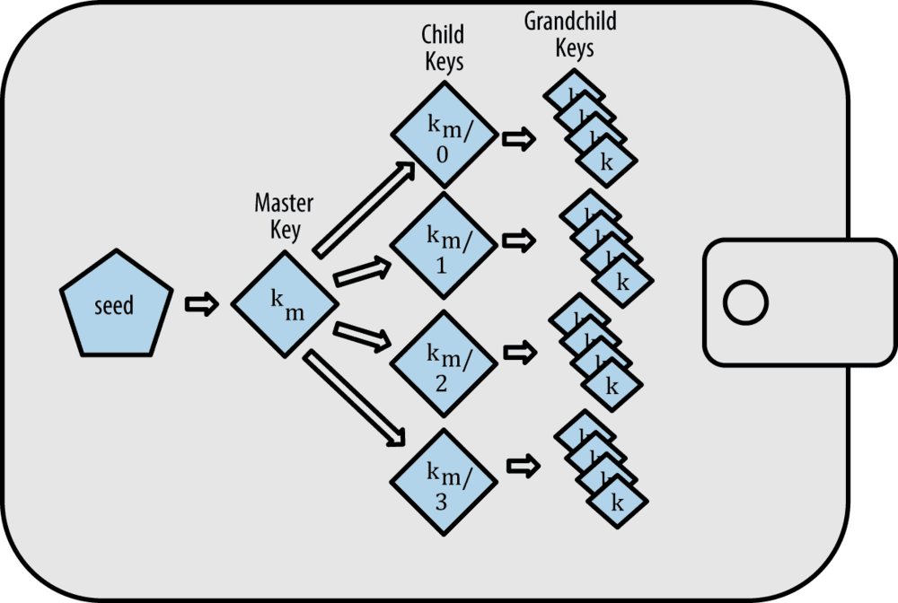

# 钱包
- BIP
- 助记词
- Base58，Base58Check
## 概念
### 钱包应用程序
1. 钱包
    * 钱包不是账号，钱包是一个应用程序，主要用于管理账号、保管私钥、发送和接受代币的客户端。
    * 钱包中可以有很多账号，账号也能导入不同的钱包。
2. 账号
 * 每个账户都是由一对钥匙组成：公钥和私钥。每个账户都对应一个地址。
 * 账户由钱包来管理，一个钱包可以包含多个账户。
 * 账号与公钥、私钥、地址，在以太坊中是一一对应的，而在有的区块链中账号与公私钥对、地址不是一一对应的，比如：EOS。
3. 地址
* 地址长度为25字节，转为base58编码后，为34或35个字符，如：`1PFjZSK9GEGoGKt3aTDZU2o7kBC4W815pC`
* base58是类似base64的编码，但去掉了易引起视觉混淆的字符，又在地址末尾添加了4个字节校验位。
* 由于存在公钥有两种形式，那么一个公钥便对应两个地址，这两个地址都可由同一私钥签署交易。
* 地址标记着一个账号，可以公开给别人，用于别人给你转账。
* 地址不是公钥，地址是由公钥生成，公钥由私钥生成，这两个过程是不可逆的，即地址不能推算出公钥，公钥也不能推算出私钥。
4. 公钥
* 公钥压缩格式是33字节，非压缩格式是65字节。即压缩格式是66位长度的十六进制，非压缩格式是130位长度的十六进制字符组成。以0x02/0x03开头为压缩公钥。早期比特币均使用非压缩公钥，现大部分客户端已默认使用压缩公钥。
* 公钥对账号的交易进行加密。即使用公钥签名交易，然后使用私钥去验证交易。
* 公钥是通过使用secp256k1椭圆曲线加密算法计算私钥所对应的公钥获得。
* 公钥、私钥、地址，它们是一一对应的，唯一的，不可修改的。
5. 私钥
* 私钥由64位长度的十六进制的字符组成，比如：`0xE4356E49C88C8B7AB370AF7D5C0C54F0261AAA006F6BDE09CD4745CF54E0115A`，
* 私钥一定要妥善保管，不能被公开和泄漏，拥有私钥就相当于拥有此账号的使用权。
* 私钥有可由助记词推导出来。
6. 密码
* 密码不是私钥，密码可以进行修改或重置。在钱包应用程序中，创建账号时需要设定一个密码，这个密码一般要求不少于 8 个字符，为了安全，密码最好设置复杂一点。

7. 助记词
* 私钥是64位长度的十六进制的字符，不利于记录且容易记错，且每个账号对应一个私钥，多个账号就有多个私钥，不易管理，所以用算法将一串随机数转化为了一串12 ~ 24个容易记住的单词，方便保存记录。所以有的同学有了下面的结论：

* 助记词是私钥的另一种表现形式。
> 助记词=私钥，这是不正确的说法，通过助记词可以获取相关联的多个私钥，但是通过其中一个私钥是不能获取助记词的，因此助记词≠私钥。

**总结:**

钱包应用程序用于管理多个账号，在比特币中账号与公私钥对、地址是一一对应的，公钥、私钥、地址也是一一对应的，私钥生成公钥，公钥生成地址，且不可逆，私钥是账号的核心且不可泄漏，地址可以公开用于转账。

### HD钱包
HD钱包，并不是Hardware Wallet硬件钱包，这里的 HD 是Hierarchical Deterministic的缩写，意思是分层确定性，所以HD钱包的全称为比特币分成确定性钱包 。比特币中的钱包就是非确定性钱包，BIP32是 HD钱包的标准定义，由种子派生生成多个私钥。

#### BIP
BIP是协议，是Bitcoin Improvement Proposals的缩写，意思是Bitcoin 的改进建议，用于提出 Bitcoin 的新功能或改进措施。BIP协议衍生了很多的版本，主要有BIP32、BIP39、BIP44。
* BIP32

    BIP32是 HD钱包的核心提案，通过种子来生成主私钥，然后派生海量的子私钥和地址，种子是一串很长的随机数。

* BIP39

    由于种子是一串很长的随机数，不利于记录，所以我们用算法将种子转化为一串12 ~ 24个的单词，方便保存记录，这就是BIP39，它扩展了 HD钱包种子的生成算法。

* BIP44

    BIP44 是在 BIP32 和 BIP43 的基础上增加多币种，提出的层次结构非常全面，它允许处理多个币种，多个帐户，每个帐户有数百万个地址。

在BIP32路径中定义以下5个级别：
```
m/purpse'/coin_type'/account'/change/address_index
```
* purpose：在BIP43之后建议将常数设置为44'。表示根据BIP44规范使用该节点的子树。
* Coin_type：币种，代表一个主节点（种子）可用于无限数量的独立加密币，如比特币，Litecoin或Namecoin。此级别为每个加密币创建一个单独的子树，避免重用已经在其它链上存在的地址。开发人员可以为他们的项目注册未使用的号码。币种列表
* Account：账户，此级别为了设置独立的用户身份可以将所有币种放在一个的帐户中，从0开始按顺序递增。
* Change：常量0用于外部链，常量1用于内部链，外部链用于钱包在外部用于接收和付款。内部链用于在钱包外部不可见的地址，如返回交易变更。
* Address_index：地址索引，按顺序递增的方式从索引0开始编号。

BIP44的规则使得 HD钱包非常强大，用户只需要保存一个种子，就能控制所有币种，所有账户的钱包，因此由BIP39 生成的助记词非常重要，所以一定安全妥善保管，那么会不会被破解呢？如果一个 HD 钱包助记词是 12 个单词，一共有 2048 个单词可能性，那么随机的生成的助记词所有可能性大概是5e+39，因此几乎不可能被破解。

### 种子
种子可以派生生成多个私钥，所以种子是一个钱包账号中最关键的数据，比私钥的等级更高，因此备份一个种子就备份了相关联的所有私钥。HD钱包中包含了在树结构中派生的密钥，这样一来，父密钥就可以派生出一系列子密钥，每个密钥都可以派生出一系列的子密钥，从而达到无限的深度。



### Base58编码
#### Base64编码
Base64就是一种基于64个可打印字符来表示二进制数据的方法

Base64使用了26个小写字母、26个大写字母、10个数字以及两个符号（例如“+”和“/”），用于在电子邮件这样的基于文本的媒介中传输二进制数据。
Base64通常用于编码邮件中的附件。
Base64字符集：
```
ABCDEFGHIJKLMNOPQRSTUVWXYZabcdefghijklmnopqrstuvwxyz0123456789+/
```
#### Base58编码
Base58是一种基于文本的二进制编码格式，是用于Bitcoin中使用的一种独特的编码方式，主要用于产生Bitcoin的钱包地址。

相比Base64，Base58不使用数字"0"，大写字母"O"，大写字母"I"和小写字母"l"，以及"+"和"/"符号。目的就是去除容易混淆的字符。
这种编码格式不仅实现了数据压缩，保持了易读性，还具有错误诊断功能。
Base58字符集：
```
ABCDEFGHJKLMNPQRSTUVWXYZabcdefghijkmnopqrstuvwxyz123456789
```
#### Base58Check
Base58Check是一种常用在比特币中的Base58编码格式，增加了错误校验码来检查数据在转录中出现的错误。在Base58Check中，对数据添加了一个称作“版本字节”的前缀，这个前缀用来明确需要编码的数据的类型。

1. 首先对数据添加一个版本前缀，这个前缀用来识别编码的数据类型。例如，比特币地址的前缀是0（十六进制是0x00）。
2. 对数据连续进行两次SHA256哈希算法`checksum = SHA256(SHA256(prefix+data))。`
3. 在产生的长度为32个字节（两次哈希云算）的哈希值中，取其前4个字节作为检验和添加到数据第一步产生的数据之后。
4. 将数据进行Base58编码处理

Base58Check的编码过程如下图:


#### Base58Check的作用:校验比特币地址是否合法

既然有了Base58编码，已经不会搞错0和O, 1和l和I，也把大整数转换成了可读字符串，为什么还要再有Base58Check这个环节呢？

假设一种情况，你在程序中输入一个Base58编码的地址，尽管你已经不会搞错0和O, 1和l和I，但是万一你不小心输错一个字符，或者少写多写一个字符，会咋样？你可能会说，没啥大不了的，错个字符而已，这不是很常见嘛，重新输入不就可以了吗？但是当用户给一个比特币地址转账，如果输入错误，那么对方就不会收到资金，更关键的是该笔资金发给了一个根本不存在的比特币地址，那么这笔资金也就永远不可能被交易，也就是说比特币丢失了。

* 校验码长4个字节，添加到需要编码的数据之后。
* 校验码是从需要编码的数据的哈希值中得到的，所以可以用来检测并避免转录和输入中产生的错误。
* 使用Base58check编码格式时，程序会计算原始数据的校验码并和自带的校验码进行对比，二者若不匹配则表明有错误产生。

实际上，在比特币交易中，都会校验比特币地址是否合法，如果经过Base58Check的比特币地址被比特币钱包程序判定是无效的，当然会阻止交易继续进行，就避免了资金损失。
## 通过助记词扩展子地址
* 助记词的生成过程
* 从助记词到种子
* 种子生成子秘钥